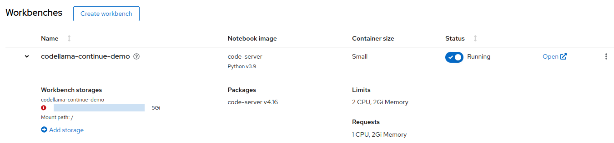
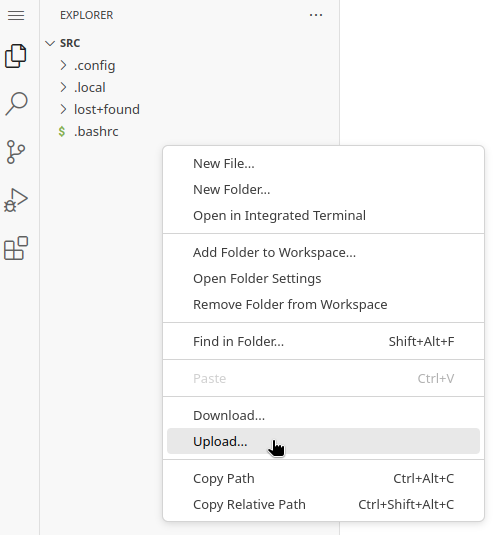
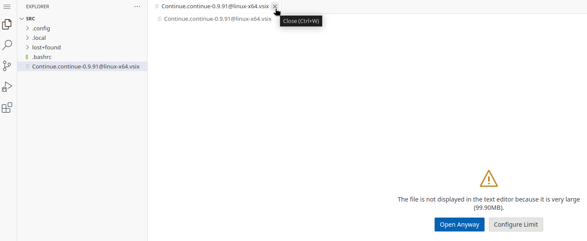
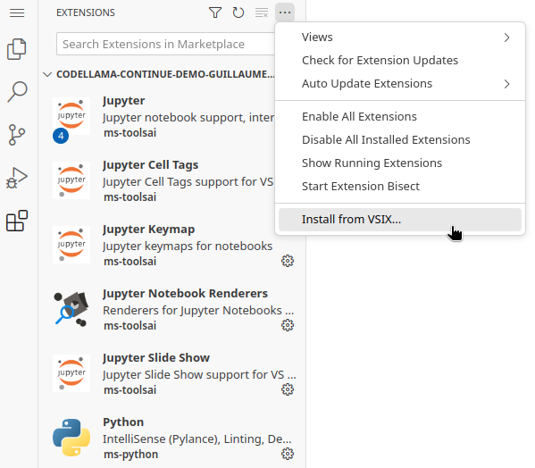
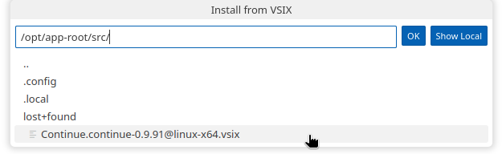
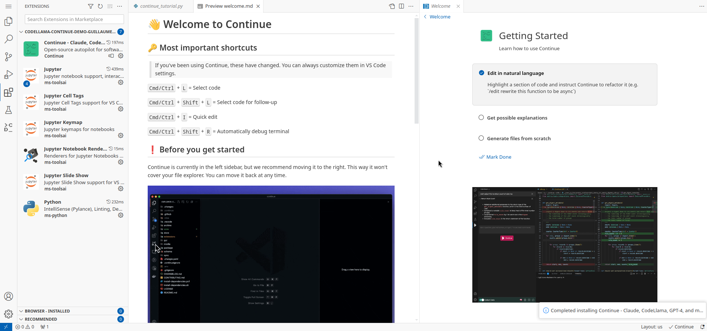
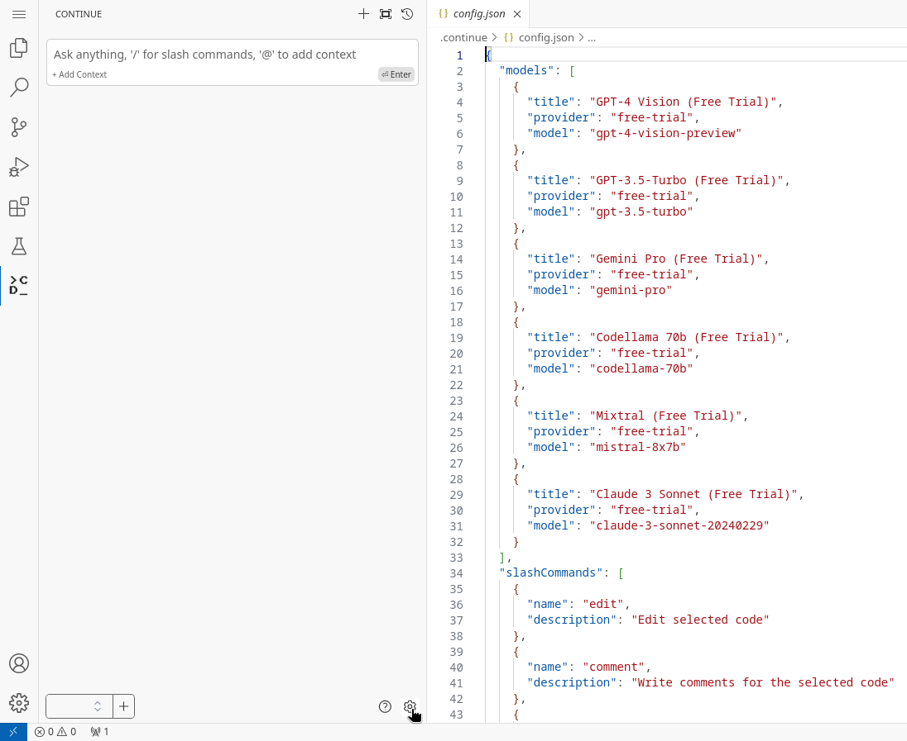
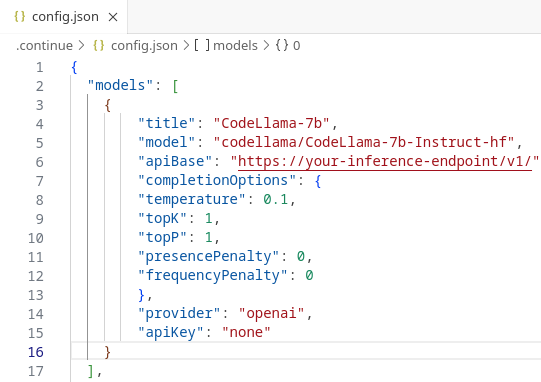
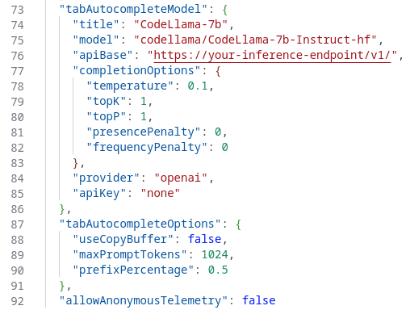
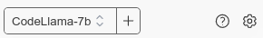

# AI Assistant in Code Server

Who has never dreamed of having a know-it-all assistant that can help you writing boilerplate code, explain a function you got from a colleague but that remains obscure to you, or quickly parse through tons of error logs to fetch the one relevant line that can help you debug you application?

With the advent of AI and LLM, such services have become pretty common (Copilot, CodeWhisperer,...). However, you may wonder what happens with all the code you are sending to those services? Or more than often, you're simply not allowed to use them...

In this article, we will show you how to integrate a code assistant in **[Code Server](https://github.com/coder/code-server){:target="_blank"}**, leveraging the **[CodeLlama](https://huggingface.co/codellama/CodeLlama-7b-Instruct-hf){:target="_blank"}** model and the **[Continue](https://continue.dev/docs/intro){:target="_blank"}** plugin (an open source assistant for VSCode similar to Copilot).

All those solutions are open source, you fully control how they are deployed and what they do, and your code will never leave your environment!

## Requirements

- A **model** that has been trained for Code Generation. Many are available. The [Big Code Leaderboard](https://huggingface.co/spaces/bigcode/bigcode-models-leaderboard){:target="_blank"} will give you information about the latest and greatest models. In this demo, we are going to use [CodeLlama-7b-Instruct-hf](https://huggingface.co/codellama/CodeLlama-7b-Instruct-hf){:target="_blank"} because it's good enough for a demo and fits in our available GPU. For large real-world production workloads, you would of course need to consider a bigger version of this model (13B, 70B), or another model.
- You must **serve your model** and have its **inference endpoint**. Refer to the **[LLM Serving](../../generative-ai/llm-serving.md#llm-serving-solutions){:target="_blank"} section** to learn how to deploy your model on RHOAI/ODH.
- A **Code Server workbench** image available in your RHOAI or ODH environment. Starting at RHOAI 2.8, this image is available out of the box. Prior to that, you would have to import it as a custom image, like [this one](https://quay.io/repository/modh/codeserver?tab=tags&tag=codeserver-ubi9-python-3.9-2023b-20240301-6560116){:target="_blank"}.
- As Code Server is fully open source, it does not include the Microsoft Marketplace. So you must download the Continue extension file from the [Open VSX Registry](https://open-vsx.org/extension/Continue/continue){:target="_blank"}. Click on the **Download** button and select the **Linux x64** version. You will get a file named `Continue.continue-0.9.91@linux-x64.vsix` (or whatever version you download).

!!! note
    There is a repository containing the files that can be used to deploy some prerequisites for this demo. You can find it [here](https://github.com/rh-aiservices-bu/code-assistant-demo).

## Installation

- Create and Start your Workbench based on Code Server:

    

- Upload the extension file:

    

- Once uploaded, Code server will try to open the file and complain about its size, just close the tab:1

    

- From the Extension menu on the sidebar, click on the three dots on the top right and select **Install from VSIX**:

    

- From the menu that opens, select the file you uploaded:

    

- Wait a few seconds... The installation completes and you're greeted with a welcome message:

    

- You can close all the tabs or follow the tutorial.

## Configuration

By default, Continue is configured with different providers and models to test. But of course we want to add our own inference endpoint to use the model we have deployed.

- In the Sidebar, click on the new icon that was added at the bottom, the one from Continue (it may trigger an error about Headers not being defined, you can ignore it for now). At the bottom right of the Continue panel, click on the Gear icon to open the configuration file.

    

- In the **models** section, add the following configuration (replace your inference endpoint with the right value, and eventually the name of your model):

    ```json
    {
        "title": "CodeLlama-7b",
        "model": "codellama/CodeLlama-7b-Instruct-hf",
        "apiBase": "https://your-inference-endpoint/v1/",
        "completionOptions": {
        "temperature": 0.1,
        "topK": 1,
        "topP": 1,
        "presencePenalty": 0,
        "frequencyPenalty": 0
        },
        "provider": "openai",
        "apiKey": "none"
    }
    ```

- You can also remove the other pre-defined models if you don't want to use them. You should end up with something like this:

    

- In the **tabAutocompleteModel** section, add the following configuration (replace your inference endpoint with the right value, and eventually the name of your model), and add/modify the options to your liking (see [documentation](https://continue.dev/docs/walkthroughs/tab-autocomplete){:target="_blank"} for all possible values):

    ```json
    "tabAutocompleteModel": {
        "title": "CodeLlama-7b",
        "model": "codellama/CodeLlama-7b-Instruct-hf",
        "apiBase": "https://your-inference-endpoint/v1/",
        "completionOptions": {
        "temperature": 0.1,
        "topK": 1,
        "topP": 1,
        "presencePenalty": 0,
        "frequencyPenalty": 0
        },
        "provider": "openai",
        "apiKey": "none"
    },
    "tabAutocompleteOptions": {
        "useCopyBuffer": false,
        "maxPromptTokens": 1024,
        "prefixPercentage": 0.5
    },
    ```

- You can also disable telemetry by setting the parameter to false. You should end up with something like this:

    

- Once the configuration is finished (file is auto-saved), you should see the model name available in the drop-down at the bottom of the Continue extension pane:

    

Continue is now ready to use!

## Usage

The best way to learn how to use it is to [read the short documentation](https://continue.dev/docs/how-to-use-continue){:target="_blank"} and experiment.

Here is a small example of what you can do: Fast Edit (ask for some code generation), then Tab completion (let the assistant suggest the next piece of code), then Explain or do something on the side:

<video controls autoplay loop muted>
      <source id="mp4" src="/demos/codellama-continue/img/codellama-continue.mp4" type="video/mp4">
     tag" />
</videos>
