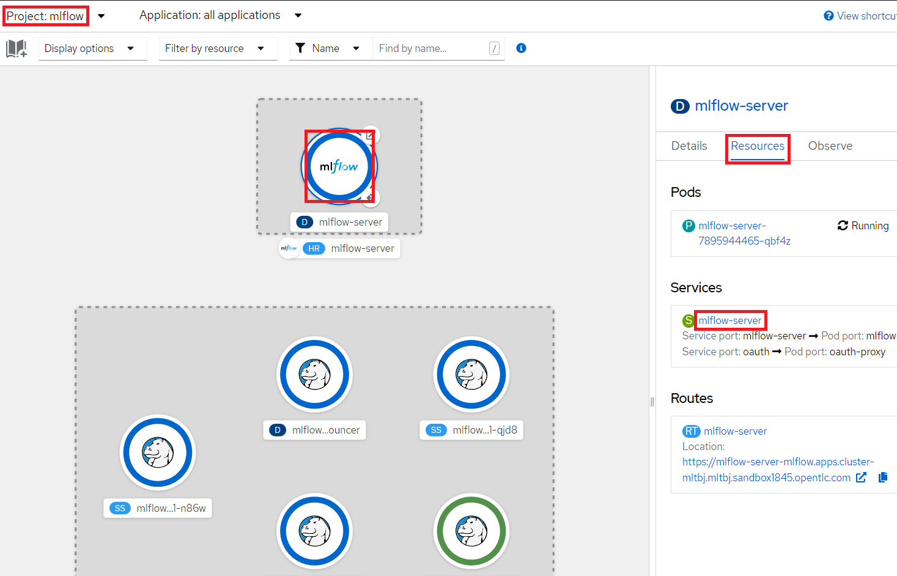
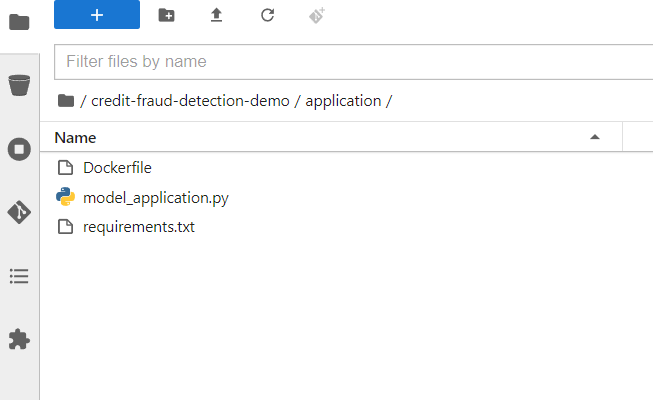
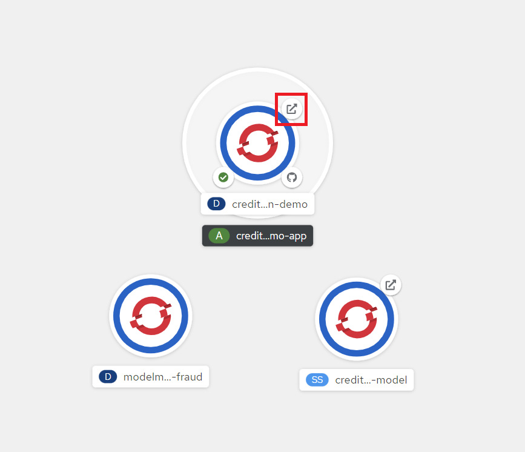

# Credit Card Fraud Detection Demo using MLFlow and Red Hat OpenShift Data Science
[GitHub Source](https://github.com/red-hat-data-services/credit-fraud-detection-demo)

## Pre-requisites:
- Have [Red Hat OpenShift Data Science](/getting-started/openshift-data-science/) (RHODS) running in a cluster
    - Note: You use [Open Data Hub](/getting-started/opendatahub/) instead of RHODS, but this demo and all the screenshots are from RHODS
- Have [MLFlow](/tools-and-applications/mlflow/mlflow/) running in a cluster

## Demo Description & Architecture
The goal of this demo is to demonstrate how RHODS and MLFlow can be used together to build an end-to-end MLOps platform where we can: 

- Build and train models in RHODS
- Track and store those models with MLFlow
- Deploy a model application in OpenShift that runs predictions with a specific model from MLFlow

The architecture looks like this:


Description of each component:

- **Data Set:** The data set contains the data used for training and evaluating the model we will build in this demo.
- **RHODS Notebook:** We will build and train the model using a Jupyter Notebook running in RHODS.
- **MLFlow Experiment tracking:** We use MLFlow to track the model training run and parameters and metrics (such as accuracy, loss, etc) of the run. Every run is called an experiment.
- **MLFlow Model registry:** As we track the experiment we also store the trained model through MLFlow so we can easily version it and assign a stage to it (for example Staging, Production, Archive).
- **S3 (ODF):** This is where the models are physically stored and what the MLFlow model registry interfaces with. We use ODF (OpenShift Data Foundation) according to the [MLFlow guide](/tools-and-applications/mlflow/mlflow/), but it can be replaced with another storage.  
- **Application interface:** This is the interface used to run predictions with the model. In our case, we will build a visual interface (interactive app) using Gradio and let it load the model from the MLFlow model registry.

The model we will build is a Credit Card Fraud Detection model, which predicts if a credit card usage is fraudulent or not depending on a few parameters such as: distance from home and last transaction, purchase price compared to median, if it's from a retailer that already has been purchased from before, if the PIN number is used and if it's an online order or not.


## Deploying the demo

### 1.1: MLFlow Route through the visual interface
Start by finding your route to MLFlow. You will need it to send any data to MLFlow.

- Go to the OpenShift Console as a Developer
- Select your mlflow project 
- Press Topology 
- Press the mlflow-server circle 
    - While you are at it, you can also press the little "Open URL" button in the top right corner of the circle to open up the MLFlow UI in a new tab - we will need it later.
- Go to the Resources tab 
- Press mlflow-server under Services 
- Look at the Hostname and mlflow-server Port.  
NOTE: This route and port only work internally in the cluster.




### 1.2: Get the MLFlow Route using command-line
Alternatively, you can use the OC command to get the route through: `oc get route mlflow -n mlflow | grep mlflow`

### 2: Create a RHODS workbench
Start by open up RHODS by clicking on the 9 square symbol in the top menu and choosing "Red Hat OpenShift Data Science".


Then create a new Data Science project (see image), this is where we will build and train our model. This will also create a namespace in OpenShift which is where we will be running our application after the model is done.  
I'm calling my project 'Credit Card Fraud', feel free to call yours something different but be aware that some things further down in the demo may change.


After the project has been created, create a workbench where we can run Jupyter.  
There are a few important settings here that we need to set:

- **Name:** I simply call it "Credit Fraud Model", but feel free to call it something else.
- **Notebook Image:** Standard Data Science
- **Deployment Size:** Small
- **Environment Variable:** Add a new one that's a Config Map -> Key/value and enter `MLFLOW_ROUTE` as the key and `http://<route-to-mlflow>:<port>` as the value, replacing `<route-to-mlflow>` and `<port>` with the  route and port that we found in [step one](#11-mlflow-route-through-the-visual-interface).  In my case it is `http://mlflow-server.mlflow.svc.cluster.local:8080`.
- **Cluster Storage:** Create new persistent storage - I call it "Credit Fraud Storage" and set the size to 20GB.


Press Create Workbench and wait for it to start - status should say "Running" and you should be able to press the Open link.


Open the workbench and login if needed.

### 3: Train the model
When inside the workbench (Jupyter), we are going to clone a GitHub repository which contains everything we need to train our model.  
You can clone the GitHub repository by pressing the GitHub button in the left side menu (see image), then select "Clone a Repository" and enter this GitHub URL: [https://github.com/red-hat-data-services/credit-fraud-detection-demo](https://github.com/red-hat-data-services/credit-fraud-detection-demo) 


Open up the folder that was added (credit-fraud-detection-demo).  
It contains:

- Data for training and evaluating the model.
- A notebook (model.ipynb) inside the `model` folder with a Deep Neural Network model we will train.
- An application (model_application.py) inside the `application` folder that will fetch the trained model from MLFlow and run a prediction on it whenever it gets any user input.

The `model.ipynb` is what we are going to use for building and training the model, so open that up and take a look inside, there is documentation outlining what each cell does. What is particularly interesting for this demo are the last two cells.  

The second to last cell contains the code for setting up MLFlow tracking:
```
mlflow.set_tracking_uri(MLFLOW_ROUTE)
mlflow.set_experiment("DNN-credit-card-fraud")
mlflow.tensorflow.autolog(registered_model_name="DNN-credit-card-fraud")
```
`mlflow.set_tracking_uri(MLFLOW_ROUTE)` just points to where we should send our MLFlow data.  
`mlflow.set_experiment("DNN-credit-card-fraud")` tells MLFlow that we want to create an experiment, and what we are going to call it. In this case I call it "DNN-credit-fraud" as we are building a Deep Neural Network.  
`mlflow.tensorflow.autolog(registered_model_name="DNN-credit-card-fraud")` enables autologging of a bunch of variables (such as accuracy, loss, etc) so we don't manually have to track them. It also automatically uploads the model to MLFlow after the training completes. Here we name the model the same as the experiment.

Then in the last cell we have our training code:
```
with mlflow.start_run():
    epochs = 2
    history = model.fit(X_train, y_train, epochs=epochs, \
                        validation_data=(scaler.transform(X_val),y_val), \
                        verbose = True, class_weight = class_weights)

    y_pred_temp = model.predict(scaler.transform(X_test)) 

    threshold = 0.995

    y_pred = np.where(y_pred_temp > threshold, 1,0)
    c_matrix = confusion_matrix(y_test,y_pred)
    ax = sns.heatmap(c_matrix, annot=True, cbar=False, cmap='Blues')
    ax.set_xlabel("Prediction")
    ax.set_ylabel("Actual")
    ax.set_title('Confusion Matrix')
    plt.show()

    t_n, f_p, f_n, t_p = c_matrix.ravel()
    mlflow.log_metric("tn", t_n)
    mlflow.log_metric("fp", f_p)
    mlflow.log_metric("fn", f_n)
    mlflow.log_metric("tp", t_p)
```
`with mlflow.start_run():` is used to tell MLFlow that we are starting a run, and we wrap our training code with it to define exactly what code belongs to the "run".  
Most of the rest of the code in this cell is normal model training and evaluation code, but at the very bottom we can see how we send some custom metrics to MLFlow through `mlflow.log_metric`. We do this as custom metrics are not tracked by the autolog we enabled in the last cell.

Now run all the cells in the notebook from top to bottom, either through clicking Shift-Enter on every cell, or by going to Run->Run All Cells in the very top menu.  
If everything is set up correctly it will train the model and push both the experiment and the model to MLFlow.  
The experiment is a record with metrics of how the run went, while the model is the actual tensorflow model which we later will use for inference.  
You may see some warnings in the last cell related to MLFlow, as long as you see a final progressbar for the model being pushed to MLFlow you are fine:


### 4: View the model in MLFlow
Let's take a look at how it looks inside MLFlow now that we have trained the model.  
If you opened the MLFlow UI in a new tab in step 1.1, then just swap over to that tab, otherwise follow these steps:

- Go to the OpenShift Console
- Make sure you are in Developer view in the left menu
- Go to Topology in the left menu
- At the top left, change your project to MLFlow (or whatever you called it when installing the MLFlow operator in pre-requisites)
- Press the "Open URL" icon in the top right of the MLFlow circle in the topology map


When inside the MLFlow interface you should see your new experiment in the left menu. Click that to see all the runs, should be a single run from the model we just trained.  
You can now click on the row in the Created column to get more information about the experiment and how to run the model.


### 5: Deploy the model application
The model application is a visual interface for interacting with the model. You can use it to send data to the model and get a prediction of whether a transaction is fraudulent or not.  
It works by loading a specific model and model version from MLFlow, and running the data through the model whenever it comes in.  
You can find the model application code in the "application" folder in the GitHub repository you cloned in [step 3](#3-train-the-model).



We are going to deploy the application with OpenShift by pointing it to the GitHub repository.  
It will pull down the folder, automatically build a container image based on the Dockerfile (instructions for ), and publish it.

To do this, go to the OpenShift Console and make sure you are in **Developer** view and have selected the **credit-card-fraud** project.  
Then press "+Add" in the left menu and select Import from Git.  


In the "Git Repo URL" enter: [https://github.com/red-hat-data-services/credit-fraud-detection-demo](https://github.com/red-hat-data-services/credit-fraud-detection-demo) (this is the same repository we pulled into RHODS earlier).  
Then press "Show advanced Git options" and set "Context dir" to "/application".  
Press Create to start deploying the application.


You should now see two objects in your topology map, one for the Workbench we created earlier and one for the application we just added.  
When the circle of your deployment turns dark blue it means that it has finished deploying.  
If you want more details on how the deployment is going, you can press the circle and look at Resources in the right menu that opens up. There you can see how the build is going and what's happening to the pod. The application will be ready when the build is complete and the pod is "Running".  
When the application has been deployed you can press the "Open URL" button to open up the interface in a new tab. 



Congratulations, you now have an application running your AI model!  
If you looked inside the application code earlier, you also know that we specifically pull version 1 of the model called "DNN Fraud Detection" from MLFlow. This makes sense since we only ran the model once, but is easy to change if any other version or model should go into production.  
We are also utilizing a program called "Gradio" to create the interface, it's a super lightweight way to get a nice-looking interface running.

Try entering a few values and see if it predicts it as a credit fraud or not. You can select one of the examples at the bottom of the application page.

