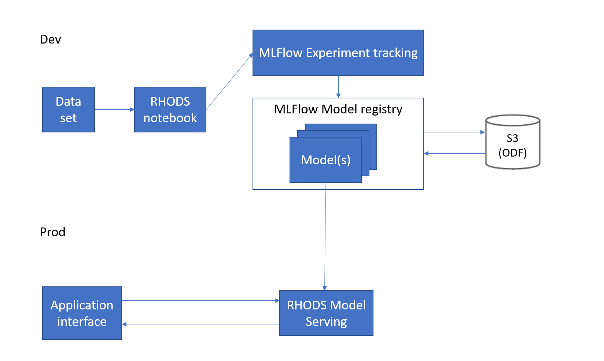
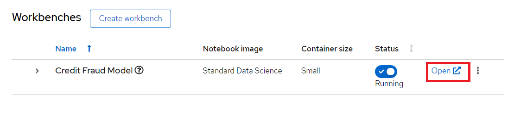

# Credit Card Fraud Detection Demo using MLFlow and Red Hat OpenShift Data Science

[GitHub Source](https://github.com/red-hat-data-services/credit-fraud-detection-demo)

## Pre-requisites

- Have [Red Hat OpenShift Data Science](/getting-started/openshift-data-science/) (RHODS) running in a cluster
  - Note: You can use [Open Data Hub](/getting-started/opendatahub/) instead of RHODS, but some instructions and screenshots may not apply
- Have [MLFlow](/tools-and-applications/mlflow/mlflow/) running in a cluster

## Demo Description & Architecture

The goal of this demo is to demonstrate how RHODS and MLFlow can be used together to build an end-to-end MLOps platform where we can:

- Build and train models in RHODS
- Track and store those models with MLFlow
- Serve a model stored in MLFlow using RHODS Model Serving (or MLFlow serving)
- Deploy a model application in OpenShift that runs sends data to the served model and displays the prediction

The architecture looks like this:


Description of each component:

- **Data Set:** The data set contains the data used for training and evaluating the model we will build in this demo.
- **RHODS Notebook:** We will build and train the model using a Jupyter Notebook running in RHODS.
- **MLFlow Experiment tracking:** We use MLFlow to track the parameters and metrics (such as accuracy, loss, etc) of a model training run. These runs can be grouped under different "experiments", making it easy to keep track of the runs.
- **MLFlow Model registry:** As we track the experiment we also store the trained model through MLFlow so we can easily version it and assign a stage to it (for example Staging, Production, Archive).
- **S3 (ODF):** This is where the models are stored and what the MLFlow model registry interfaces with. We use ODF (OpenShift Data Foundation) according to the [MLFlow guide](/tools-and-applications/mlflow/mlflow/), but it can be replaced with another solution.  
- **RHODS Model Serving:** We recommend using RHODS Model Serving for serving the model. It's based on ModelMesh and allows us to easily send requests to an endpoint for getting predictions.
- **Application interface:** This is the interface used to run predictions with the model. In our case, we will build a visual interface (interactive app) using Gradio and let it load the model from the MLFlow model registry.

The model we will build is a Credit Card Fraud Detection model, which predicts if a credit card usage is fraudulent or not depending on a few parameters such as: distance from home and last transaction, purchase price compared to median, if it's from a retailer that already has been purchased from before, if the PIN number is used and if it's an online order or not.

## Deploying the demo

### 1.1: MLFlow Route through the visual interface

Start by finding your route to MLFlow. You will need it to send any data to MLFlow.

- Go to the OpenShift Console as a Developer
- Select your mlflow project
- Press Topology
- Press the mlflow-server circle
  - While you are at it, you can also press the little "Open URL" button in the top right corner of the circle to open up the MLFlow UI in a new tab - we will need it later.
- Go to the Resources tab
- Press mlflow-server under Services
- Look at the Hostname and mlflow-server Port.
NOTE: This route and port only work internally in the cluster.


### 1.2: Get the MLFlow Route using command-line
Alternatively, you can use the OC command to get the hostname through:  
`oc get svc mlflow-server -n mlflow -o go-template --template='{{.metadata.name}}.{{.metadata.namespace}}.svc.cluster.local{{println}}'`  

The port you will find with: `oc get svc mlflow-server -n mlflow -o yaml` 


### 2: Create a RHODS workbench

Start by opening up RHODS by clicking on the 9 square symbol in the top menu and choosing "Red Hat OpenShift Data Science".


Then create a new Data Science project (see image), this is where we will build and train our model. This will also create a namespace in OpenShift which is where we will be running our application after the model is done.
I'm calling my project 'Credit Card Fraud', feel free to call yours something different but be aware that some things further down in the demo may change.


After the project has been created, create a workbench where we can run Jupyter.
There are a few important settings here that we need to set:

- **Name:** Credit Fraud Model
- **Notebook Image:** Standard Data Science
- **Deployment Size:** Small
- **Environment Variable:** Add a new one that's a **Config Map -> Key/value** and enter 
    - **Key:** `MLFLOW_ROUTE` 
    - **Value:** `http://<route-to-mlflow>:<port>`, replacing `<route-to-mlflow>` and `<port>` with the route and port that we found in [step one](#11-mlflow-route-through-the-visual-interface).  In my case it is `http://mlflow-server.mlflow.svc.cluster.local:8080`.
- **Cluster Storage:** Create new persistent storage - I call it "Credit Fraud Storage" and set the size to 20GB.


Press Create Workbench and wait for it to start - status should say "Running" and you should be able to press the Open link.



Open the workbench and login if needed.

### 3: Train the model
When inside the workbench (Jupyter), we are going to clone a GitHub repository which contains everything we need to train (and run) our model.  
You can clone the GitHub repository by pressing the GitHub button in the left side menu (see image), then select "Clone a Repository" and enter this GitHub URL: [https://github.com/red-hat-data-services/credit-fraud-detection-demo](https://github.com/red-hat-data-services/credit-fraud-detection-demo) 


Open up the folder that was added (credit-fraud-detection-demo).
It contains:

- Data for training and evaluating the model.
- A notebook (model.ipynb) inside the `model` folder with a Deep Neural Network model we will train.
- An application (model_application.py) inside the `application` folder that will fetch the trained model from MLFlow and run a prediction on it whenever it gets any user input.

The `model.ipynb` is what we are going to use for building and training the model, so open that up and take a look inside, there is documentation outlining what each cell does. What is particularly interesting for this demo are the last two cells.

The second to last cell contains the code for setting up MLFlow tracking:

```python
mlflow.set_tracking_uri(MLFLOW_ROUTE)
mlflow.set_experiment("DNN-credit-card-fraud")
mlflow.tensorflow.autolog(registered_model_name="DNN-credit-card-fraud")
```

`mlflow.set_tracking_uri(MLFLOW_ROUTE)` just points to where we should send our MLFlow data.
`mlflow.set_experiment("DNN-credit-card-fraud")` tells MLFlow that we want to create an experiment, and what we are going to call it. In this case I call it "DNN-credit-card-fraud" as we are building a Deep Neural Network.
`mlflow.tensorflow.autolog(registered_model_name="DNN-credit-card-fraud")` enables autologging of a bunch of variables (such as accuracy, loss, etc) so we don't manually have to track them. It also automatically uploads the model to MLFlow after the training completes. Here we name the model the same as the experiment.

Then in the last cell we have our training code:

```python
with mlflow.start_run():
    epochs = 2
    history = model.fit(X_train, y_train, epochs=epochs, \
                        validation_data=(scaler.transform(X_val),y_val), \
                        verbose = True, class_weight = class_weights)

    y_pred_temp = model.predict(scaler.transform(X_test))

    threshold = 0.995

    y_pred = np.where(y_pred_temp > threshold, 1,0)
    c_matrix = confusion_matrix(y_test,y_pred)
    ax = sns.heatmap(c_matrix, annot=True, cbar=False, cmap='Blues')
    ax.set_xlabel("Prediction")
    ax.set_ylabel("Actual")
    ax.set_title('Confusion Matrix')
    plt.show()

    t_n, f_p, f_n, t_p = c_matrix.ravel()
    mlflow.log_metric("tn", t_n)
    mlflow.log_metric("fp", f_p)
    mlflow.log_metric("fn", f_n)
    mlflow.log_metric("tp", t_p)

    model_proto,_ = tf2onnx.convert.from_keras(model)
    mlflow.onnx.log_model(model_proto, "models")
```
`with mlflow.start_run():` is used to tell MLFlow that we are starting a run, and we wrap our training code with it to define exactly what code belongs to the "run".  
Most of the rest of the code in this cell is normal model training and evaluation code, but at the bottom we can see how we send some custom metrics to MLFlow through `mlflow.log_metric` and then convert the model to ONNX. This is because ONNX is one of the standard formats for RHODS Model Serving which we will use later.


Now run all the cells in the notebook from top to bottom, either by clicking Shift-Enter on every cell, or by going to Run->Run All Cells in the very top menu.  
If everything is set up correctly it will train the model and push both the run and the model to MLFlow.  
The run is a record with metrics of how the run went, while the model is the actual tensorflow and ONNX model which we later will use for inference.  
You may see some warnings in the last cell related to MLFlow, as long as you see a final progressbar for the model being pushed to MLFlow you are fine:


### 4: View the model in MLFlow
Let's take a look at how it looks inside MLFlow now that we have trained the model.  
If you opened the MLFlow UI in a new tab in [step 1.1](#11-mlflow-route-through-the-visual-interface), then just swap over to that tab, otherwise follow these steps:

- Go to the OpenShift Console
- Make sure you are in Developer view in the left menu
- Go to Topology in the left menu
- At the top left, change your project to "mlflow" (or whatever you called it when installing the MLFlow operator in pre-requisites)
- Press the "Open URL" icon in the top right of the MLFlow circle in the topology map


When inside the MLFlow interface you should see your new experiment in the left menu. Click on it to see all the runs under that experiment name, there should only be a single run from the model we just trained.
You can now click on the row in the Created column to get more information about the run and how to use the model from MLFlow.


We will need the Full Path of the model in the next section when we are going to serve it, so keep this open. 


### 5: Serve the model
> **NOTE:** You can either serve the model using RHODS Model Serving or use the model straight from MLFlow.  
> We will here show how you serve it with RHODS Model Serving as that scales better for large applications and load.  
> At the bottom of this section we'll go through how it would look like to use MLFlow instead.

To start, go to your RHODS Project and click "Add data connection".
This data connection connects us to a storage we can load our models from.


Here we need to fill out a few details. These are all assuming that you set up MLFlow according to this [guide](/tools-and-applications/mlflow/mlflow/) and have it connected to ODF. If that's not the case then enter the relevant details for your usecase.

- **Name**: mlflow-connection
- **AWS_ACCESS_KEY_ID**: Run `oc get secrets mlflow-server -n mlflow -o json | jq -r '.data.AWS_ACCESS_KEY_ID|@base64d'` in your command prompt, in my case it's `nB0z01i0PwD9PMSISQ2W`
- **AWS_SECRET_ACCESS_KEY**: Run `oc get secrets mlflow-server -n mlflow -o json | jq -r '.data.AWS_SECRET_ACCESS_KEY|@base64d'` in your command prompt, in my case it's `FLgEJmGQm5CdRQRnXc8jVFcc+QDpM1lcrGpiPBzI`.  
> **NOTE:** In my case the cluster and storage has already been shut down, don't share this in normal cases.
- **AWS_S3_ENDPOINT**: Run `oc get configmap mlflow-server -n mlflow -o yaml | grep BUCKET_HOS` in your command prompt, in my case it's `http://s3.openshift-storage.svc`
- **AWS_DEFAULT_REGION**: Where the cluster is being ran
- **AWS_S3_BUCKET**: Run `oc get obc -n mlflow -o yaml | grep bucketName` in your command prompt, in my case it's `mlflow-server-576a6525-cc5b-46cb-95f3-62c3986846df`

Then press "Add data connection".  
Here's an example of how it can look like:  


Then we will configure a model server, which will serve our models.


Just check the 'Make deployed available via an external route' checkbox and then press "Configure" at the bottom.

Finally, we will deply the model, to do that, press the "Deploy model" button which is in the same place that "Configure Model" was before.  
We need to fill out a few settings here:

- **Name**: credit card fraud
- **Model framework**: onnx-1 - Since we saved the model as ONNX in the [model training section](#3-train-the-model)
- **Model location**:
    - **Name**: `mlflow-connection`
    - **Folder path**: This is the full path we can see in the MLFlow interface from the end of the [previous section](#4-view-the-model-in-mlflow). In my case it's `1/b86481027f9b4b568c9efa3adc01929f/artifacts/models/`.  
    Beware that we only need the last part, which looks something like: `1/..../artifacts/models/`
    


Press Deploy and wait for it to complete. It will show a green checkmark when done.  
You can see the status here:


Click on "Internal Service" in the same row to see the endpoints, we will need those when we deploy the model application.

**[Optional] MLFlow Serving**:
!!! warning "This section is optional"
    This section explains how to use MLFlow Serving instead of RHODS Model Serving.  
    We recommend using RHODS Model Serving as it scales better. However, if you quickly want to get a model up and running for testing, this would be an easy way.

To use MLFlow serving, simply deploy an application which loads the model straight from MLFlow.
You can find the model application code for using MLFlow serving in the "application_mlflow_serving" folder in the GitHub repository you cloned in [step 3](#3-train-the-model).

If you look inside `model_application_mlflow_serve.py` you are going to see a few particularly important lines of code:
```
# Get a few environment variables. These are so we can:
# - get data from MLFlow
# - Set server name and port for Gradio
MLFLOW_ROUTE = os.getenv("MLFLOW_ROUTE")
...

# Connect to MLFlow using the route.
mlflow.set_tracking_uri(MLFLOW_ROUTE)

# Specify what model and version we want to load, and then load it.
model_name = "DNN-credit-card-fraud"
model_version = 1
model = mlflow.pyfunc.load_model(
    model_uri=f"models:/{model_name}/{model_version}"
)
```

Here is where we set up everything that's needed for loading the model from MLFlow. The environment variable MLFLOW_ROUTE is set in the Dockerfile.
You can also see that we specifically load version 1 of the model called "DNN-credit-card-fraud" from MLFlow. This makes sense since we only ran the model once, but is easy to change if any other version or model should go into production

Follow the steps of the [next section](#6-deploy-the-model-application) to see how to deploy an application, but when given the choice for "Context dir" and "Environment variables (runtime only)", use these settings instead:

- **Context dir:** "/model_application_mlflow_serve"
- **Environment variables (runtime only)** fields:
    - **Name**: `MLFLOW_ROUTE`
    - **Value**: The MLFlow route from [step one](#11-mlflow-route-through-the-visual-interface) (`http://mlflow-server.mlflow.svc.cluster.local:8080` for example)

### 6: Deploy the model application
The model application is a visual interface for interacting with the model. You can use it to send data to the model and get a prediction of whether a transaction is fraudulent or not.   
You can find the model application code in the "application" folder in the GitHub repository you cloned in [step 3](#3-train-the-model).


If you look inside it `model_application.py`, you will see two particularly important lines of code:

```
# Get a few environment variables. These are so we:
# - Know what endpoint we should request
# - Set server name and port for Gradio
URL = os.getenv("INFERENCE_ENDPOINT") <----------
...

    response = requests.post(URL, json=payload, headers=headers)  <----------
```

This is what we use to send a request to our RHODS Model Server with some data we want it to run a prediction on.

We are going to deploy the application with OpenShift by pointing to the GitHub repository.  
It will pull down the folder, automatically build a container image based on the Dockerfile, and publish it.

To do this, go to the OpenShift Console and make sure you are in **Developer** view and have selected the **credit-card-fraud** project.
Then press "+Add" in the left menu and select Import from Git.


In the "Git Repo URL" enter: [https://github.com/red-hat-data-services/credit-fraud-detection-demo](https://github.com/red-hat-data-services/credit-fraud-detection-demo) (this is the same repository we pulled into RHODS earlier).
Then press "Show advanced Git options" and set "Context dir" to "/application".
Finally, at the very bottom, click the blue "Deployment" link:


Set these values in the **Environment variables (runtime only)** fields:

- **Name**: `INFERENCE_ENDPOINT`
- **Value**: In the RHODS projects interface (from the previous section), copy the "restURL" and add `/v2/models/credit-card-fraud/infer` to the end if it's not already there. For example: `http://modelmesh-serving.credit-card-fraud:8008/v2/models/credit-card-fraud/infer`


Your full settings page should look something like this:


Press Create to start deploying the application.

You should now see three objects in your topology map, one for the Workbench we created earlier, one for the model serving, and one for the application we just added.  
When the circle of your deployment turns dark blue it means that it has finished deploying.  

If you want more details on how the deployment is going, you can press the circle and look at Resources in the right menu that opens up. There you can see how the build is going and what's happening to the pod. The application will be ready when the build is complete and the pod is "Running".  

When the application has been deployed you can press the "Open URL" button to open up the interface in a new tab. 


Congratulations, you now have an application running your AI model!

Try entering a few values and see if it predicts it as a credit fraud or not. You can select one of the examples at the bottom of the application page.


