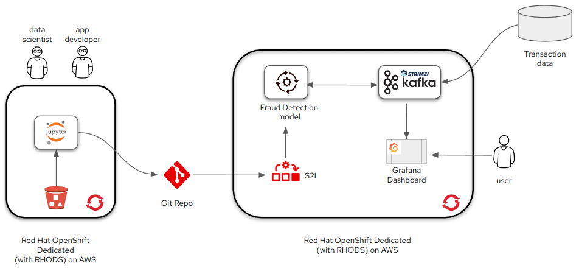

# Financial Fraud Detection

!!!info
    The full source and instructions for this demo are available in **[this repo](https://github.com/OpenShiftDemos/rhods-fraud-detection/){:target="_blank"}**

This demo shows how to use OpenShift Data Science to train and test a relatively simplistic fraud detection model. In exploring this content, you will become familiar with the OpenShift Data Science offering and common workflows to use with it.

