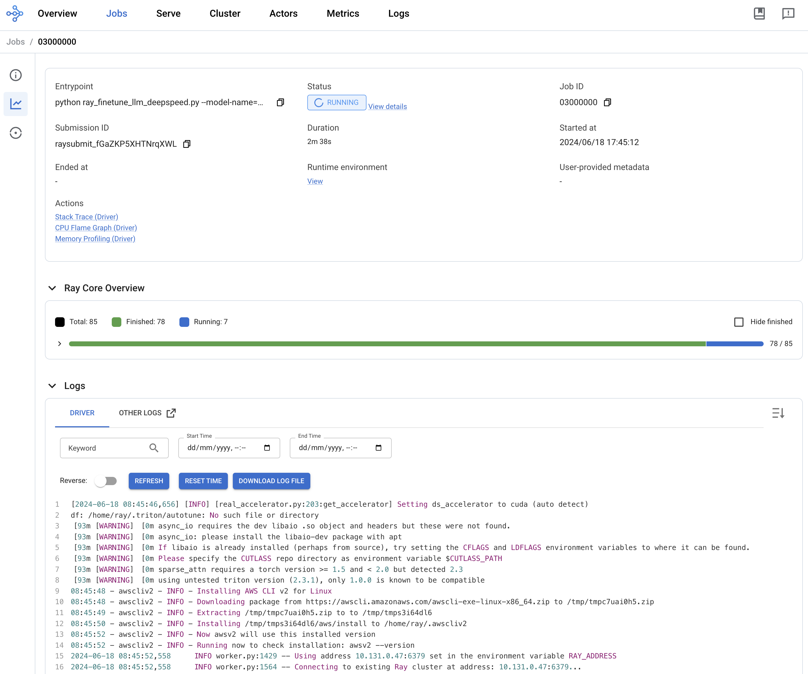

# Fine-Tune Llama 2 Models with Ray and DeepSpeed

In [this repo](https://github.com/opendatahub-io/distributed-workloads/tree/main/examples/ray-finetune-llm-deepspeed), you will find an example demonstrating how to **fine-tune** LLMs with **Ray** on **OpenShift AI**, using HF Transformers, Accelerate, PEFT (LoRA), and **DeepSpeed**, for Llama 2 models.

It adapts the Fine-tuning Llama-2 series models with Deepspeed, Accelerate, and Ray Train TorchTrainer[^1] example from the Ray project, so it runs using the Distributed Workloads stack, on OpenShift AI.

Overview of the Ray Dashboard during the fine-tuning:

Example of a visualization comparing experiments with different combinations of context length and batch size:

[^1]: [https://github.com/ray-project/ray/tree/master/doc/source/templates/04_finetuning_llms_with_deepspeed](https://github.com/ray-project/ray/tree/master/doc/source/templates/04_finetuning_llms_with_deepspeed)
