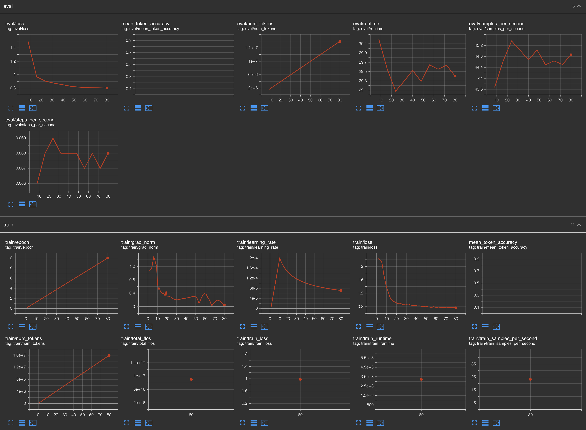

# Fine-Tune Llama Models with Kubeflow Training Operator

In [this repo](https://github.com/opendatahub-io/distributed-workloads/tree/main/examples/kfto-sft-llm), you will find an example showing how to **fine-tune** Large Language Models with the **Kubeflow Training Operator** on **OpenShift AI**. This example uses tools like HuggingFace SFTTrainer, PEFT (LoRA) and PyTorch FSDP, for Llama 3.1 and 3.3 models.
This approach is built for Kubernetes and provides a simple way to train large models across multiple GPUs (Nvidia & AMD)

Openshift AI workbench setup with all required components and shared storage:

TensorBoard dashboard showing successful model finetuning using NVIDIA GPUs:

TensorBoard dashboard showing successful model finetuning on AMD GPUs:

[^1]: [https://github.com/opendatahub-io/distributed-workloads/tree/main/examples/kfto-sft-llm]