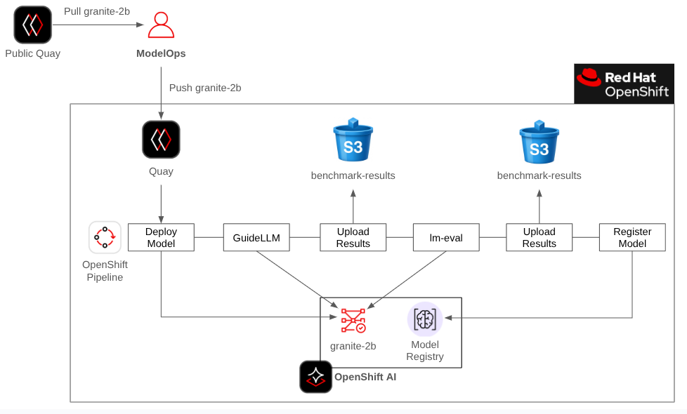
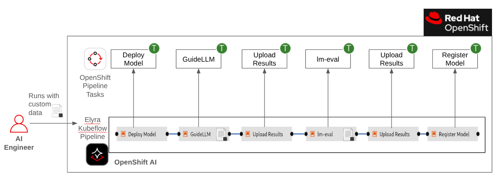

# Secure Model Ingestion and Evaluation with OpenShift AI

**The LLM Selection Problem**

As organizations rush to adopt AI they quickly find that LLMs are not created equal and model selection is not an easy task. Allowing developers to download and deploy any model they want is not sustainable. This creates massive security vulnerabilities, leads to resource waste, and provides no clear way to compare model capabilities for a given business problem.

**The Solution: A Two-Part ModelOps Strategy**

A successful enterprise AI strategy requires a formal process for managing the LLM lifecycle. This involves two key groups: a central ModelOps team and the AI Engineers building applications.

**Part 1: The ModelOps Team**

The ModelOps team acts as the gatekeeper. They are responsible for:

- Secure Ingestion: Creating an OpenShift pipeline to safely bring new models inside the organization's network.

- Baseline Validation: Before a model is made available for internal use, baseline benchmarks with GuideLLM and lm-eval harness should be run and published.

  - Infrastructure Performance (GuideLLM): How fast does this model run on our hardware?

  - General Accuracy (lm-eval): How does it score on standard academic evaluation datasets?

This process creates a central registry (OpenShift AI model registry) of approved models that gives teams a safe, documented starting point.

**Part 2: The AI Engineer**

AI Engineers can now browse the internal registry and use the baseline benchmarks to create a shortlist. However, a general-purpose benchmark doesn't guarantee performance for a specific use case.

Therefore, the AI Engineer's workflow becomes:

- Discovery: Find a promising model in the OpenShift AI model registry based on the ModelOps team's general benchmarks.

- Specific Evaluation: Run that model through an OpenShift AI pipeline using their own custom, use-case-specific data.

This final step is what provides the definitive answer, allowing the AI Engineer to confidently determine if a model's performance and accuracy are a true fit for their unique application.

**Personas**

The terms ModelOps and AI Engineer are used throughout this tutorial. Since these might not be well defined or dedicated roles in your organization we'll offer the following role mapping for this tutorial:

- ModelOps - In your organization this could be your IT operations team or DevOps team.
- AI Engineer - In your organization this could be an application developer or a data scientist.

**Learning Outcomes**

- Implement a Two-Part ModelOps Strategy: Clearly distinguish between the responsibilities of the ModelOps or IT Operations team and a consuming AI Engineer or Developer team.
- Understand how a central, trusted model registry acts as the hand-off between operations teams and application teams.
- Configure OpenShift AI model registry and AI pipelines. 
- In the ModelOps tutorial, deploy and run a GuideLLM and lm-eval harness OpenShift pipeline.
- In the AI Engineer tutorial, deploy and run a GuideLLM and lm-eval harness OpenShift AI Elyra pipeline that is compiled into a Kubeflow pipeline. 
- See how the benchmark results are stored in the OpenShift AI model registry to easily compare results based on default and custom datasets.   

**Pre-reqs**

- OpenShift is installed
- OpenShift AI is installed
- OpenShift AI is configured with a GPU
- This tutorial was test with OpenShift AI 2.25 and OpenShift 4.19

**Tutorials**

1. [ModelOps Tutorial](https://github.com/jhurlocker/modelops-benchmarking/blob/main/docs/modelops_tutorial.adoc#model-ops){:target="_blank"}  (est. 1 hour)
    - For the ModelOps role that covers part 1 of the solution presented above.

2. [AI Engineer Tutorial](https://github.com/jhurlocker/modelops-benchmarking/blob/main/docs/ai_engineer_tutorial.adoc#ai-engineer){:target="_blank"} (est. 30 minutes)
    - For the AI Engineer role that covers part 2 of the solution presented above.

    <b>NOTE</b>: The ModelOps tutorial must be completed before you can start the AI Engineer tutorial.

**Special Thanks**

Parts of this tutorial builds on or reuses some of the awesome work that [Taylor Smith](https://github.com/taylorjordanNC){:target="_blank"} and [Roberto Carratalá](https://github.com/rcarrata) have created. 