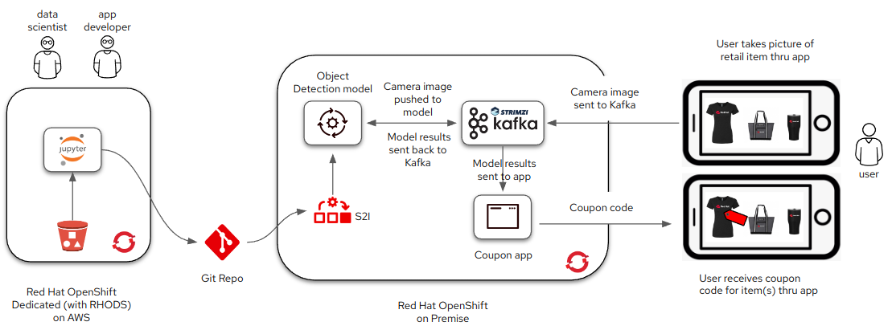
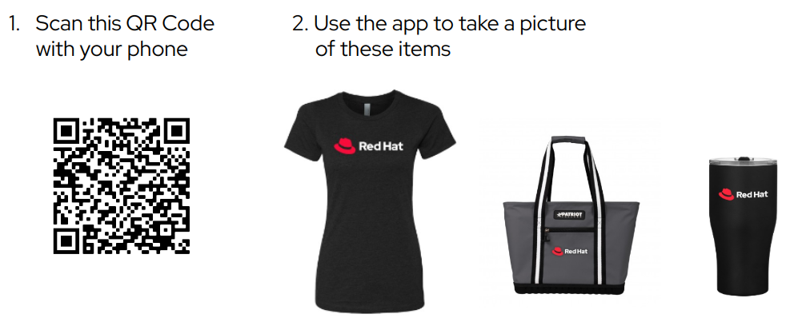
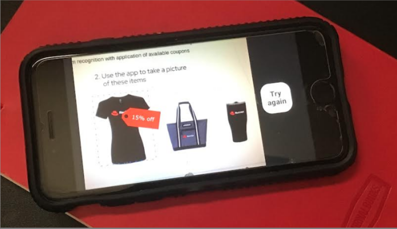

# Object Detection in Retail

!!!info
    The full source and instructions for this demo are available in **[this repo](https://github.com/rh-aiservices-bu/object-detection-app){:target="_blank"}**

In this demo, you can see how to build an intelligent application that gives a customer the ability to find merchandise discounts, for shirts, as they browse clothing in a department store.

You can [download](ODSC-East-2022-MLOps-GitOps_Pipelines.pdf){:target="_blank"} the related presentation.

