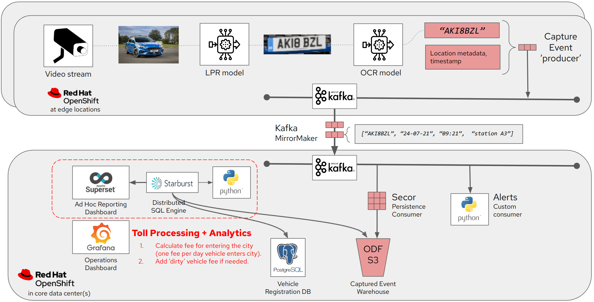
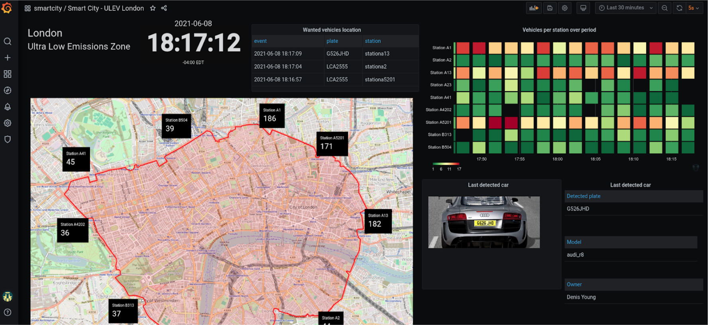

# Smart City, an Edge-to-Core Data Story

!!!info
    The full source and instructions for this demo are available in **[this repo](https://github.com/red-hat-data-services/jumpstart-library/tree/main/demo2-smart-city){:target="_blank"}**

In this demo, we show how to implement this scenario:

- Using a trained ML model, licence plates are recognized at toll location.
- Data (plate number, location, timestamp) is send from toll locations (edge) to the core using Kafka mirroring to handle communication issues and recovery.
- Incoming data is screened real-time to trigger alerts for wanted vehicles (Amber Alert).
- Data is aggregated and stored into object storage.
- A central database contains other information coming from licence registry system: car model, color,…​
- Data analysis leveraging Presto and Superset is done against stored data.

This demo is showcased in [this video](https://www.youtube.com/watch?v=2CZYSLOaVQI){:target="_blank"}.

