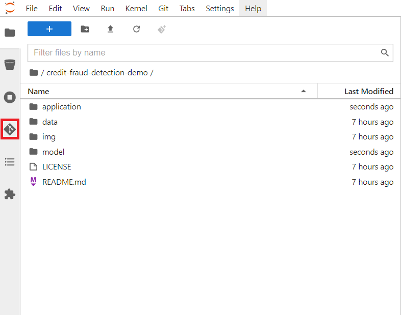

# Telecom Customer Churn using Airflow and Red Hat OpenShift Data Science

!!!info
    The full source and instructions for this demo are available in **[this repo](https://github.com/red-hat-data-services/telecom-customer-churn-airflow){:target="_blank"}**

## Demo description

The goal of this demo is to demonstrate how RHODS and Airflow can be used together to build an easy-to-manage pipeline.  
To do that, we will show how to deploy an airflow pipeline, both using a DAG script and with Elyra.  
In the end, you will have a pipeline that:

- Pulls data from S3
- Trains two different models
- Evaluates which model is best
- Pushes that model to S3

The models we build are used to predict customer churn for a Telecom company using structured data. The data contains fields such as: If they are a senior citizen, if they are a partner, their tenure, etc.

## Deploying the demo

### Pre-requisites

- Have [Airflow](/tools-and-applications/airflow/airflow/) running in a cluster and point Airflow to this GitHub: [https://github.com/red-hat-data-services/telecom-customer-churn-airflow](https://github.com/red-hat-data-services/telecom-customer-churn-airflow)
- Have access to some S3 storage (ODF or Minio for example) and upload this CSV file into a bucket: [https://github.com/red-hat-data-services/telecom-customer-churn-airflow/tree/main/include/data](https://github.com/red-hat-data-services/telecom-customer-churn-airflow/tree/main/include/data){:target="_blank"}
- Have [Red Hat OpenShift Data Science](/getting-started/openshift-data-science/) (RHODS) running in a cluster. Make sure you have admin access in RHODS
!!! note
    Note: You can use [Open Data Hub](/getting-started/opendatahub/) instead of RHODS, but some instructions and screenshots may not apply

### 1: Add Elyra as a Custom Notebook Image

!!!note
    Note: You can skip this step if you are not going to use Elyra

Start by opening up RHODS by clicking on the 9-square symbol in the top menu and choosing "Red Hat OpenShift Data Science".

Then go to Settings -> Notebook Images and press "Import new image".  
If you can't see Settings then you are lacking sufficient access, ask your admin to add this image instead.

Under Repository enter: `quay.io/thoth-station/s2i-lab-elyra:v0.2.1` and then name it to something like `Elyra`.

### 2: Create a RHODS workbench

A workbench in RHODS lets us spin up and down notebooks as needed and bundle them under Projects, which is a great way to get easy access to compute resources and keep track of your work.  
Start by creating a new Data Science project (see image). I'm calling my project 'Telecom Customer Churn', feel free to call yours something different but be aware that some things further down in the demo may change.

After the project has been created, create a workbench where we can run Jupyter.
There are a few important settings here that we need to set:

- **Name:** Customer Churn
- **Notebook Image:** Elyra
- **Deployment Size:** Small

Press Create Workbench and wait for it to start - status should say "Running" and you should be able to press the Open link.

Open the workbench and login if needed.

### 3: Load a Git repository

When inside the workbench (Jupyter), we are going to clone a GitHub repository that contains everything we need to build our DAG.  
You can clone the GitHub repository by pressing the GitHub button in the left side menu (see image), then select "Clone a Repository" and enter this GitHub URL: [https://github.com/red-hat-data-services/telecom-customer-churn-airflow](https://github.com/red-hat-data-services/telecom-customer-churn-airflow){:target="_blank"}

### 4.1: Create the DAG with Elyra

First, we need to configure Elyra to talk with our Airflow instance.  
Start by opening 

Define these variables:

- Apache Airflow UI Endpoint: https://airflow-airflow.apps.pilot.j61u.p1.openshiftapps.com
- GitHub or GitLab server API Endpoint: https://api.github.com
- GitHub or GitLab DAG Repository: red-hat-data-services/telecom-customer-churn-airflow
- Personal Access Token: Git token

- Cloud Object Storage Endpoint: https://rlundber-test.s3.us-east-1.amazonaws.com
- Cloud Object Storage Bucket Name: rlundber-test
- Cloud Object Storage Username: s3_rlundber-test_rw

Now that we have a runtime and runtime image defined we can build and run the workflow.  
Open up `train_and_compare_models.pipeline` and take a look at the workflow.  
We can see how we first pull and process the data, then we run two models on the processed data. After they both have run we compare which one performed best (based on accuracy) and finally we push the winner to somewhere - in this case to our S3 bucket.

Press Run to start the pipeline:

You can now go to the Airflow console to see the progress.  
You find the route to the Airflow console through this command: 

### 4.2: Use an Airflow DAG file

Instead of building a pipeline through notebooks in Elyra, we can of course use an Airflow DAG.  
You can then develop methods in RHODS notebooks and the pull them together in a DAG file.  
This is a more segmented way for a Data Scientist to work than with Elyra, but still very possible within OpenShift.  

Go to notebook interface in RHODS and open `train_and_compare_models.py`, this contains the DAG description which runs a similar workflow to what we just did.  
Highlights:
- something

Now, go to the Airflow UI and you will see a dag called `train_and_compare_models`. Open it and press the Graph tab.  

As you can see, it's a similar pipeline to what we just built with Elyra.  
To run this pipeline, activate the DAG:

### 5: See the results

Then go to the ??? view and we can see that the run has been completed.  
If you press on the icon, you can view details about the run, such as the logs.

!!!hint
    Hint: Instead of pushing to an S3 bucket, you can push to [MLFlow](/tools-and-applications/mlflow/mlflow), or deploy it into some application, like in the [Credit Card Fraud Demo](/demos/credit-card-fraud-detection-mlflow/credit-card-fraud)