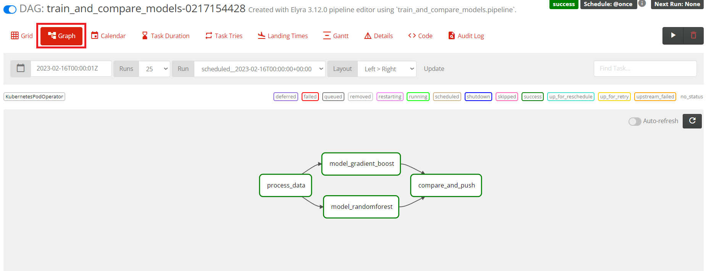
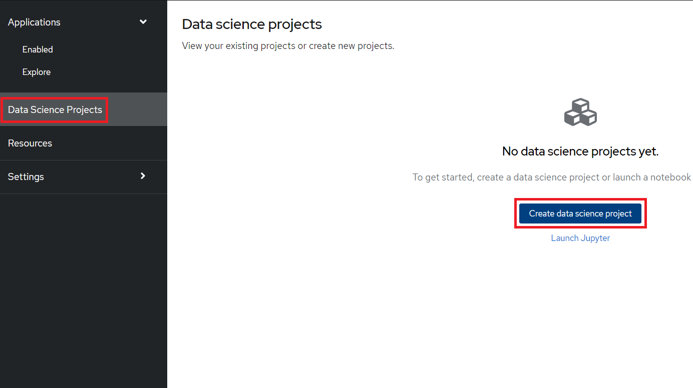
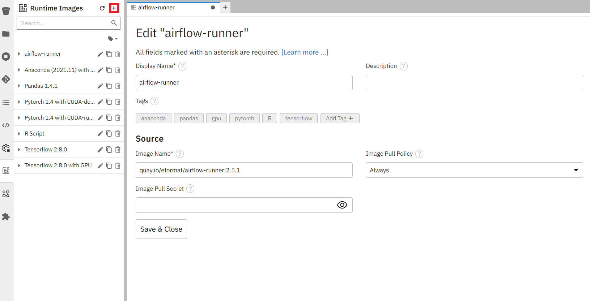

# Telecom Customer Churn using Airflow and Red Hat OpenShift Data Science

!!!info
    The full source and instructions for this demo are available in **[this repo](https://github.com/red-hat-data-services/telecom-customer-churn-airflow){:target="_blank"}**

## Demo description

The goal of this demo is to demonstrate how Red Hat OpenShift Data Science (RHODS) and Airflow can be used together to build an easy-to-manage pipeline.  
To do that, we will show how to deploy an airflow pipeline, both using a DAG script and with Elyra.  
In the end, you will have a pipeline that:

- Loads some data
- Trains two different models
- Evaluates which model is best
- Saves that model

The models we build are used to predict customer churn for a Telecom company using structured data. The data contains fields such as: If they are a senior citizen, if they are a partner, their tenure, etc.

## Deploying the demo

### Pre-requisites

- Clone this git repository into a GitHub or GitLab (the demo shows step for GitHub, but either work) repo: [https://github.com/red-hat-data-services/telecom-customer-churn-airflow](https://github.com/red-hat-data-services/telecom-customer-churn-airflow)
- Have [Airflow](/tools-and-applications/airflow/airflow/) running in a cluster and point Airflow to the cloned git repository.
- Have access to some S3 storage (this guide uses ODF with a bucket created in the namespace "airflow") and upload this CSV file into a bucket: [https://github.com/red-hat-data-services/telecom-customer-churn-airflow/tree/main/include/data](https://github.com/red-hat-data-services/telecom-customer-churn-airflow/tree/main/include/data){:target="_blank"}
- Have [Red Hat OpenShift Data Science](/getting-started/openshift-data-science/) (RHODS) running in a cluster. Make sure you have admin access in RHODS
!!! note
    Note: You can use [Open Data Hub](/getting-started/opendatahub/) instead of RHODS, but some instructions and screenshots may not apply

### 1: Open up Airflow and get familiar with the UI

You find the route to the Airflow console through this command: `oc get route -n airflow`


Enter it in the browser and you will see something like this:


The already existing DAG (`CustomerChurnModel`) is a pre-created version of what we will build using Elyra. We will run it as an optional section at the end of this demo.  
The columns for that DAG indicate when it will run and shows what runs it has done and if they have been successful.  

If you press on the DAG you will get another view with more information. The most commonly used is the Graph view where you can see how the DAG is built and the progress of each node when running the DAG:



### 2: Add Elyra as a Custom Notebook Image

It's possible to build pipelines by creating an Airflow DAG script in python. Another, arguably simpler, method is to use Elyra to visually build out the pipeline and then submit it to Airflow.  
Most of this demo is going to be revolving around using Elyra together with Airflow, but at the very end there will be a bonus section for how to use Airflow independently.

To get access to Elyra, we will simply import it as a custom notebook image.  
Start by opening up RHODS by clicking on the 9-square symbol in the top menu and choosing "Red Hat OpenShift Data Science".


Then go to Settings -> Notebook Images and press "Import new image".  
If you can't see Settings then you are lacking sufficient access. Ask your admin to add this image instead.


Under Repository enter: `quay.io/thoth-station/s2i-lab-elyra:v0.2.1` and then name it to something like `Elyra`.

### 3: Create a RHODS workbench

A workbench in RHODS lets us spin up and down notebooks as needed and bundle them under Projects, which is a great way to get easy access to compute resources and keep track of your work.  
Start by creating a new Data Science project (see image). I'm calling my project 'Telecom Customer Churn', feel free to call yours something different but be aware that some things further down in the demo may change.



After the project has been created, create a workbench where we can run Jupyter.
There are a few important settings here that we need to set:

- **Name:** Customer Churn
- **Notebook Image:** Elyra
- **Deployment Size:** Small


Press Create Workbench and wait for it to start - status should say "Running" and you should be able to press the Open link.


Open the workbench and login if needed.

### 4: Load a Git repository

When inside the workbench (Jupyter), we are going to clone a GitHub repository that contains everything we need to build our DAG.  
You can clone the GitHub repository by pressing the GitHub button in the left side menu (see image), then select "Clone a Repository" and enter this GitHub URL: [https://github.com/red-hat-data-services/telecom-customer-churn-airflow](https://github.com/red-hat-data-services/telecom-customer-churn-airflow){:target="_blank"}


The files we will use are inside the `include/notebooks` folder, there should be 4 in total.  
They all run standard Python code, which is the beauty of Airflow combined with Elyra. There is no need to worry about additional syntax.

### 5: Configure Elyra to work with Airflow

First, we need to configure Elyra to talk with our Airflow instance.  
There will be two ways to configure this, either visually or through the terminal.  
If you want to do it through the terminal, then open the terminal like this:


#### 5.1 Create a Runtime Image

We will start by configuring a Runtime Image, this is the image we will use to run each node in our pipeline.  
Open Runtime Images on the left-hand side of the screen.  


##### 5.1.1 Create the Runtime Image visually

Press the plus icon next to the Runtime Images title to start creating a new Runtime Image.  
There are only three fields we need to worry about here:



- **Display name:** airflow-runner
- **Image Name:** image-registry.openshift-image-registry.svc:5000/rainforest-ci-cd/airflow-runner:2.3.2
- **Image Pull Policy:** Always

##### 5.1.2 Create the Runtime Image via the terminal

Execute this in the terminal:

```bash
mkdir -p ~/.local/share/jupyter/metadata/runtime-images/
cat << EOF > ~/.local/share/jupyter/metadata/runtime-images/airflow-runner.json
{
  "display_name": "airflow-runner",
  "metadata": {
    "tags": [],
    "display_name": "airflow-runner",
    "image_name": "image-registry.openshift-image-registry.svc:5000/rainforest-ci-cd/airflow-runner:2.3.2",
    "pull_policy": "Always"
  },
  "schema_name": "runtime-image"
}
EOF
```

Refresh and you should see `airflow-runner` appear in the Runtime Images.

#### 5.2 Create a Runtime

Now we just need a Runtime configuration, which is what Elyra will use to save the DAG (a .pipeline is saved in your Git repository while ), connect to Airflow and run the pipeline.  
Just like with the Runtime image, we can configure this visually or via the terminal as well.

Open Runtimes on the left-hand side of the screen.  


##### 5.2.1 Configure the Runtime visually

Just like before, press the plus icon next to the title and enter these fields:


General settings:

- **Display Name:** airflow

Airflow settings:

- **Apache Airflow UI Endpoint:** run `oc get route -n airflow` to get the route, like in step ???
- **Apache Airflow User Namespace:** airflow

Github/GitLabs settings:

- **Git type:** GITHUB or GITLAB, depending on where you stored the repository
- **GitHub or GitLab server API Endpoint:** https://api.github.com or your GitLab endpoint
- **GitHub or GitLab DAG Repository:** Your repository (`red-hat-data-services/telecom-customer-churn-airflow` in my case)
- **GitHub or GitLab DAG Repository Branch:** Your branch (`main` in my case)
- **Personal Access Token:** A personal access token for pushing to the repository

Cloud Object Storage settings:  
These completely depend on where and how you set up your S3 storage. If you created a bucket from ODF then it will look similar to this:

- **Cloud Object Storage Endpoint:** http://s3.openshift-storage.svc
- **Cloud Object Storage Bucket Name:** airflow-storage-729b10d1-f44d-451d-badb-fbd140418763
- **Cloud Object Storage Authentication Type:** KUBERNETES_SECRET
- **Cloud Object Storage Credentials Secret:** s3-auth
- **Cloud Object Storage Username:** your AWS_ACCESS_KEY_ID
- **Cloud Object Storage Password:** your AWS_SECRET_ACCESS_KEY

##### 5.2.2 Configure the Runtime via the terminal

Execute this in the terminal and replace any variables with their values (see the [visual section](#421-configure-the-runtime-visually) for hints):

``` bash
mkdir -p ~/.local/share/jupyter/metadata/runtimes
cat << EOF >  ~/.local/share/jupyter/metadata/runtimes/airflow.json
{
  "display_name": "airflow",
  "metadata": {
     "tags": [],
     "display_name": "airflow",
     "user_namespace": "airflow",
     "git_type": "GITHUB",
     "github_api_endpoint": "https://${GIT_SERVER}",
     "api_endpoint": "${AIRFLOW_ROUTE}",
     "github_repo": "${GIT_REPO}",
     "github_branch": "main",
     "github_repo_token": "${GIT_TOKEN}",
     "cos_auth_type": "KUBERNETES_SECRET",
     "cos_endpoint": "${STORAGE_ENDPOINT}",
     "cos_bucket": "${STORAGE_BUCKET}",
     "cos_secret": "s3-auth",
     "cos_username": "${AWS_ACCESS_KEY_ID}",
     "cos_password": "${AWS_SECRET_ACCESS_KEY}",
     "runtime_type": "APACHE_AIRFLOW"
  },
  "schema_name": "airflow"
}
EOF

```

Refresh and you should see `airflow` appear in the Runtimes.

### 6. Create a DAG with Elyra

Now that we have a runtime and runtime image defined we can build and run the workflow.  
Open up `train_and_compare_models.pipeline` and take a look at the workflow.  
We can see how we first pull and process the data, then we run two models on the processed data. After they both have run we compare which one performed best (based on accuracy) and finally we push the winner to somewhere - in this case to our S3 bucket.

Press Run to start the pipeline:


You can now go to the Airflow UI to see the progress. If you have close the tab then refer to [section 1](#1-open-up-airflow).

In Airflow you will see a dag called `Elyra_train_and_compare_models`. Click on it and go open the Graph tab.


Then click on the latest run to see the results:


We can now also confirm that the trained model was saved in our S3 bucket:


!!!hint
    Hint: Instead of pushing to an S3 bucket, you can push to [MLFlow](/tools-and-applications/mlflow/mlflow), or deploy it into some application, like in the [Credit Card Fraud Demo](/demos/credit-card-fraud-detection-mlflow/credit-card-fraud)

And that's how you can use Airflow together with RHODS to create a pipeline.  
The last section showcases how you can use Airflow without Elyra as an alternative.

### Bonus section: Use an Airflow DAG file

Instead of building a pipeline through notebooks in Elyra, we can of course use an Airflow DAG.  
You can then develop methods in RHODS notebooks and then pull them together in a DAG file.  
This is a more segmented way for a Data Scientist to work than with Elyra, but still very possible within OpenShift.  

Go to notebook interface in RHODS and open `train_and_compare_models.py`, this contains the DAG description which runs a similar workflow to what we just did.  
Highlights:
- something

Now, go to the Airflow UI and you will see a dag called `train_and_compare_models`. Open it and press the Graph tab.  


As you can see, it's a similar pipeline to what we just built with Elyra.  
To run this pipeline, activate the DAG:
