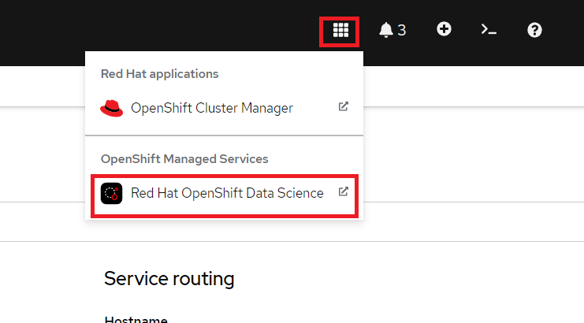

# Telecom Customer Churn using Airflow and Red Hat OpenShift Data Science

!!!info
    The full source and instructions for this demo are available in **[this repo](https://github.com/red-hat-data-services/telecom-customer-churn-airflow){:target="_blank"}**

## Demo description

The goal of this demo is to demonstrate how Red Hat OpenShift Data Science (RHODS) and Airflow can be used together to build an easy-to-manage pipeline.  
To do that, we will show how to build and deploy an airflow pipeline, mainly with Elyra but also some tips if you want to build it manually.  
In the end, you will have a pipeline that:

- Loads some data
- Trains two different models
- Evaluates which model is best
- Saves that model to S3

!!!hint
    You can expand on this demo by loading the pushed model into [MLFlow](/tools-and-applications/mlflow/mlflow), or automatically deploying it into some application, like in the [Credit Card Fraud Demo](/demos/credit-card-fraud-detection-mlflow/credit-card-fraud)

The models we build are used to predict customer churn for a Telecom company using structured data. The data contains fields such as: If they are a senior citizen, if they are a partner, their tenure, etc.

## Deploying the demo

### Pre-requisites

- Fork this git repository into a GitHub or GitLab repo (the demo shows steps for GitHub, but either works): [https://github.com/red-hat-data-services/telecom-customer-churn-airflow](https://github.com/red-hat-data-services/telecom-customer-churn-airflow)
- Have [Airflow](/tools-and-applications/airflow/airflow/) running in a cluster and point Airflow to the cloned git repository.
- Have access to some S3 storage (this guide uses ODF with a bucket created in the namespace "airflow").
- Have [Red Hat OpenShift Data Science](/getting-started/openshift-data-science/) (RHODS) running in a cluster. Make sure you have admin access in RHODS, or know someone who does.

!!! note
    Note: You can use [Open Data Hub](/getting-started/opendatahub/) instead of RHODS, but some instructions and screenshots may not apply

### 1: Open up Airflow

You find the route to the Airflow console through this command: `oc get route -n airflow`


Enter it in the browser and you will see something like this:


Keep that open in a tab as we will come back to Airflow later on.

### 2: Add Elyra as a Custom Notebook Image

It's possible to build pipelines by creating an Airflow DAG script in python. Another, arguably simpler, method is to use Elyra to visually build out the pipeline and then submit it to Airflow.  
Most of this demo is going to be revolving around using Elyra together with Airflow, but at the very end, there will be a bonus section for how to use Airflow independently.

To get access to Elyra, we will simply import it as a custom notebook image.  
Start by opening up RHODS by clicking on the 9-square symbol in the top menu and choosing "Red Hat OpenShift Data Science".



Then go to Settings -> Notebook Images and press "Import new image".  
If you can't see Settings then you are lacking sufficient access. Ask your admin to add this image instead.


Under Repository enter: `quay.io/eformat/elyra-base:0.2.1` and then name it something like `Elyra`.

### 3: Create a RHODS workbench

A workbench in RHODS lets us spin up and down notebooks as needed and bundle them under Projects, which is a great way to get easy access to compute resources and keep track of your work.  
Start by creating a new Data Science project (see image). I'm calling my project 'Telecom Customer Churn', feel free to call yours something different but be aware that some things further down in the demo may change.


After the project has been created, create a workbench where we can run Jupyter.
There are a few important settings here that we need to set:

- **Name:** Customer Churn
- **Notebook Image:** Elyra
- **Deployment Size:** Small
- **Environment Variables:** Secret -> AWS with your AWS details


Press Create Workbench and wait for it to start - status should say "Running" and you should be able to press the Open link.


Open the workbench and login if needed.

### 4: Load a Git repository

When inside the workbench (Jupyter), we are going to clone a GitHub repository that contains everything we need to build our DAG.  
You can clone the GitHub repository by pressing the GitHub button in the left side menu (see image), then select "Clone a Repository" and enter your GitHub URL (Your **forked** version of this: [https://github.com/red-hat-data-services/telecom-customer-churn-airflow](https://github.com/red-hat-data-services/telecom-customer-churn-airflow){:target="_blank"})


The notebooks we will use are inside the `include/notebooks` folder, there should be 5 in total, 4 for building the pipeline and 1 for verifying that everything worked.  
They all run standard Python code, which is the beauty of Airflow combined with Elyra. There is no need to worry about additional syntax.

### 5: Configure Elyra to work with Airflow

Before we can build and run any DAGs through Elyra, we first need to configure Elyra to talk with our Airflow instance.  
There will be **two** ways to configure this, either visually **or** through the terminal. Chose one for each section.  
If you want to do it through the terminal, then open the terminal like this:


#### 5.1 Create a Runtime Image

We will start by configuring a Runtime Image, this is the image we will use to run each node in our pipeline.  
Open Runtime Images on the left-hand side of the screen.  


##### 5.1.1 Create the Runtime Image visually

Press the plus icon next to the Runtime Images title to start creating a new Runtime Image.  
There are only three fields we need to worry about here:

- **Display name:** `airflow-runner`
- **Image Name:** `quay.io/eformat/airflow-runner:2.5.1`
- **Image Pull Policy:** Always


##### 5.1.2 Create the Runtime Image via the terminal

Execute this in the terminal:

```bash
mkdir -p ~/.local/share/jupyter/metadata/runtime-images/
cat << EOF > ~/.local/share/jupyter/metadata/runtime-images/airflow-runner.json
{
  "display_name": "airflow-runner",
  "metadata": {
    "tags": [],
    "display_name": "airflow-runner",
    "image_name": "quay.io/eformat/airflow-runner:2.5.1",
    "pull_policy": "Always"
  },
  "schema_name": "runtime-image"
}
EOF
```

Refresh and you should see `airflow-runner` appear in the Runtime Images.

#### 5.2 Create a Runtime

Now we just need a Runtime configuration, which is what Elyra will use to save the DAG (in our Git repo), connect to Airflow and run the pipeline.  
Just like with the Runtime image, we can configure this visually **or** via the terminal.

Open Runtimes on the left-hand side of the screen.  


##### 5.2.1 Configure the Runtime visually

Press the plus icon next to the title, select "New Apache Airflow runtime configuration" and enter these fields:


General settings:

- **Display Name:** `airflow`

Airflow settings:

- **Apache Airflow UI Endpoint:** run `oc get route -n airflow` to get the route
- **Apache Airflow User Namespace:** `airflow`

Github/GitLabs settings:

- **Git type:** GITHUB or GITLAB, depending on where you stored the repository
- **GitHub or GitLab server API Endpoint:** `https://api.github.com` or your GitLab endpoint
- **GitHub or GitLab DAG Repository:** Your repository (`red-hat-data-services/telecom-customer-churn-airflow` in my case)
- **GitHub or GitLab DAG Repository Branch:** Your branch (`main` in my case)
- **Personal Access Token:** A personal access token for pushing to the repository

Cloud Object Storage settings:  
These completely depend on where and how you set up your S3 storage. If you created a bucket from ODF then it will look similar to this:

- **Cloud Object Storage Endpoint:** `http://s3.openshift-storage.svc`
- **Cloud Object Storage Bucket Name:** The name of your bucket (`airflow-storage-729b10d1-f44d-451d-badb-fbd140418763` in my case)
- **Cloud Object Storage Authentication Type:** KUBERNETES_SECRET
- **Cloud Object Storage Credentials Secret:** The name of your secret containing the access and secret key is (in my case it was `airflow-storage`, which is the name I gave the Object Bucket Claim)
- **Cloud Object Storage Username:** your AWS_ACCESS_KEY_ID
- **Cloud Object Storage Password:** your AWS_SECRET_ACCESS_KEY

##### 5.2.2 Configure the Runtime via the terminal

If you prefer doing this through the terminal, then execute this in the terminal and replace any variables with their values (see the [visual section](#521-configure-the-runtime-visually) for hints):

``` bash
mkdir -p ~/.local/share/jupyter/metadata/runtimes
cat << EOF >  ~/.local/share/jupyter/metadata/runtimes/airflow.json
{
  "display_name": "airflow",
  "metadata": {
     "tags": [],
     "display_name": "airflow",
     "user_namespace": "airflow",
     "git_type": "GITHUB",
     "github_api_endpoint": "https://${GIT_SERVER}",
     "api_endpoint": "${AIRFLOW_ROUTE}",
     "github_repo": "${GIT_REPO}",
     "github_branch": "main",
     "github_repo_token": "${GIT_TOKEN}",
     "cos_auth_type": "KUBERNETES_SECRET",
     "cos_endpoint": "${STORAGE_ENDPOINT}",
     "cos_bucket": "${STORAGE_BUCKET}",
     "cos_secret": "airflow-storage" - the name of your secret,
     "cos_username": "${AWS_ACCESS_KEY_ID}",
     "cos_password": "${AWS_SECRET_ACCESS_KEY}",
     "runtime_type": "APACHE_AIRFLOW"
  },
  "schema_name": "airflow"
}
EOF

```

Refresh and you should see `airflow` appear in the Runtimes.

### 6. Create a DAG with Elyra

Now that we have a runtime and runtime image defined, we can build and run the pipeline.  
You can also find this pipeline in `/dags/train_and_compare_models.pipeline` if you prefer to just open an existing one.  

To start creating a new pipeline, open up the launcher (click on the plus next to a notebook tab if you don't have it open), and press the "Apache Airflow Pipeline Editor".  


Now drag the Notebooks in the correct order and connect them up with each other.
You can find the Notebooks in `/included/notebooks` and the correct order is:  
process_data -> model_gradient_boost & model_randomforest -> compare_and_push.  
These are their functions:

- **process_data.ipynb:** Downloads data from GitHub that we will use to train the models. Then processes it, splits it into training and testing partitions and finally pushes it to S3.
- **model_gradient_boost.ipynb:** Fetches the processed data from S3 and uses it to train the model and evaluate it to get a test accuracy. Then pushes the model and the accompanying accuracy to S3.
- **model_randomforest.ipynb:** Fetches the processed data from S3 and uses it to train the model and evaluate it to get a test accuracy. Then pushes the model and the accompanying accuracy to S3.
- **compare_and_push.ipynb:** Downloads the models and their accuracies from S3, does a simple compare on which performs better, and pushes that model under the name "best_model" to S3.


After the notebooks are added, we need to go through each of them and change their Runtime Images to `airflow-runner` that we created earlier.


We also need to set some environment variables so that the airflow nodes get access to the bucket name and endpoint when running, without hard-coding it in the notebooks.  
These details are already added to the Airflow Runtime we set up before, but when running it only passes along the Kubernetes secret which contains AWS_ACCESS_KEY_ID and AWS_SECRET_ACCESS_KEY.  

Add these two environment variables (both should be the same as you entered in [section 5.2](#52-create-a-runtime)):

- Endpoint:
    - Name: AWS_S3_ENDPOINT
    - Value: `http://s3.openshift-storage.svc` (or similar endpoint address)
- Bucket name:
    - Name: AWS_S3_BUCKET
    - Value: The name of your bucket (`airflow-storage-729b10d1-f44d-451d-badb-fbd140418763` in my case)


Press Run to start the pipeline:


You can now go to the Airflow UI to see the progress. If you have closed the tab then refer to [section 1](#1-open-up-airflow).

In Airflow you will see a dag called `train_and_compare_models` with some numbers behind it. Click on it and go open the Graph tab.  


If all are dark green that means that the run has completed successfully.

We can now also confirm that the trained model was saved in our bucket by going back to the RHODS notebook and running the notebook `test_airflow_success.ipynb`.  
If all went well it should print the model, its type and its accuracy.


And that's how you can use Airflow together with RHODS to create a pipeline!

### Bonus section: Use an Airflow DAG file

Instead of building a pipeline through notebooks in Elyra, we can of course build and use an Airflow DAG.  
You can develop individual methods (data processing, mode training, etc) in RHODS notebooks and then pull them all together in a DAG python file.  
This is a more segmented way for a Data Scientist to work than with Elyra, but still very possible within OpenShift and provides some more flexibility.  

I have created a simple `test_dag.py` just to show what it can look like. You can find it in the `/dags` folder.  
Then it's up to you what operators you want to run, which secrets you want to load, etc.  
For inspiration, you can open up the automatically created Elyra DAG we just ran. To do that, go into the DAG and press Code:


Some notes if you wish to manually build a similar DAG:

- Make sure to add the environment variables
- Don't hardcode secrets into the DAG, but rather reference a Kubernetes secret. For example:

``` python
secrets=[
        Secret("env", "AWS_ACCESS_KEY_ID", "airflow-storage", "AWS_ACCESS_KEY_ID"),
        Secret(
            "env", "AWS_SECRET_ACCESS_KEY", "airflow-storage", "AWS_SECRET_ACCESS_KEY"
        ),
    ]
```

- The image that is being used for the KubernetesPodOperator is `quay.io/eformat/airflow-runner:2.5.1`
- If you want to run notebooks manually, look at the [Papermill Operator](https://airflow.apache.org/docs/apache-airflow-providers-papermill/stable/operators.html)
