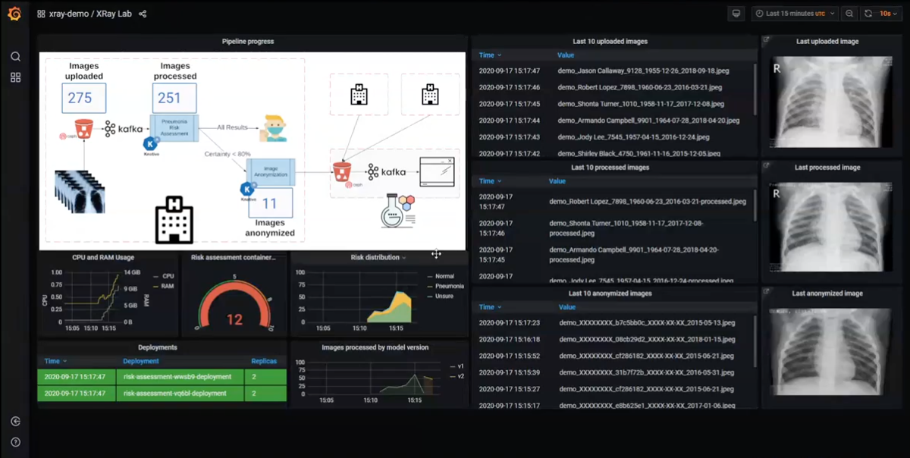

# XRay Analysis Automated Pipeline

!!!info
    The full source and instructions for this demo are available in **[this repo](https://github.com/red-hat-data-services/jumpstart-library/tree/main/demo1-xray-pipeline){:target="_blank"}**

In this demo, we implement an automated data pipeline for chest Xray analysis:

- Ingest chest Xrays into an object store based on Ceph.
- The Object store sends notifications to a Kafka topic.
- A KNative Eventing Listener to the topic triggers a KNative Serving function.
- An ML-trained model running in a container makes a risk of Pneumonia assessment for incoming images.
- A Grafana dashboard displays the pipeline in real time, along with images incoming, processed and anonymized, as well as full metrics.

This pipeline is showcased in [this video](https://www.youtube.com/watch?v=zja83FVsm14){:target="_blank"} (slides are also [here](https://github.com/red-hat-data-services/jumpstart-library/blob/main/demo1-xray-pipeline/docs/Commons_Data_Science_Pipelines.pdf){:target="_blank"}).

