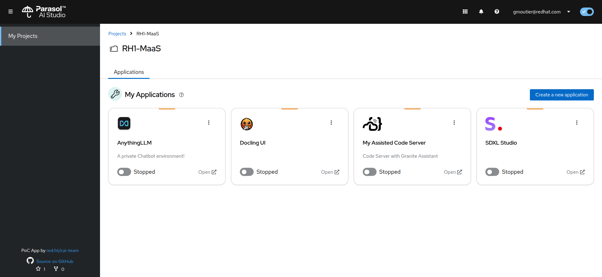
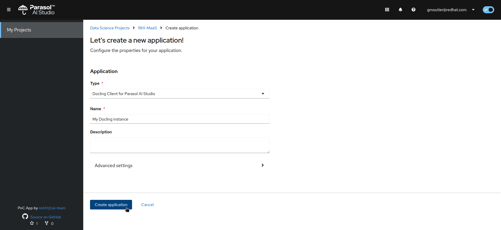

# Making AI Accessible to Everyone: What We Learned

If you are a **Data Scientist**, training or fine-tuning models is now easier than it was not so long ago. There are tools, libraries, frameworks, tons of documentation and examples available to help. Of course you still have some long and hard work to do, but you are not alone. Not totally...

It's also true for **ML Engineers**. It's not as hard as it used to be to serve models, with the benefits of modern platforms: scalability, security,... And if you're the wisest, you've automated everything to make it easier.

If you are a **Developer**, well, we're almost there. Most of the times, those models are now available as API endpoints. You may not know exactly what to put for the parameters, but you're learning (fast!). And at least it's your world, you don't have to learn any Python to be able to develop your application! Some patterns, like [Models-as-a-Service](https://github.com/rh-aiservices-bu/models-aas), make it even easier to discover, register to, and consume the models you need.

But what if you are a **"Normal User"**? Who obviously does not know how to train or serve a model, but neither how to use an API Gateway Portal, what an authentication token is, or a context window,... Isn't it frustrating to be able to use AI daily in your personal/consumer world, but not inside your organization?

In this Proof of Concept, we will show you how the Parasol company their employees with easy access to Private AI!

## Some background

Parasol is a fictitious company that has been modernizing its applications and work environment for some time now, trying to take advantage from AI wherever it can.

After having implemented OpenShift AI for its data scientists and ML engineers, served and used models in its own applications, Parasol went a step further and implemented a "models-as-service infrastructure". The goal was to enable people with "self-service AI". Basically, they put the 3Scale API Gateway in front of OpenShift AI, following this architecture:

This instantly enabled their developers, who are now able to use the self-service portal to get API keys and consume the models. They would also have access to statistics and other API-related tools, while admin keep a constant overview and control on who is consuming what.

However, Parasol felt it was not enough. So they went one step further.

## Parasol AI Studio

At its heart, Parasol AI Studio is a spin on the OpenShift AI dashboard, heavily simplifying it. The goal is to make it as easy as possible for anyone to quickly instantiate and use AI-enabled applications without having to know anything about AI, models, APIs,...

Currently available applications (which behind the scene are in fact OpenShift AI custom Workbenches) are:

- [AnythingLLM](https://github.com/rh-aiservices-bu/llm-on-openshift/tree/main/llm-clients/anythingllm)
- [Docling Serve UI](https://github.com/rh-aiservices-bu/llm-on-openshift/tree/main/tools/docling-serve-ui-workbench)
- [Code Server with Continue.dev plugin](https://github.com/rh-aiservices-bu/parasol-code-server)
- [Stable Diffusion XL Studio](https://github.com/rh-aiservices-bu/image-generation-on-openshift/tree/main/sdxl/sdxl-studio/client)

All these applications are automatically consuming AI models through the APIs of a fully integrated [Models-as-a-Service](https://github.com/rh-aiservices-bu/models-aas) environment. Accounts are automatically provisioned and tokens generated, without needing the user to know it even happens.

## Architecture/Flow

The flow for creating a new application is pretty simple:

1. The user selects which application they want to use, giving it a name.
2. Parasol AI Studio backends executes different queries to the Models-as-a-Service (MaaS) API, using the username, the selected model (determined by the application they chose), and the name of the application entered by the user:
   - If the user does not exists in MaaS, it is created.
   - If the application name already exists for this user, the existing token is retrieved.
   - If the application does not exist in MaaS, it is created and the corresponding token is sent back.
3. Now that the Parasol AI Studio backend has all the needed information (model, endpoint, token,...), it creates a new Workbench of the requested type (AnythingLLM, Docling,...), injecting this information as environment variables. Those variables are used to properly configure the Workbench instance at startup (exact process depends on the type).
4. The Application (Workbench) can now consume the model from MaaS, using its token to authenticate itself.

The full source code of the Parasol AI Studio is available [here](https://github.com/rh-aiservices-bu/parasol-ai-studio).

## The Studio in Action

### Interactive Demo

Follow this link to experience a [fully interactive demo of the Parasol AI Studio](https://interact.redhat.com/share/RK066swfARYNhOwhilvK).

### Screenshots

- Applications launcher, easy-to-use UI

- Application creation, with minimal information needed

