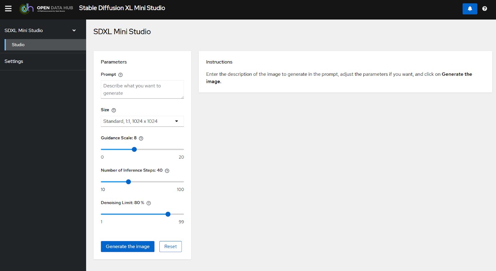

# Building an Image Generation App: What We Learned

At first, building an image generation app might seem as simple as hosting a model with a nice UI.  
We thought so too—until we realized there were a few more things we needed to consider. Here’s what we learned while creating our internal image generation app.

## The key components:

- An image generation model – We use Stable Diffusion XL (SDXL).
- Text input guardrails – We filter prompts using Granite Guardian.
- Image output guardrails – We check generated images with Stable Diffusion Safety Checker.
- A user-friendly interface – Built with React (code available here).

In the end, our system looks like this:  

Let’s go through the different parts! 🤓  
The full code can be found [here](https://github.com/rh-aiservices-bu/image-generation-on-openshift).

## The image generation model 🎨

If you are unfamiliar with how an image generation model works, here is a quick overview.  
An image generation model takes **text** as input (often called prompts) and generates **images** as outputs. For example, if you type “cute dog” you will soon have a very cute dog on your screen, and depending on the model, it may have an extra nose or foot to keep it interesting.

This is great for anyone who quickly wants to illustrate something, just make sure to consider licensing implications before using generated images commercially.

There are different types of image generation models. Stable Diffusion, the model we use, gradually converts noise into an image over multiple steps.  
Since it’s a process with multiple steps, we can show how the image gradually starts appearing, giving a sense of progression to the user while they wait.  

The specific model we use is SDXL (Stable Diffusion XL) 1.0. We chose it because it has a fairly permissive [license](https://github.com/Stability-AI/generative-models/blob/main/model_licenses/LICENSE-SDXL1.0) and open weights.  
SDXL works in two phases:  

1. The [base model](https://huggingface.co/stabilityai/stable-diffusion-xl-base-1.0) handles the initial denoising.
2. The [refiner model](https://huggingface.co/stabilityai/stable-diffusion-xl-refiner-1.0) improves image quality in the final steps.  

This way we can get even higher quality by having two models specializing in the different areas.  
By default, we allocate 80% of the steps to the base model and 20% to the refiner model, but users can adjust this with a slider to see how it impacts the final image.  

If you want more details, you can check the deployment instructions and code [here](https://github.com/rh-aiservices-bu/image-generation-on-openshift/tree/main/sdxl/kserve).

## Guardrails 👮

One of the first things we had to consider was that the SDXL model was trained on fairly diverse content.  
This means that the model also can generate a diverse range of images, which is great in many cases, but as an enterprise there are a few categories of images that we don’t want our users to be able to generate.

To guard ourselves, and our users, against unsafe images we added two types of guardrails:  

- **Text guardrails** – These check input prompts before generation.
- **Image guardrails** – These review the generated images before displaying them.

By looking at both the image and text, we reduce the chances of unsafe images slipping through.

### Text Guardrails ✍️

The text guardrail is a Large Language Model (LLM) that can generate text outputs from text inputs.

There exist specific Guardrail LLMs that have been trained on analyzing text and generating simple outputs that describe potential risks.  
The [Granite Guardian](https://huggingface.co/ibm-granite/granite-guardian-3.1-2b) is one of these models, which have been specifically designed to detect risks from the [IBM AI Risk Atlas](https://www.ibm.com/docs/en/watsonx/saas?topic=ai-risk-atlas).

For our case, we also wanted to customize the categories that the guardian model detects, to add our own.  
This is possible with the Granite Guardian by including custom categories in the input prompt sent to Granite Guardian along with the user’s text.

You can find more details in [this excellent article](https://ai-on-openshift.io/odh-rhoai/llm-guardrails/).

### Image Guardrails 🖼️

For filtering generated images, we use a model called [Stable Diffusion Safety Checker](https://huggingface.co/CompVis/stable-diffusion-safety-checker).   
How it works is that it will take an image as an input and create embeddings. These **embeddings** are just long arrays/lists of numbers, but they are really cool because the model is trained so that embeddings that are close to each other come from similar looking images.

The model then uses this to see if our image is too close to any unsafe image so we can block it.  
In the drawing above we can pretend that tractors are unsafe, so any image too close to the tractor dot will be blocked.

We can also customize it and add another category by simply adding another image that we are not allowed to be too close to.  
Note that this works much better if the model has been trained on images from the new category so it easier can identify them, but it still works well enough without the training to experiment with it.

However, we noticed an issue: the model wasn’t great at detecting unsafe content while images were still blurry during generation.  
A simple fix would have been to check only the final image, but by that point, the image is already visible.  
Instead, we decided to only use the image guardrails after 50% of the steps, where the image is blurry enough that details aren’t clear, but visible enough for the guardrails to not be confused.

You can find more details about how this works and was customized [here](https://ai-on-openshift.io/odh-rhoai/stable_diffusion_safety_checker/).

## UI 🪄

To be able to interface with the model, we built a user-friendly UI.

There are a few settings in this UI:

- Prompt - Users enter a text description of what image they want.
- Size - Dropdown to choose the image size.
- Guidance Scale - Adjusts how creative vs. strict the model follows the prompts.
- Number of Inference Steps - Balances speed and image quality.
- Denoising Limit - Controls when the refiner model takes over from the base model.

Along with calling the text and image guardrails, the UI automatically watermarks final images, making it clear they were generated by our system.

## Summary

We can now look back at the full architecture and see how all the pieces fit together

Here’s a step-by-step look at how the system works:

1. User enters a prompt in the UI.
2. Granite Guardian checks the prompt for safety.
3. If approved, the SDXL model starts generating an image.
4. Each step of the denoising process is shown to the user.
5. After 50% completion, the image guardrail checks for unsafe content.
6. If the image passes, the user sees it; otherwise, it gets blocked.
7. The final image gets a watermark.
