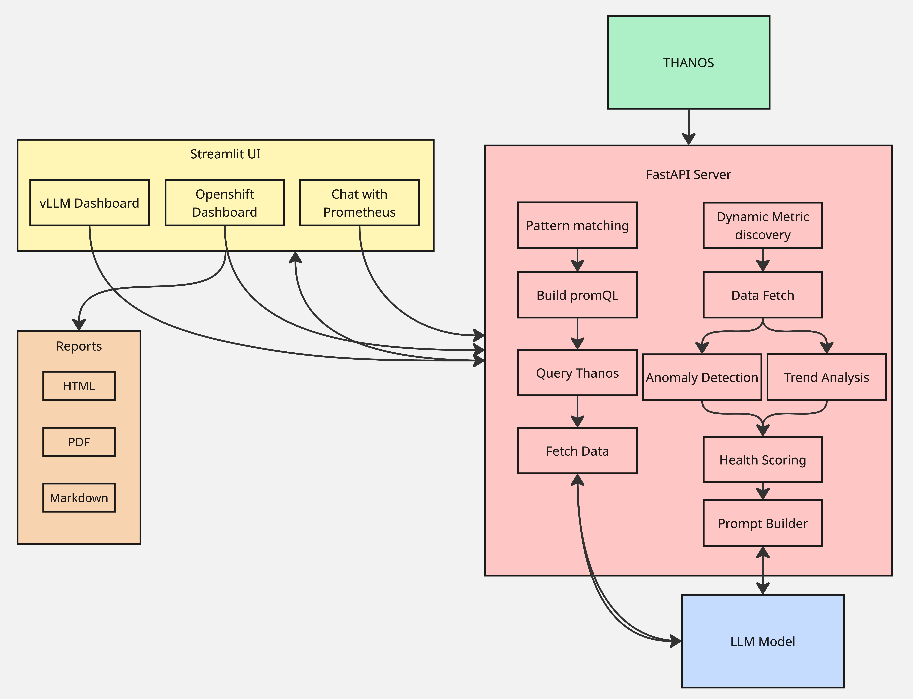
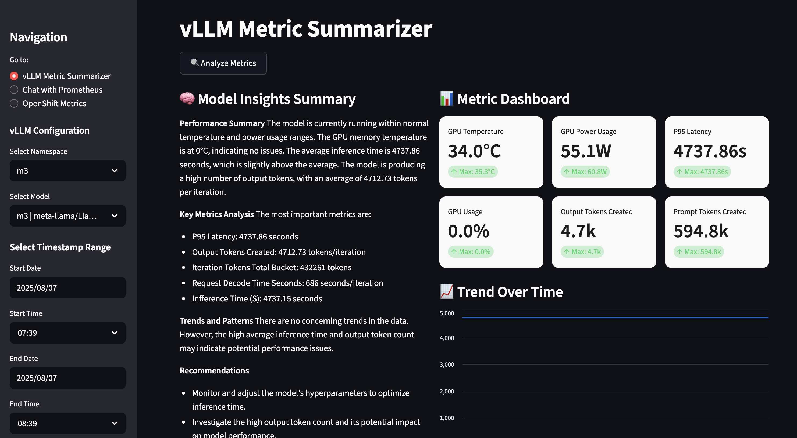
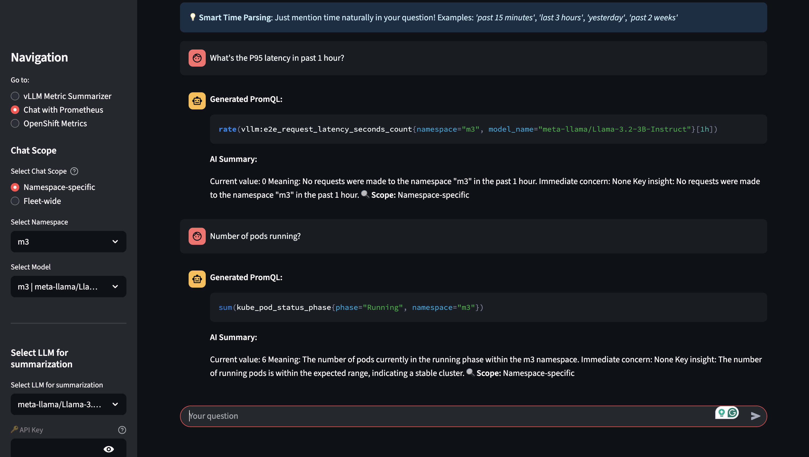
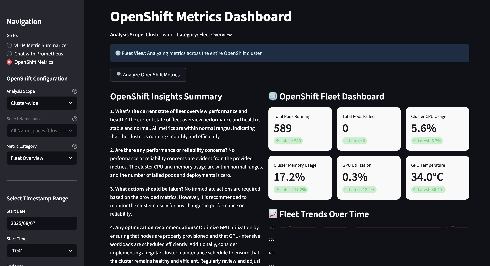

# OpenShift AI Observability Summarizer

## Objective

The **OpenShift AI Observability Summarizer** is an open-source, CNCF-style project designed to transform complex monitoring data into actionable insights. Its primary objective is to enhance traditional monitoring dashboards by providing AI-powered, human-readable summaries of AI model metrics and OpenShift cluster health.

**Key Goals:**
- **Simplify Monitoring**: Convert raw Prometheus metrics into contextual, human-readable insights
- **AI-Powered Analysis**: Use LLMs to generate intelligent summaries and detect anomalies
- **Multi-Dashboard Experience**: Provide specialized views for vLLM deployments, OpenShift fleet monitoring, and interactive chat
- **Proactive Alerting**: Enable real-time notifications with contextual summaries
- **Comprehensive Reporting**: Generate detailed reports in multiple formats (HTML, PDF, Markdown)

---

## Features

### **1. vLLM Model Monitoring**
- **Real-time Performance Tracking**: Monitor GPU usage, latency, request volume, and throughput
- **DCGM GPU Metrics**: Automatic discovery and monitoring of GPU temperature, power consumption, memory usage, and energy consumption
- **Anomaly Detection**: AI-powered identification of performance issues and trends
- **Model Health Dashboard**: Visual representation of model performance with interactive charts

### **2. OpenShift Fleet Monitoring**
- **Cluster-wide Analysis**: Monitor entire OpenShift cluster health and performance
- **Namespace-scoped Views**: Focus on specific namespaces or workloads
- **GPU Fleet Monitoring**: Comprehensive DCGM metrics across all GPU nodes
- **Enhanced Metrics**: Temperature (°C), power (Watts), memory (GB), and utilization tracking
- **Workload Monitoring**: Pod health, container metrics, restarts, and failures

### **3. AI-Powered Insights & Chat**
- **LLM-Generated Summaries**: Use fine-tuned Llama models to create contextual insights
- **Interactive Chat Interface**: Ask natural language questions about your metrics
- **PromQL Query Generation**: Get specific queries and insights from conversational input
- **Multi-Model Support**: Support for both internal and external LLM models
- **Context-Aware Analysis**: AI assistant with full metrics context for troubleshooting

### **4. Advanced Reporting System**
- **Multi-Format Export**: Generate reports in HTML, PDF, or Markdown formats
- **Time-Series Visualization**: Interactive charts and metric visualizations
- **Automated Calculations**: Trend analysis and metric calculations
- **Customizable Reports**: Tailored reports for different stakeholders and use cases

### **5. Alerting & Notifications**
- **Smart Alerting**: Set up alerts for vLLM models and OpenShift metrics
- **Slack Integration**: Real-time notifications with contextual summaries
- **Custom Thresholds**: Configurable alert conditions and triggers
- **Proactive Monitoring**: Early warning system for potential issues

### **6. GPU Monitoring Excellence**
- **DCGM Metrics Support**: Automatic discovery and monitoring of:
  - **Temperature**: GPU core and memory temperature (°C)
  - **Power**: Real-time power consumption (Watts)
  - **Memory**: GPU memory usage (GB) and utilization (%)
  - **Energy**: Total energy consumption (Joules)
  - **Performance**: GPU utilization, clock speeds (MHz)
- **Fleet View**: Monitor GPU health across entire OpenShift cluster
- **Vendor Detection**: Automatic identification of GPU models and vendors

---

## Architecture

### Core Components

- **llm-service**: LLM inference (Llama models)
- **llama-stack**: Backend API for LLM operations
- **vLLM**: Model serving with Prometheus metrics export
- **Prometheus/Thanos**: Metrics scraping and long-term storage
- **DCGM**: GPU monitoring and metrics collection
- **Streamlit UI**: Multi-dashboard frontend interface
- **MCP (Model Context Protocol)**: Metric Collection & Processing backend
- **Report Generator**: PDF/HTML/Markdown export capabilities
- **Alerting Service**: Real-time notifications and alert management



### **Key Dashboards**
1. **vLLM Dashboard**: Monitor model performance, GPU usage, latency, and throughput
2. **OpenShift Dashboard**: Fleet monitoring with cluster-wide and namespace views
3. **Chat Interface**: Interactive Q&A with metrics-aware AI assistant
4. **Report Generator**: Automated analysis reports in multiple formats

---

## Getting Started

### Prerequisites

- OpenShift cluster with GPU nodes (for DCGM metrics)
- `oc` CLI with cluster-admin permissions
- `helm` v3.x
- `yq` (YAML processor)
- Deployed Prometheus/Thanos
- (Optional) DCGM exporter for GPU monitoring
- (Optional) Slack Webhook URL for alerting

### Installation

Use the included `Makefile` to install everything:

```bash
cd deploy/helm
make install NAMESPACE=your-namespace
```

This will install the project with the default LLM deployment, `llama-3-2-3b-instruct`.

### Choosing Different Models

To see all available models:
```bash
make list-models
```

You can use the `LLM` flag during installation to set a model:
```bash
make install NAMESPACE=your-namespace LLM=llama-3-2-3b-instruct
```

### Advanced Installation Options

**With GPU tolerations:**
```bash
make install NAMESPACE=your-namespace LLM=llama-3-2-3b-instruct LLM_TOLERATION="nvidia.com/gpu"
```

**With safety models:**
```bash
make install NAMESPACE=your-namespace \
  LLM=llama-3-2-3b-instruct LLM_TOLERATION="nvidia.com/gpu" \
  SAFETY=llama-guard-3-8b SAFETY_TOLERATION="nvidia.com/gpu"
```

**With alerting:**
```bash
make install NAMESPACE=your-namespace ALERTS=TRUE
```

### Accessing the Application

Navigate to your **OpenShift Cluster → Networking → Route** to access the application:

```bash
oc get route
```

---

## Usage

### **Multi-Dashboard Interface**

Access via the OpenShift route: `oc get route ui`

#### **vLLM Metric Summarizer**
1. Select your AI model and namespace
2. Choose time range for analysis
3. Click **Analyze Metrics** for AI-powered insights
4. Download reports in HTML/PDF/Markdown format

#### **OpenShift Metrics Dashboard**
1. Choose metric category (Fleet Overview, GPU & Accelerators, etc.)
2. Select scope: Cluster-wide or Namespace-scoped
3. Analyze performance with AI-generated summaries
4. Monitor GPU temperature, power usage, and utilization across fleet

#### **Chat with Prometheus**
1. Ask natural language questions about your metrics
2. Get specific PromQL queries and insights
3. Interactive troubleshooting with metrics context

#### **Key Monitoring Categories**
- **Fleet Overview**: Pods, CPU, Memory, GPU temperature
- **GPU & Accelerators**: Temperature, power, utilization, memory (GB)
- **Workloads & Pods**: Container metrics, restarts, failures
- **Storage & Networking**: I/O rates, network throughput
- **Application Services**: HTTP metrics, endpoints, errors

### **Report Generation**

Generate detailed metric reports in multiple formats:

- **HTML Report**: Interactive and visually rich, suitable for sharing or archiving
- **PDF Report**: Print-ready, ideal for documentation or compliance needs
- **Markdown Report**: Lightweight, easy to edit or integrate into wikis

To generate a report:
1. Complete your analysis in either the vLLM or OpenShift dashboard
2. Click the **Download Report** button
3. Choose your preferred format (HTML, PDF, or Markdown)
4. The report will be generated and downloaded automatically






---

## Local Development

### Prerequisites for Local Development

1. You have a deployment on the cluster already
2. You are logged into the cluster and can execute `oc` commands
3. Install `uv` by following instructions on the [uv website](https://github.com/astral-sh/uv)

### Setting Up Local Development

1. **Sync up the environment and development dependencies:**
```bash
uv sync --group dev
```

2. **Activate the virtual environment:**
```bash
source .venv/bin/activate
```

3. **Export the namespace where the kickstart is deployed:**
```bash
export LLM_NAMESPACE=<DESIRED_NAMESPACE>
```

4. **Run the local development script:**
```bash
./scripts/local-dev.sh
```

### MacOS WeasyPrint Setup

For report generation on MacOS:
1. Install via brew: `brew install weasyprint`
2. Ensure installation: `weasyprint --version`
3. Set **DYLD_FALLBACK_LIBRARY_PATH**: `export DYLD_FALLBACK_LIBRARY_PATH=/opt/homebrew/lib:$DYLD_FALLBACK_LIBRARY_PATH`

---

## Testing

### Running Tests with Pytest

1. **Sync up the test dependencies:**
```bash
uv sync --group test
```

2. **Run all tests:**
```bash
uv run pytest -v --cov=src --cov-report=html --cov-report=term
```

3. **Run specific test suites:**
```bash
# Run only MCP tests
uv run pytest -v tests/mcp/

# Run specific test file
uv run pytest -v tests/mcp/test_api_endpoints.py
```

To view a detailed coverage report, open `htmlcov/index.html`.

---

## Build & Deploy

### Building Container Images

#### **Build FastAPI Backend (metrics-api)**

**Using Podman:**
```bash
cd src
podman buildx build --platform linux/amd64 \
  -f api/Dockerfile \
  -t quay.io/ecosystem-appeng/metrics-api:your-tag .
podman push quay.io/ecosystem-appeng/metrics-api:your-tag
```

**Using Docker:**
```bash
cd src
docker buildx build --platform linux/amd64 \
  -f api/Dockerfile \
  -t quay.io/ecosystem-appeng/metrics-api:your-tag .
docker push quay.io/ecosystem-appeng/metrics-api:your-tag
```

#### **Build Streamlit UI (metric-ui)**
```bash
cd src/ui
podman buildx build --platform linux/amd64 \
  -f Dockerfile \
  -t quay.io/ecosystem-appeng/metric-ui:your-tag .
podman push quay.io/ecosystem-appeng/metric-ui:your-tag
```

#### **Build Alerting Service (metric-alerting)**
```bash
cd src/alerting
podman buildx build --platform linux/amd64 \
  -f Dockerfile \
  -t quay.io/ecosystem-appeng/metric-alerting:your-tag .
podman push quay.io/ecosystem-appeng/metric-alerting:your-tag
```

### Deploy to OpenShift

1. **Update Helm values** with your new image tags
2. **Deploy using Helm:**
```bash
cd deploy/helm
make install NAMESPACE=your-namespace
```

### Automated CI/CD

The project includes GitHub Actions workflow (`.github/workflows/build-and-push.yml`) that automatically builds and pushes container images when changes are pushed to the repository.

---

## Contributing

We welcome contributions and feedback! Please open issues or submit PRs to improve this dashboard or expand model compatibility.

See [CONTRIBUTING.md](https://github.com/rh-ai-kickstart/openshift-ai-observability-summarizer/blob/main/CONTRIBUTING.md) for full contribution guidelines.

---

## Community

- [GitHub Discussions](https://github.com/rh-ai-kickstart/openshift-ai-observability-summarizer/discussions)
- [OpenShift AI](https://www.redhat.com/en/technologies/cloud-computing/openshift/openshift-ai)
- [Prometheus](https://prometheus.io/)
- [Streamlit](https://streamlit.io/)

---

## License

Licensed under the [MIT License](https://github.com/rh-ai-kickstart/openshift-ai-observability-summarizer/blob/main/LICENSE).

---

## Ready to Try It?

Visit the GitHub repo to get started and contribute:

**[OpenShift AI Observability Summarizer on GitHub](https://github.com/rh-ai-kickstart/openshift-ai-observability-summarizer)**

Feedback and contributions are welcome!