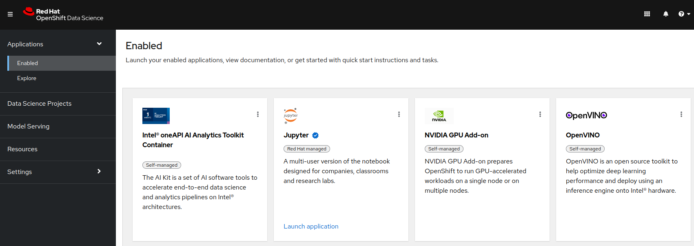

# OpenShift Data Science

## What is Red Hat OpenShift Data Science?

Red Hat® OpenShift® Data Science is a managed cloud service that IT operations teams can enable for data scientists and developers of intelligent applications. It provides a fully supported environment in which to rapidly develop, train, and test machine learning (ML) models in the public cloud before deploying in production.

[Documentation for Managed RHODS](https://access.redhat.com/documentation/en-us/red_hat_openshift_data_science){:target="_blank"}

[Documentation for Self-Managed RHODS](https://access.redhat.com/documentation/en-us/red_hat_openshift_data_science_self-managed){:target="_blank"}

## Accelerate your data science

Red Hat OpenShift Data Science provides a fully managed cloud service environment on Red Hat OpenShift Service on AWS or Red Hat OpenShift Dedicated

Red Hat OpenShift Data Science allows organizations to quickly build and deploy artificial intelligence (AI)/ML models by integrating open source tooling with commercial partner applications.

The ML models built in Red Hat OpenShift Data Science are easily portable to other platforms, allowing teams to deploy them in production, on containers, whether on-premise, at the edge or in the public cloud.

*[Want to know more?](https://www.redhat.com/en/technologies/cloud-computing/openshift/openshift-data-science){:target="_blank"}*
