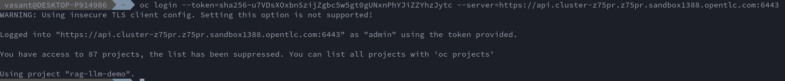
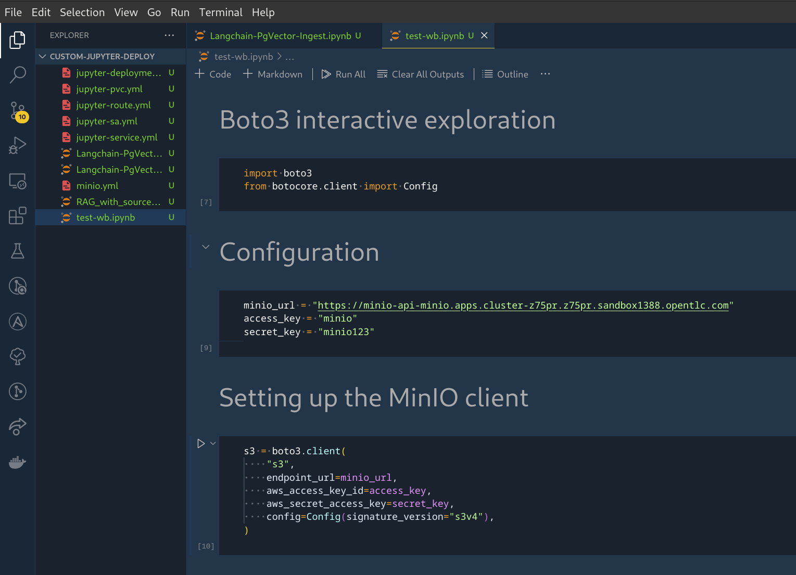
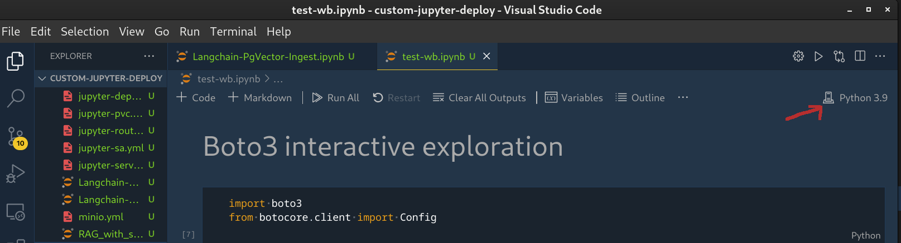

# Connect to RHOAI Workbench Kernel from local VS Code

Some users have expressed their desire to work directly on their local IDE and execute the Jupyter notebook(s) using the kernel on remote workbench running on RHOAI. Most IDEs provide connection to a remote Kernel as a standard feature. However, this standard feature does not work with RHOAI because of the way authentication to workbench is set up in RHOAI 
The standard feature of most IDEs to connect to remote kernel uses token based authentication. Workbench pods running on RHOAI contain an authentication mechanism that sits in front of the workbench container and handles the authentication of the user connecting to the workbench. This container uses Openshift Authentication mechanism and is not compatible with the standard connection feature of most IDEs.

## Workaround: Connect to the remote kernel using Openshift port-forwarding

Use the following steps to connect your local VS Code to RHOAI Workbench kernel:

- In your data science project in RHOAI, create a workbench that you would like to use as your remote kernel. If you want to use gpu accelerator, use the compatible workbench image (e.g. pytorch). 

    

- Open the workbench and copy the context path from the browser. You will need this later when connecting from VS Code. 

    

- From terminal on your laptop/desktop login to openshift.
    

- Switch to your data science project
    

- Start port-forwarding to your workbench pod
    * List all the pods in your project. The pod running your workbench is named using the name of your workbench in RHOAI. e.g. `mywb-0` if your workbench name is `mywb`.
    * Enable port-forwarding to your workbench pod. You need to forward to the port the pod is listening on. It is usually 8888 for RHOAI workbench. You can find this port from the service in your project with name same as your workbench.
    

- Open the Jupyter notebook in your VS Code
    

- From the top right corner of the notebook, click on `Select Kernel`.
    

- From the options, select `Existing Jupyter Server` and then enter the url as follows:
    `localhost` `[:port]` `/context-path` copied earlier that has the pattern `/notebook/ds-project-name/workbench-name/lab`. e.g. `http://localhost:8888/notebook/rag-llm-demo/mywb/lab`

- A prompt saying  
`Connecting over HTTP without a token may be an insecure connection. Do you want to connect to a possibly insecure server?` 
is displayed. select `Yes`
    

- Select the prompted `Server display name` or enter a new one.
    

- A list of available kernels is displayed. Choose `Python 3.9`.
    

- You should see the selected Kernel in the top right corner.
    

- The code inside of your notebook will now execute using the remote kernel on the RHOAI workbench pod.

- If your workbench uses a Nvidia GPU, you can verify that it is being used in the execution of your notebook by adding a command `!nvidia-smi`. You should see output similar to the image below.

    

## Caveats

- Jupyter notebooks in your local VSCode environment will not be saved to the workbench.
- If your notebook uses any files (models, inputdata etc.), they should be present on the workbench and their path should match the path specified in your notebook.
