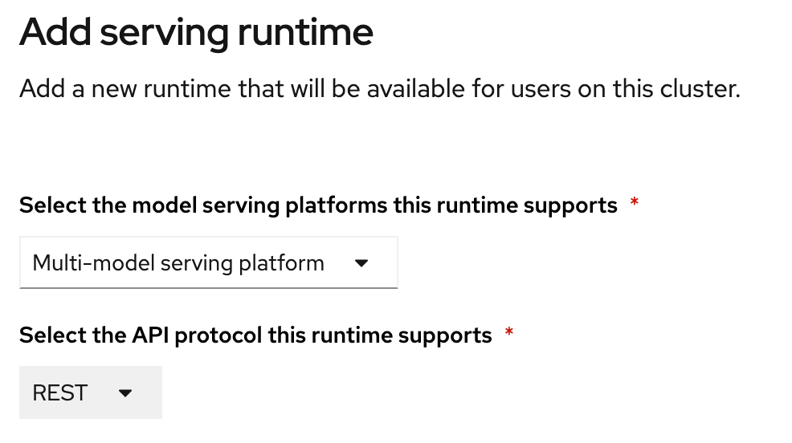
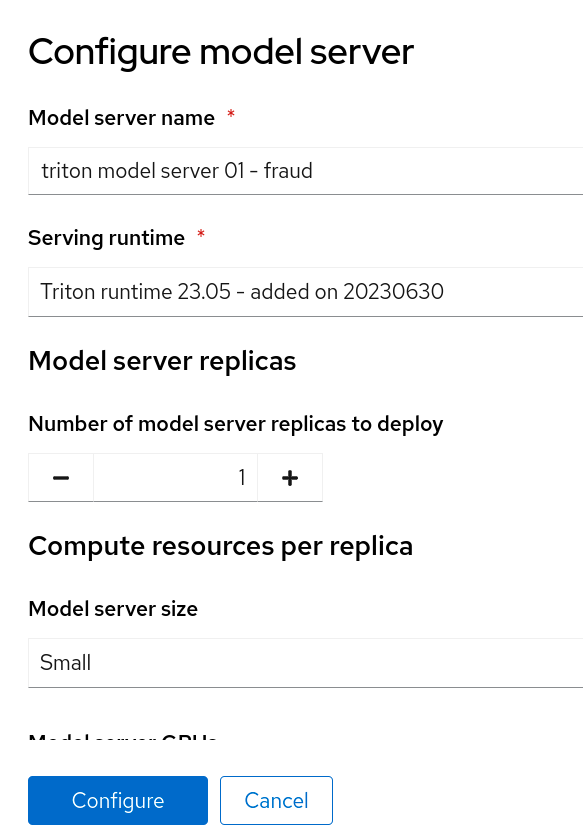
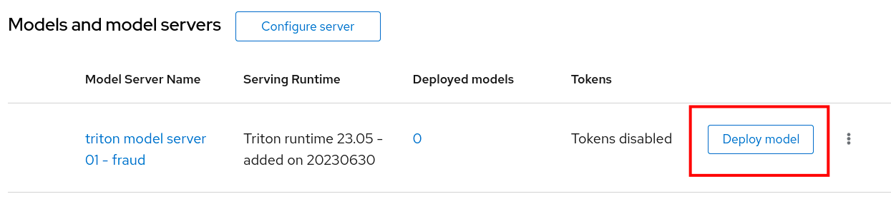

# Deploying and using a Custom Serving Runtime in ODH/RHOAI

Although these instructions were tested mostly using RHOAI (Red Hat OpenShift AI), they apply to ODH (Open Data Hub) as well.

## Before you start

This document will guide you through the broad steps necessary to deploy a custom Serving Runtime in order to serve a model using the Triton Runtime (NVIDIA [Triton Inference Server](https://developer.nvidia.com/triton-inference-server)).

While RHOAI supports your ability to add your own runtime, it does not support the runtimes themselves. Therefore, it is up to you to configure, adjust and maintain your custom runtimes.

This document expects a bit of familiarity with RHOAI.

The sources used to create this document are mostly:

* [https://github.com/kserve/modelmesh-serving/tree/main/config/runtimes](https://github.com/kserve/modelmesh-serving/tree/main/config/runtimes)
* [https://catalog.ngc.nvidia.com/orgs/nvidia/containers/tritonserver](https://catalog.ngc.nvidia.com/orgs/nvidia/containers/tritonserver)
* Official [Red Hat OpenShift AI Documentation](https://access.redhat.com/documentation/en-us/red_hat_openshift_data_science_self-managed/1-latest/html/working_on_data_science_projects/working-on-data-science-projects_nb-server#configuring_model_servers)

## Adding the custom triton runtime

1. Log in to your OpenShift AI with a user who is part of the RHOAI admin group.
    1. (by default, cluster-admins and dedicated admins are).
1. Navigate to the **Settings** menu, then **Serving Runtimes**

    { style="width:200px"}

1. Click on the **Add Serving Runtime** button:

    { style="width:200px"}

1. From the drop down menu, select **Multi-model serving platform.  The option for REST will be selected automatically:

    { style="width:200px"}

1. Click on **Start from scratch** and in the window that opens up, paste the following YAML:
  ```yaml
  # Copyright 2021 IBM Corporation
  #
  # Licensed under the Apache License, Version 2.0 (the "License");
  # you may not use this file except in compliance with the License.
  # You may obtain a copy of the License at
  #
  #     http://www.apache.org/licenses/LICENSE-2.0
  #
  # Unless required by applicable law or agreed to in writing, software
  # distributed under the License is distributed on an "AS IS" BASIS,
  # WITHOUT WARRANTIES OR CONDITIONS OF ANY KIND, either express or implied.
  # See the License for the specific language governing permissions and
  # limitations under the License.
  apiVersion: serving.kserve.io/v1alpha1
  # kind: ClusterServingRuntime     ## changed by EG
  kind: ServingRuntime
  metadata:
    name: triton-23.05-20230804
    labels:
      name: triton-23.05-20230804
    annotations:
      maxLoadingConcurrency: "2"
      openshift.io/display-name: "Triton runtime 23.05 - added on 20230804 - with /dev/shm"
  spec:
    supportedModelFormats:
      - name: keras
        version: "2" # 2.6.0
        autoSelect: true
      - name: onnx
        version: "1" # 1.5.3
        autoSelect: true
      - name: pytorch
        version: "1" # 1.8.0a0+17f8c32
        autoSelect: true
      - name: tensorflow
        version: "1" # 1.15.4
        autoSelect: true
      - name: tensorflow
        version: "2" # 2.3.1
        autoSelect: true
      - name: tensorrt
        version: "7" # 7.2.1
        autoSelect: true

    protocolVersions:
      - grpc-v2
    multiModel: true

    grpcEndpoint: "port:8085"
    grpcDataEndpoint: "port:8001"

    volumes:
      - name: shm
        emptyDir:
          medium: Memory
          sizeLimit: 2Gi
    containers:
      - name: triton
        # image: tritonserver-2:replace   ## changed by EG
        image: nvcr.io/nvidia/tritonserver:23.05-py3
        command: [/bin/sh]
        args:
          - -c
          - 'mkdir -p /models/_triton_models;
            chmod 777 /models/_triton_models;
            exec tritonserver
            "--model-repository=/models/_triton_models"
            "--model-control-mode=explicit"
            "--strict-model-config=false"
            "--strict-readiness=false"
            "--allow-http=true"
            "--allow-sagemaker=false"
            '
        volumeMounts:
          - name: shm
            mountPath: /dev/shm
        resources:
          requests:
            cpu: 500m
            memory: 1Gi
          limits:
            cpu: "5"
            memory: 1Gi
        livenessProbe:
          # the server is listening only on 127.0.0.1, so an httpGet probe sent
          # from the kublet running on the node cannot connect to the server
          # (not even with the Host header or host field)
          # exec a curl call to have the request originate from localhost in the
          # container
          exec:
            command:
              - curl
              - --fail
              - --silent
              - --show-error
              - --max-time
              - "9"
              - http://localhost:8000/v2/health/live
          initialDelaySeconds: 5
          periodSeconds: 30
          timeoutSeconds: 10
    builtInAdapter:
      serverType: triton
      runtimeManagementPort: 8001
      memBufferBytes: 134217728
      modelLoadingTimeoutMillis: 90000
  ```
1. You will likely want to update the name , as well as other parameters.
1. Click **Add**
1. Confirm the new Runtime is in the list, and re-order the list as needed.
  (the order chosen here is the order in which the users will see these choices)

    { style="width:800px"}

## Creating a project

* Create a new Data Science Project
* In this example, the project is called **fraud**

## Creating a model server

1. In your project, scroll down to the "Models and Model Servers" Section
1. Click on **Configure server**

    { style="width:500px"}

1. Fill out the details:

    { style="width:300px"}

    { style="width:300px"}

1. Click **Configure**

## Deploying a model into it

1. If you don't have any model files handy, you can grab a copy of [this file](img-triton/card.fraud.detection.onnx) and upload it to your Object Storage of choice.
1. Click on **Deploy Model**

    { style="width:800px"}

1. Choose a model name and a framework:

    { style="width:400px"}

1. Then create a new data connection containing the details of where your model is stored in Object Storage:

    { style="width:400px"}

1. After a little while, you should see the following:

    { style="width:800px"}

## Validating the model

1. If you've used the model mentioned earlier in this document, you can run the following command from a Linux prompt:
  ```bash
  function val-model {
      myhost="$1"
      echo "validating host $myhost"
      time curl -X POST -k "${myhost}" -d '{"inputs": [{ "name": "dense_input", "shape": [1, 7], "datatype": "FP32", "data": [57.87785658389723,0.3111400080477545,1.9459399775518593,1.0,1.0,0.0,0.0]}]}' | jq
  }

  val-model "https://fraud-model-fraud.apps.mycluster.openshiftapps.com/v2/models/fraud-model/infer"
  ```
1. Change the host to match the address for your model.
1. You should see an output similar to:
  ```json
  {
    "model_name": "fraud-model__isvc-c1529f9667",
    "model_version": "1",
    "outputs": [
      {
        "name": "dense_3",
        "datatype": "FP32",
        "shape": [
          1,
          1
        ],
        "data": [
          0.86280495
        ]
      }
    ]
  }
  ```


## Extra considerations for Disconnected environments.

The YAML included in this file makes a reference to the following Nvidia Triton Image:
`nvcr.io/nvidia/tritonserver:23.05-py3`

Ensure that this image is properly mirrored into the mirror registry.

Also, update the YAML definition as needed to point to the image address that matches the image registry.

## GitOps related information

Each of the activities performed via the user interface will create a Kubernetes Object inside your OpenShift Cluster.

* The addition of a new runtime creates a `template` in the `redhat-ods-applications` namespace.
* Each model server is defined as a `ServingRuntime`
* Each model is defined as an `InferenceService`
* Each Data Connection is stored as a `Secret`
