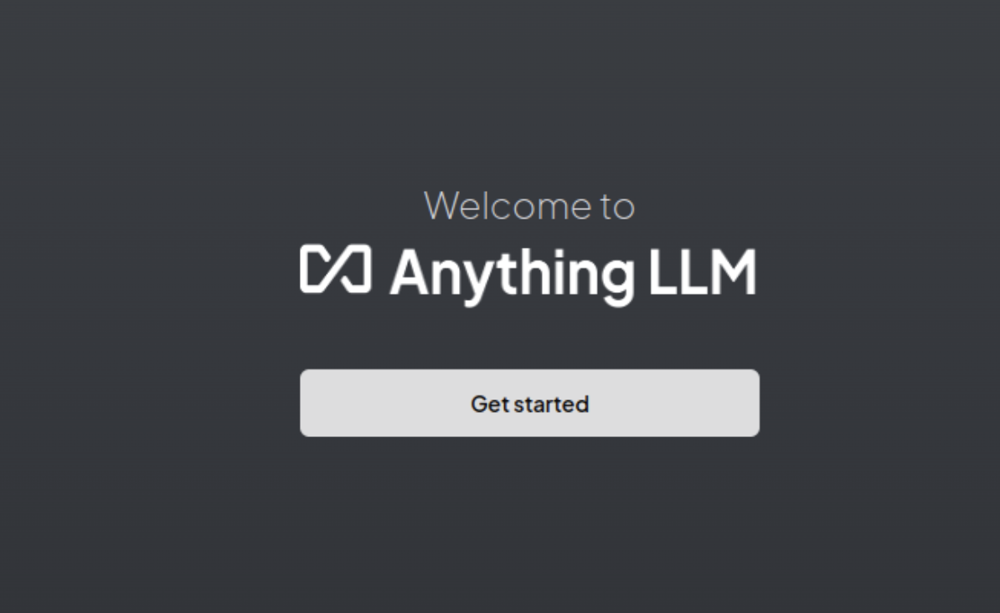
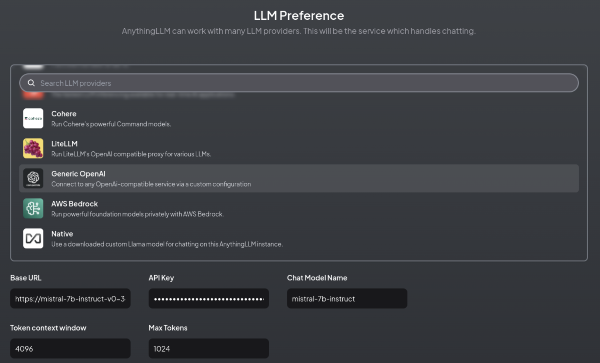
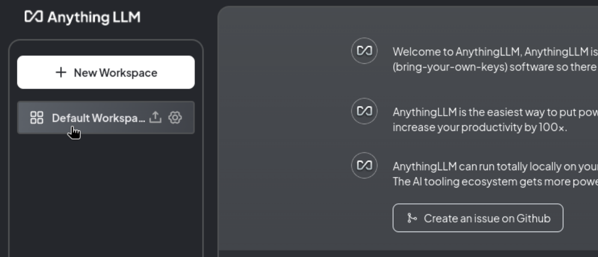

# Using AnythingLLM as Custom Workbench in ODH/RHOAI

[AnythingLLM](https://anythingllm.com/) is the "All-in-one AI application. Any LLM, any document, any agent, fully private." It is a fully open-source, customizable chatbot that allows users to interact with various documents locally or on a hosted platform. It enables conversations with documents in formats like PDFs, TXT, and CSVs. The tool is particularly useful for creating private, localized versions of ChatGPT that can process and answer questions based on uploaded files. 

In this post, we'll explore how to deploy AnythingLLM on your Red Hat OpenShift AI instance to create a private chatbot for your internal users. AnythingLLM allows teams to securely interact with documents and knowledge bases by integrating large language models (LLMs) with private data in a controlled environment. Combining it with OpenShift’s robust platform for AI and its security features, we can set up AnythingLLM as an efficient internal chatbot. 

Whether your team needs to query PDFs, CSVs, or other document types, this guide will help you seamlessly bring AnythingLLM into your OpenShift AI infrastructure. 

## Prerequisites

### 1. Running a Large Language Model

To get started with AnythingLLM, you'll need an endpoint for a large language model (LLM) to interact with. AnythingLLM supports various models, so you're not limited to a single provider. You can deploy open-source models like Granite or Mistral, or use your own custom-trained LLM. To integrate the LLM, provide the endpoint URL and, if needed, an authentication token.
Alternatively, you can adopt a "Models as a Service (MaaS)" approach, allowing users to experiment with different models to find the best fit. For MaaS setup guidance, refer [here](https://github.com/rh-aiservices-bu/models-aas/).

### 2. Custom Workbench for AnythingLLM in OpenShift AI

A workbench is your development and experimentation environment, similar to an IDE. OpenShift AI provides several default workbench images, but to use AnythingLLM, you'll need to add it as a custom workbench. This involves making the AnythingLLM container image available in your OpenShift AI environment for users to select in their projects.

The AnythingLLM image is hosted on [Quay](http://quay.io/rh-aiservices-bu/anythingllm-workbench). You can view its details [here](https://github.com/rh-aiservices-bu/llm-on-openshift/tree/main/llm-clients/anythingllm).

To make this image available cluster-wide by using the OpenShift AI user interface:

- Log in to your OpenShift AI instance as `rhoai-admin`.
- From the left menu, navigate to Settings > Notebook Images > Import New Image.
- Enter `quay.io/rh-aiservices-bu/anythingllm-workbench` as the image location.

For more guidance on building custom notebook images, check out [this blog post](https://ai-on-openshift.io/odh-rhoai/custom-notebooks/).

## Configuration of AnythingLLM Workbench

Now that you have the prerequisites set up, it’s time to dive in! In the following steps, we’ll walk you through creating a custom AnythingLLM workbench, configuring it to connect to an LLM, and getting hands-on with it. Let’s bring your ideas to life and explore AnythingLLM!

### Create the Workbench

Go to your Data Science project and click `Create a Workbench`.

- **Name:** Choose a name, such as “AnythingLLM”.
- **Image selection:** Select your `custom-anythingLLM-image`.
- **Deployment size:** Choose `Small` (no GPU is needed for this setup).
- **Cluster storage:** It is to save your data for retrieval-augmented generation (RAG). Adjust the size based on your data needs.

You can leave the rest of the settings as default and click Create.

### Launch the Workbench

Once the workbench is running, click `Open`. On the first launch, you’ll see a splash screen. Click on Get started.

### Configure the LLM Endpoint

We’ll connect the workbench to an LLM running in your environment.

- **Provider:** Choose Generic OpenAI from the available options.
- **Base URL:** Enter the endpoint of your model, ending with /v1 (e.g., https://mistral-7b-instruct-v0-3-mycluster.com:443/v1).
- **API Key & Model Name:** Enter the required API key and specify the model name.
- **Token Context Window:** Set the context window size. This value may vary depending on the model you’re using.
- **Max Tokens:** Specify the maximum number of tokens to be generated by default. 1024 is good to start, and you can adjust this later in your workspaces.

### Set Up User Access

On the next screen, select `Just me`. OpenShift’s authentication ensures that only you can access your workbench anyhow, hence we select Just me.

Then you’ll be prompted to set up a secondary password. Normally it’s not necessary as access to the workbench is already secured with OpenShift authentication.

### Review Configuration

You will see a summary screen displaying your settings. Confirm that everything looks correct.

You might encounter a brief survey, which you can skip if you prefer.

### Create Your First Workspace

Next, you’ll set up a workspace, which acts as a project area within AnythingLLM. Each workspace can have its own settings and data, allowing you to organize different tasks or experiments separately.

Click on `Create Workspace` to proceed.

### Start Chatting

The initial view will provide you with various information, but you can go straight to your workspace and begin interacting with the LLM.

There’s a lot you can do with AnythingLLM, so be sure to explore its features! For more details, check out the [documentation](https://docs.anythingllm.com/).

