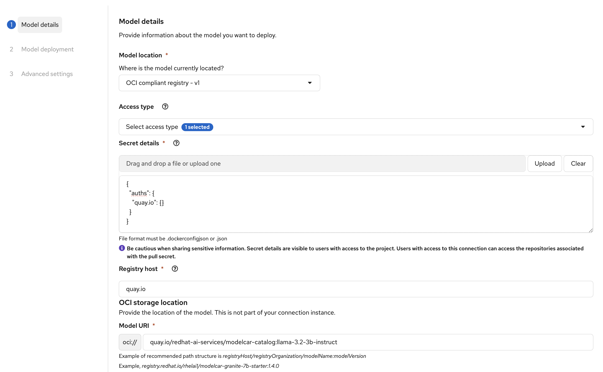

# Deploying Models from Public OCI Registries in OpenShift AI

When deploying models in OpenShift AI using the [ModelCar](https://kserve.github.io/website/master/modelserving/storage/oci/#using-modelcars) approach, you can pull model images directly from OCI-compliant registries. ModelCar packages models as OCI images, simplifying deployment by eliminating the need to manually download models and upload them to S3 storage.

## Two Options for Public Registries

If you're deploying a model from a **public OCI registry** that doesn't require authentication, OpenShift AI offers two approaches:

### Option 1: Using URI - v1

This is the simpler approach when working with public repositories:

1. In the model deployment wizard, select **Model location**: `URI - v1`
2. Enter the OCI URI directly (e.g., `oci://quay.io/redhat-ai-services/modelcar-catalog:llama-3.2-3b-instruct`)
3. Check the box **"Create a connection to this location"** if you want to reuse this connection


!!! tip
    The URI option bypasses the need for authentication configuration entirely, making it the quickest path for deploying from public registries.

### Option 2: Using OCI Compliant Registry with Empty Auth Secret

Alternatively, you can use the **OCI compliant registry - v1** option, but this requires providing secret details even for public registries:

1. Select **Model location**: `OCI compliant registry - v1`
2. Choose or create an **Access type** (connection)
3. In the **Secret details** field, provide an empty authentication JSON:

```json
{
  "auths": {}
}
```



The file format must be `.dockerconfigjson` or `.json`.


## When to Use Each Option

- **Use URI - v1**: When deploying from public registries and you want the simplest configuration
- **Use OCI compliant registry - v1**: When you need private registry authentication or want to manage credentials for multiple private registries

## Example: Deploying a Public ModelCar

Here's a complete example using a model from the Red Hat AI Services ModelCar Catalog:

**Model**: Llama 3.2 3B Instruct

**Registry**: quay.io (public)

**URI**: `oci://quay.io/redhat-ai-services/modelcar-catalog:llama-3.2-3b-instruct`

Using the URI - v1 option:
1. Enter the URI above
2. Provide a connection name (e.g., "llama-3.2-public")
3. Continue with your deployment configuration

That's it! No authentication required.

## Additional Resources

- [Red Hat AI Services ModelCar Catalog](https://github.com/redhat-ai-services/modelcar-catalog) - Pre-built public ModelCar images
- [Build and Deploy a ModelCar Container in OpenShift AI](https://developers.redhat.com/articles/2025/01/30/build-and-deploy-modelcar-container-openshift-ai) - Comprehensive guide from Red Hat Developer
- [KServe ModelCar Documentation](https://kserve.github.io/website/master/modelserving/storage/oci/#using-modelcars) - Official KServe modelcar reference
