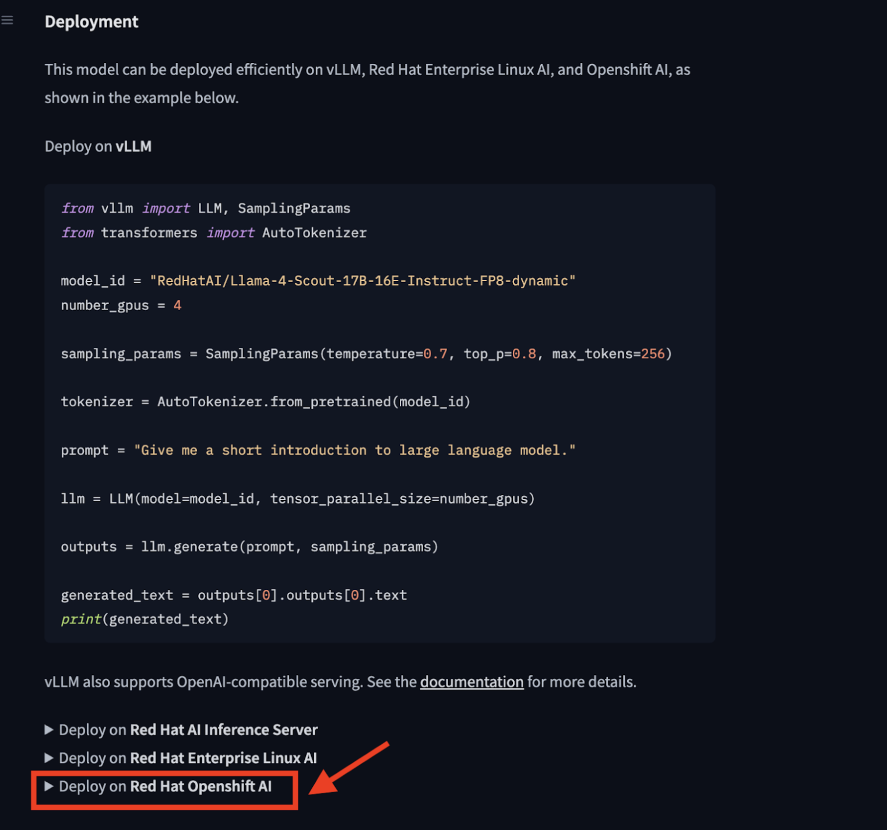
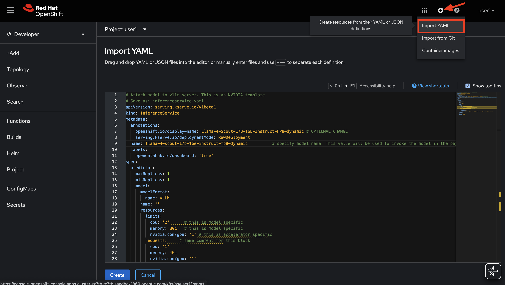

# Deploying a Red Hat Validated Model in a Disconnected OpenShift AI Environment

Red Hat AI provides access to a rich repository of **Third Party Models** validated to run efficiently across the platform. These models are available through [Red Hat’s Hugging Face repository](https://huggingface.co/collections/RedHatAI/red-hat-ai-validated-models-v10-682613dc19c4a596dbac9437).

The repository offers comprehensive information about each model’s architecture, optimizations, deployment options, and evaluation metrics. This information helps you make informed decisions about model selection, deployment configurations, and hardware accelerator choices tailored to your domain-specific use cases.

In this blog post, we will walk you through **how to deploy one of these validated models into your disconnected Red Hat OpenShift AI platform**.

## Step-by-Step Guide to Deploy a Model in a Disconnected Environment

### 1. Select the Model

For this blog post, as an example, we will deploy one of the popular models: [Llama 4 Scout 17B FP8](https://huggingface.co/RedHatAI/Llama-4-Scout-17B-16E-Instruct-FP8-dynamic) \- an optimized large language model using FP8 quantization.

### 2. Gather Required Image Information

You have different options for deploying models to your OpenShift AI cluster. We recommend using [**Modelcar**](https://kserve.github.io/website/master/modelserving/storage/oci/#using-modelcars), as it eliminates the need to manually download models from Hugging Face, upload them to S3, and manage access. With Modelcar, you can package your models as OCI images and either pull them at runtime or precache them. This simplifies versioning, improves traceability, and integrates naturally with CI/CD workflows.

With modelcar approach, in order to deploy this model, you need two images:

- **A runtime image:** The container runtime that runs the model.  
- **A ModelCar image:** The packaged model artifact for deployment.

You can find this information in the model’s [Deployment section](https://huggingface.co/RedHatAI/Llama-4-Scout-17B-16E-Instruct-FP8-dynamic#deployment) on the Hugging Face repository.



- **Runtime image** (from the *Deploy on Red Hat OpenShift AI* → *ServingRuntime* section):

```
image: quay.io/modh/vllm:rhoai-2.20-cuda
```

* **ModelCar image** (from the *InferenceService* section):

```
storageUri: oci://registry.redhat.io/rhelai1/modelcar-llama-4-scout-17b-16e-instruct-fp8-dynamic:1.5
```

That means, below are the two images you should have in your registry:

```
- quay.io/modh/vllm:rhoai-2.20-cuda
- registry.redhat.io/rhelai1/modelcar-llama-4-scout-17b-16e-instruct-fp8-dynamic:1.5
```

### 3. Mirror Images to Your Disconnected OpenShift Cluster

Mirroring container images to a disconnected OpenShift cluster means copying them from a connected environment (your local machine or a connected bastion host) to disconnected OpenShift cluster's internal image registry or a private image registry accessible from your disconnected cluster.

**Prerequisites:**

* Access to a connected environment that can pull images from image registries.  
* Access to your disconnected OpenShift cluster and its internal or your private image registry.  
* `oc` CLI installed and configured to access both environments.

We will use the `oc image mirror` utility for this process. While this blog shows mirroring to an internal OpenShift registry, the same applies to external private registries (e.g., self-hosted Quay or Artifactory).

***Note:** If you’re using a **mirror registry** configured with **`oc-mirror`**, you can also include specific images by listing them under the `additionalImages` section in your `ImageSetConfig`. Refer to the official [documentation](https://docs.redhat.com/en/documentation/openshift_container_platform/4.19/html/disconnected_environments/mirroring-in-disconnected-environments) for details.*

Before start mirroring, let’s  verify that you are able to login to the relevant registries and your OpenShift cluster:

```shell
oc login <your-cluster-api-url>
oc registry login # for internal registry
podman login registry.redhat.io
podman login <your-private-registry>
```

#### 

### 4. Mirroring the Images

Mirroring time depends on image size, network speed, and registry performance. Small images may take a few minutes, while large model images can take longer.

The general command format is:

```shell
oc image mirror <source-image> <destination-image>
```

#### Mirror the vLLM Runtime Image

```shell
oc image mirror quay.io/modh/vllm:rhoai-2.20-cuda default-route-openshift-image-registry.apps.example-domain.com/<project-name>/vllm:rhoai-2.20-cuda
```

***Note:*** *If you're running OpenShift AI 2.20 or later and have already mirrored the required images, the vLLM image needed to serve this model may already be available in your environment.*

#### Mirror the Modelcar Image

```shell
oc image mirror registry.redhat.io/rhelai1/modelcar-llama-4-scout-17b-16e-instruct-fp8-dynamic:1.5 default-route-openshift-image-registry.apps.example-domain.com/<project-name>/modelcar-llama-4-scout-17b-16e-instruct-fp8-dynamic:1.5
```

### 5. Deploy the Model in Your Disconnected Cluster

After mirroring the images, navigate back to the model’s **Deployment** page on Hugging Face and expand the **Red Hat OpenShift AI** option.

To deploy the model, you need to create the required `ServingRuntime` and `InferenceService` objects in your namespace.

You can copy the provided YAML files and apply them to your disconnected cluster.

‼️🚨**Important:** Before applying the YAMLs, make sure to update all **image references** in both the **ServingRuntime** and **InferenceService** to point to your mirrored images. This ensures OpenShift AI can pull the images inside your disconnected environment.

```shell
# Apply the ServingRuntime
oc apply -f vllm-servingruntime.yaml -n <project-name>

# Apply the InferenceService
oc apply -f llama4-inferenceservice.yaml -n <project-name>

```

Alternatively, you can apply the YAMLs on OpenShift console by clicking the `+` sign > `Import YAML`:



If you encounter an error like the following, check that your object names comply with **DNS naming conventions** — uppercase letters are not allowed.

```shell
Error "Invalid value: "LLama-4-Scout-17B-16E-Instruct-FP8-Dynamic": a lowercase RFC 1123 subdomain must consist of lower case alphanumeric characters, '-' or '.', and must start and end with an alphanumeric character (e.g. 'example.com', regex used for validation is '[a-z0-9]([-a-z0-9]*[a-z0-9])?(\.[a-z0-9]([-a-z0-9]*[a-z0-9])?)*')" for field "metadata.name".
```

> Make sure names use only lowercase letters, numbers, and hyphens, and follow Kubernetes' DNS label requirements.
---

## Summary

Deploying validated models from Red Hat AI’s Hugging Face Validated Models repository in disconnected OpenShift AI environments involves:

* Selecting the desired model.  
* Identifying the required runtime and model images.  
* Mirroring these images to your cluster’s internal or private registry.  
* Updating the deployment instructions to reflect mirrored image references.

This process ensures your AI workloads run seamlessly even in restricted or disconnected environments, enabling you to leverage validated, optimized AI models securely.
