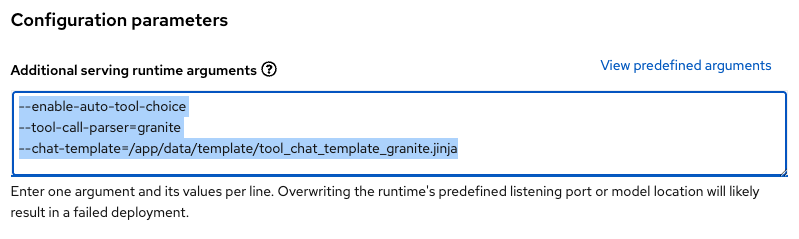

# Enable Function Calling in OpenShift AI

Function calling enhances large language models by enabling them to interact with external tools and APIs in a structured way, extending their capabilities beyond text generation. It equips LLMs with functions (or tools) to perform actions like making API calls, querying databases, executing code, or accessing external knowledge.

While LLMs don’t execute these functions directly, they generate the required parameters, which are then executed by the connected application or system.

## How Function Calling works

When you provide an LLM with a question or task, it analyzes the request and determines the most relevant function to call based on its training, the prompt, and any available context. The LLM doesn’t execute the function itself; instead, it generates a JSON object containing the function name and input arguments. Your application processes this JSON, executes the function, and returns the result to the LLM. This workflow allows the LLM to interact with external systems and perform actions on your behalf.


1. Define Tools: Identify the functions (tools) for the LLM, each with a descriptive name, purpose, and input schema (e.g., JSON Schema).
2. Provide Tools: Pass these tool definitions to your LLM.
Prompt the LLM: Ask a question or assign a task. The LLM will determine the most relevant tool to use.
3. Generate Tool Call: The LLM outputs a JSON object specifying the tool and required arguments.
4. Execute Tool: Your application executes the function with the provided arguments and retrieves the result.
5. Return Results: Send the tool’s output back to the LLM for further processing.
6. Generate Final Response: The LLM integrates the tool results into a user-friendly response.

## Function Calling in vLLM

[vLLM supports](https://docs.vllm.ai/en/latest/features/tool_calling.html) named function calling and offers flexible options for the `tool_choice` field in the chat completion API, including `auto` and `none`. 

By leveraging guided decoding, vLLM ensures that responses adhere to the `tool` parameter objects defined by the JSON schema specified in the `tools` parameter, maintaining structured and accurate interactions.

IMPORTANT: vLLM supports function calling for [certain LLMs](https://docs.vllm.ai/en/latest/features/tool_calling.html#automatic-function-calling) up to 0.6.3+ versions (specifically for IBM Granite3 family is included in [0.6.4](https://github.com/vllm-project/vllm/releases/tag/v0.6.3#:~:text=Add%20support%20for%20Llama%203.1%20and%203.2%20tool%20use%20(%238343)))

## How to enable Function Calling with vLLM in OpenShift AI

To enable Function Calling within vLLM in OpenShift AI we need to use a vLLM image with a 0.6.3+ version (depending on the model you use, like Granite3 family you should use 0.6.5 onwards).

Function Calling will work out of the box with RHOAI 2.17+, which includes the required vLLM versions for LLMs like Granite3. In the meantime, you can use the [suggested vLLM image](quay.io/opendatahub/vllm@sha256:f7e40286a9e0a5870fcb96f3dc6c2cb094ed8eb8d9a17dc886fc6aae2ad06519) (that includes vLLM v0.6.6).

To deploy an LLM with vLLM on OpenShift AI **with Function Calling enabled**, use a Serving Runtime configured with vLLM images and set the required flags as described in the [vLLM documentation](https://docs.vllm.ai/en/latest/features/tool_calling.html#automatic-function-calling):

- **`--enable-auto-tool-choice`**: Mandatory. Enables the model to autonomously generate tool calls when needed.
- **`--tool-call-parser`**: Specifies the tool parser to use. Additional parsers can be registered via `--tool-parser-plugin`.
- **`--tool-parser-plugin`**: Optional. Registers custom tool parsers, which can then be selected with `--tool-call-parser`.
- **`--chat-template`**: Optional for auto tool choice. Defines the chat template handling tool-role and assistant-role messages with tool calls. Pre-configured templates exist for Granite3, Hermes, Mistral, and Llama models in their `tokenizer_config.json` files (like the [Granite3](https://huggingface.co/ibm-granite/granite-3.1-8b-instruct/blob/main/tokenizer_config.json))

The Serving Runtime for [Granite3.0-8B-Instruct](https://huggingface.co/ibm-granite/granite-3.0-8b-instruct), for example, looks like the following:

```yaml
apiVersion: serving.kserve.io/v1alpha1
kind: ServingRuntime
metadata:
  annotations:
    opendatahub.io/recommended-accelerators: '["nvidia.com/gpu"]'
    openshift.io/display-name: CUSTOM - vLLM ServingRuntime - vLLM 0.6.6 - Tool Calling Parser
  labels:
    opendatahub.io/dashboard: "true"
  name: vllm-runtime-tool-calling
spec:
  annotations:
    prometheus.io/path: /metrics
    prometheus.io/port: "8080"
  containers:
    - args:
        - --port=8080
        - --model=/mnt/models
        - --served-model-name={{.Name}}
        - --distributed-executor-backend=mp
        - --max-model-len
        - "6048"
        - --dtype=half
        - --enable-auto-tool-choice
        - --tool-call-parser
        - granite
        - --chat-template
        - /app/data/template/tool_chat_template_granite.jinja
      command:
        - python
        - -m
        - vllm.entrypoints.openai.api_server
      env:
        - name: HF_HOME
          value: /tmp/hf_home
      image: quay.io/opendatahub/vllm@sha256:f7e40286a9e0a5870fcb96f3dc6c2cb094ed8eb8d9a17dc886fc6aae2ad06519
      name: kserve-container
      ports:
        - containerPort: 8080
          protocol: TCP
  multiModel: false
  supportedModelFormats:
    - autoSelect: true
      name: vLLM
```

NOTE: For [Granite3.1-8B-Instruct](https://huggingface.co/ibm-granite/granite-3.1-8b-instruct) as the [vLLM Function Calling documentation](https://docs.vllm.ai/en/latest/features/tool_calling.html#ibm-granite) refers use only the flags:

```yaml
        - --enable-auto-tool-choice
        - --tool-call-parser
        - granite
```

The vLLM images used include different templates for several models, such as Llama3, Hermes, and Mistral, that can be used to enable function calling for these models. Check the [upstream vLLM Function Calling documentation](https://docs.vllm.ai/en/latest/features/tool_calling.html#mistral-models-mistral) to know more.

## Using Function Calling with LangChain

If you're interested in using Function Calling in your apps or Jupyter Notebooks, check out this notebook example of Function Calling with LangChain. 

* *[Function Calling with LangChain example](https://github.com/rh-aiservices-bu/llm-on-openshift/blob/main/examples/notebooks/langchain/Langchain-FunctionCalling.ipynb)*

In this example, we demonstrate how to enable Granite3 (with [Function Calling](https://arxiv.org/abs/2407.00121)) to search the Internet using DuckDuckGo as a tool.

## Bonus: Deploy Function Calling as regular RHOAI user (non-admin)

If you want to deploy Function Calling using vLLM in RHOAI but are not an RHOAI admin, you still have an option to do so!

From Red Hat OpenShift AI 2.16 onwards, you can configure the [additional Serving Runtime arguments](https://docs.redhat.com/en/documentation/red_hat_openshift_ai_self-managed/2.16/html-single/serving_models/index#deploying-models-using-multiple-gpu-nodes_serving-large-models) during model deployment.

NOTE: The only requirement will be having a 0.6.3+ (or 0.6.4+ if you're willing to use Granite3) in vLLM image of the Serving Runtime used, no additional parameters used:

```yaml
apiVersion: serving.kserve.io/v1alpha1
kind: ServingRuntime
metadata:
  annotations:
    opendatahub.io/recommended-accelerators: '["nvidia.com/gpu"]'
    openshift.io/display-name: CUSTOM - vLLM ServingRuntime for KServe Tweaked
      Float16 - v0.6.4 - Tool Calling Parser Generic
  labels:
    opendatahub.io/dashboard: "true"
  name: vllm-runtime-tool-calling-generic
spec:
  annotations:
    prometheus.io/path: /metrics
    prometheus.io/port: "8080"
  containers:
    - args:
        - --port=8080
        - --model=/mnt/models
        - --served-model-name={{.Name}}
        - --distributed-executor-backend=mp
        - --max-model-len
        - "6048"
        - --dtype=half
      command:
        - python
        - -m
        - vllm.entrypoints.openai.api_server
      env:
        - name: HF_HOME
          value: /tmp/hf_home
      image: quay.io/opendatahub/vllm@sha256:f7e40286a9e0a5870fcb96f3dc6c2cb094ed8eb8d9a17dc886fc6aae2ad06519
      name: kserve-container
      ports:
        - containerPort: 8080
          protocol: TCP
  multiModel: false
  supportedModelFormats:
    - autoSelect: true
      name: vLLM
```

When you deploy your Model Serving (Granite3.0-8B-Instruct in this case) as a regular user in RHOAI Dashboard, in the Additional serving runtime arguments define the following:

```yaml
--enable-auto-tool-choice
--tool-call-parser=granite
--chat-template=/app/data/template/tool_chat_template_granite.jinja
```



NOTE: For Granite3.1-8B-Instruct only the flags `--enable-auto-tool-choice` and `--tool-call-parser=granite` are required, remove the --chat-template flag as is not required.

This setup creates a "generic" Serving Runtime for Function Calling, allowing you to customize additional Serving Runtime arguments depending on the model used.

The vLLM image includes the following templates ([vLLM image](quay.io/opendatahub/vllm@sha256:f7e40286a9e0a5870fcb96f3dc6c2cb094ed8eb8d9a17dc886fc6aae2ad06519) with vLLM 0.6.6):

```bash
ls /app/data/template/
template_alpaca.jinja        template_vlm2vec.jinja
template_baichuan.jinja      tool_chat_template_granite.jinja
template_blip2.jinja         tool_chat_template_granite_20b_fc.jinja
template_chatglm.jinja       tool_chat_template_hermes.jinja
template_chatglm2.jinja      tool_chat_template_internlm2_tool.jinja
template_chatml.jinja        tool_chat_template_llama3.1_json.jinja
template_dse_qwen2_vl.jinja  tool_chat_template_llama3.2_json.jinja
template_falcon.jinja        tool_chat_template_llama3.2_pythonic.jinja
template_falcon_180b.jinja   tool_chat_template_mistral.jinja
template_inkbot.jinja        tool_chat_template_mistral_parallel.jinja
template_llava.jinja         tool_chat_template_toolace.jinja
```

For additional details about template models and using Function Calling, check the [vLLM Function Calling documentation](https://docs.vllm.ai/en/latest/features/tool_calling.html#mistral-models-mistral)

Happy function calling!