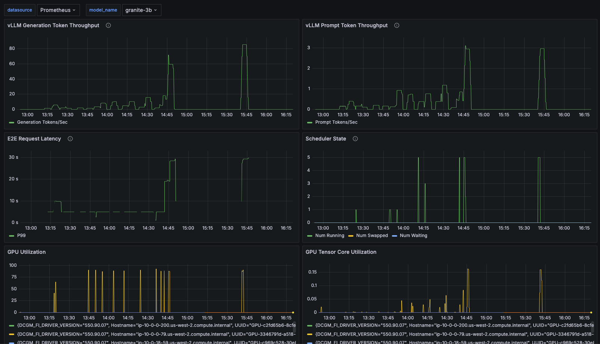

# RHOAI Metrics Dashboard for Single Serving Models

Enable RHOAI User Workload Metrics for Single Serving Models and deploy the Grafana Metrics Dashboard to monitor the performance of your Single Serving Models and the resources they consume.

## Overview

Enabling RHOAI User Workload Metrics for Single Serving Models and deploying a Grafana Metrics Dashboard provides valuable insights into the performance and resource usage of your Single Model Serving instances.

By monitoring these metrics, you can identify bottlenecks, optimize resource allocation, and ensure efficient infrastructure utilization. This enables data-driven decisions to improve the overall performance and scalability of your AI applications.

* *[RHOAI Metrics Dashboard for Single Serving Models Code Repository](https://github.com/rh-aiservices-bu/rhoai-uwm)*

### Prerequisites

- OpenShift 4.10 or later
- OpenShift AI 2.10+ installed
- [OpenShift AI KServe installed and configured](https://docs.redhat.com/en/documentation/red_hat_openshift_ai_self-managed/2.11/html/serving_models/serving-large-models_serving-large-models#configuring-automated-installation-of-kserve_serving-large-models)
- [NVIDIA GPU Operator installed and configured](https://docs.nvidia.com/datacenter/cloud-native/openshift/latest/install-gpu-ocp.html)

## Installation

To enable RHOAI User Workload Metrics for Single Serving Models and deploy the Grafana Metrics Dashboard, perform the following steps:

* [Configure Monitoring for the Single Model Serving Platform](https://docs.redhat.com/en/documentation/red_hat_openshift_ai_self-managed/2.11/html/serving_models/serving-large-models_serving-large-models#configuring-monitoring-for-the-single-model-serving-platform_serving-large-models)
* [Configure GPU Monitoring Dashboard](https://docs.nvidia.com/datacenter/cloud-native/openshift/23.9.2/enable-gpu-monitoring-dashboard.html)
* [Install the RHOAI Metrics Grafana and Dashboards for Single Serving Models](https://github.com/rh-aiservices-bu/rhoai-uwm/blob/main/rhoai-uwm-grafana/README.md)

### Configure Monitoring for the Single Model Serving Platform

To configure monitoring for the Single Model Serving Platform, refer to the [official documentation](https://docs.redhat.com/en/documentation/red_hat_openshift_ai_self-managed/2.11/html/serving_models/). The Single Model Serving Platform includes metrics for supported runtimes of the KServe component. KServe relies on the underlying model-serving runtimes to provide metrics and does not generate its own. The available metrics for a deployed model depend on its model-serving runtime.

Additionally, you can configure monitoring for OpenShift Service Mesh to understand dependencies and traffic flow between components in the mesh.

Once monitoring is configured for the Single Model Serving Platform, you can [view the metrics](https://docs.redhat.com/en/documentation/red_hat_openshift_ai_self-managed/2.11/html/serving_models/serving-large-models_serving-large-models#viewing-metrics-for-the-single-model-serving-platform_serving-large-models) in the OpenShift Web Console under the **Observe Dashboards** section.

### Configure GPU Monitoring Dashboard

To configure the GPU Monitoring Dashboard, refer to the [official documentation](https://docs.nvidia.com/datacenter/cloud-native/openshift/23.9.2/enable-gpu-monitoring-dashboard.html). The GPU Monitoring Dashboard provides a comprehensive view of GPU utilization, memory usage, and other metrics for your GPU nodes.

The GPU Operator exposes GPU telemetry for Prometheus using the NVIDIA DCGM Exporter. These metrics can be visualized in the OpenShift Web Console under the **Observe Dashboards** section, specifically in the [NVIDIA DCGM Exporter Dashboard](https://docs.nvidia.com/datacenter/cloud-native/openshift/latest/enable-gpu-monitoring-dashboard.html#viewing-gpu-metrics).

> **Note:** This step is optional but very useful for monitoring the GPU resources consumed by your Single Serving Models. If you do **not enable** this step, the Grafana Dashboard will not display GPU metrics.

### Install the RHOAI Metrics Grafana and Dashboards for Single Serving Models

To install the RHOAI Metrics Grafana Dashboards for Single Serving Models (for both vLLM and OpenVino), refer to the [RHOAI UWM repository](https://github.com/rh-aiservices-bu/rhoai-uwm/tree/main/rhoai-uwm-grafana). The Grafana Dashboard provides a comprehensive view of the performance and resource utilization of Single Serving Models.

```bash
kubectl apply -k overlays/grafana-uwm-user-app
```

The RHOAI UWM Grafana Dashboard will deploy a Grafana instance with pre-configured dashboards for monitoring the performance of your Single Serving Models using the Grafana Operator.

The following dashboards are currently available:

- **vLLM Model Metrics Dashboard**: Provides Model metrics for vLLM Single Serving Models dashboard.



- **vLLM Service Performance Dashboard**: Provides Service Performance metrics for vLLM Single Serving Models dashboard.


- **OpenVino Service Model Metrics Dashboard**: Provides metrics for OpenVino Single Serving Models


- **OpenVino Model Metrics Dashboard**: Provides Service Performance metrics for OpenVino Single Serving Models.


### Conclusion

By turning on RHOAI User Workload Metrics and setting up the Grafana Dashboard, you can easily track how your Single Serving Models are doing and what resources they're using. It helps you find problems, tweak resource use, and make better choices to keep your AI apps running smoothly.
