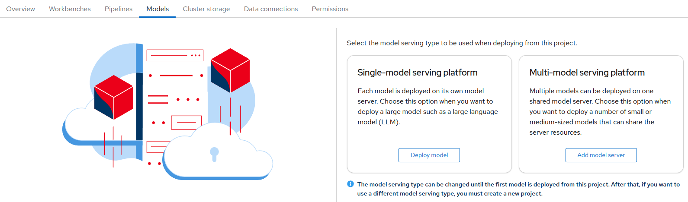

# Model Serving Type Modification

## Background

In each Project, you can only have one type of Model Serving: either **Single-model** Serving, or **Multi-model** Serving.

This is due to the fact that the engines responsible of model serving share the same definitions (CRDs) for them. If both were enabled simultaneously in the same project, it would be impossible to know which one should handle a model serving definition.

So when you serve the first model in a project, you need to choose which type of model serving you want to use. It then becomes "fixed" and all further model serving will be of the chose type.

## Changing the Serving Type

### How this works?

The behavior is controlled by a simple label in the **Namespace** definition of your project: `modelmesh-enabled`.

- When this label does not exist, you get the initial choice panel on the Dashboard:

      

- When this label is set to `true`, so like this:
  
    ```yaml
      labels:
        modelmesh-enabled: 'true'
    ```

    Then Multi-model Serving (ModelMesh) is enabled:

    

- When this label is set to `false` (or whatever value other than true to be honest, you can try 😉), like this:

    ```yaml
      labels:
        modelmesh-enabled: 'false'
    ```

    Then Single-model Serving (ModelMesh) is enabled:

    

### Changing the type

!!! important
      Starting with version 2.16 of OpenShift AI, the following procedure is not needed any more. A **Change** button has been added right next to the model serving type label, achieving the same in a much simpler way.

So what to do if you have remorse at some point and want to change the serving type? The recipe is pretty simple with what we now know.

!!! important
    **Prerequisite**: you need to be OpenShift Cluster admin, or find a friend who is, or have enough rights to modify the Namespace object from your project.

- Remove all existing served models. As the type of model serving and engine will change, the definitions won't be compatible in most cases and cause lots of trouble. If you don't use the Dashboard, remove all instances of `InferenceService` and `ServingRuntime` from your project/namespace.
- In the OpenShift Console, open the YAML definition of your Namespace (not the Project, that you can't modify!).<br>
  You will find it under the Administrator perspective, under Administration->Namespaces:
  
    

- In the YAML, modify, delete or add the label `modelmesh-enabled` according to the rules explained above.
- The change will be immediately reflected in the Dashboard.
- You can now deploy a new model with the Serving type you chose.
