# ODH and RHODS Configuration

## Standard configuration

As an administrator of ODH/RHODS, you have access to different settings through the Settings menu on the dashboard:

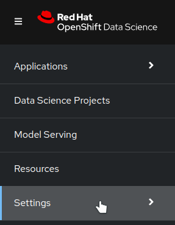{ style="width:200px"}

### Custom notebook images

That's where you can import other notebooks images. You will find resources on available custom images and how to create your own in the [Custom notebooks](custom-notebooks.md) section.

To import a new image, follow those steps.

- Click on import image.

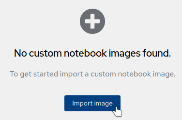{ style="width:300px"}

- Enter the full address of your container, set a name (this is what will appear in the launcher), and a description.

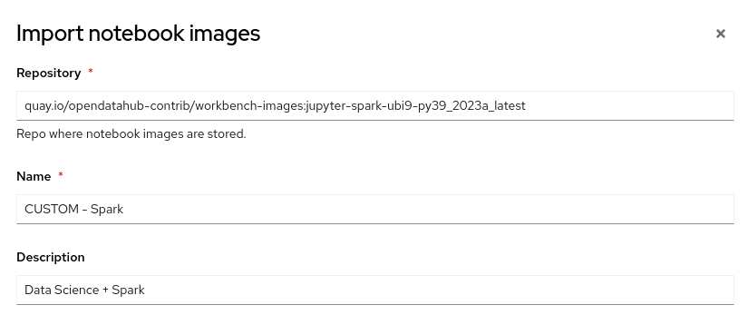

- On the bottom part, add information regarding the softwares and the packages that are present in this image. This is purely informative.

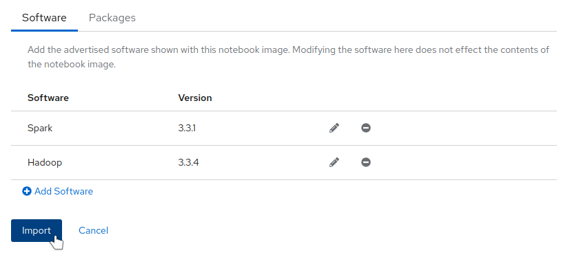

- Your image is now listed and enabled. You can hide it without removing it by simply disabling it.

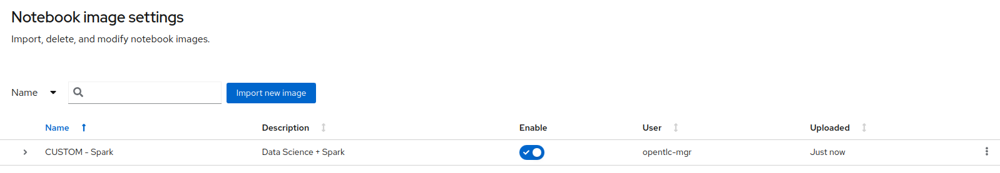

- And it is now available in the launcher, as well as in the Data Science Projects.

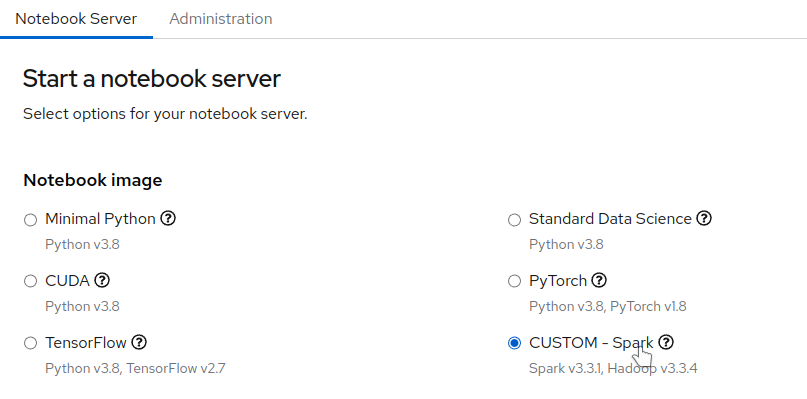{ style="width:600px"}

### Cluster settings

In this panel, you are able to adjust:

- The default size of the volumes that are created for new users.
- If you want to stop idle notebooks, and after how much time.
!!! note
    This feature currently looks at running Jupyter kernels, like a Python notebook. If you are only using a Terminal, or another IDE window like VSCode or RStudio from the [custom images](custom-notebooks.md), this activity is not detected and your Pod can be stopped without notice after the set delay.
- If you allow usage data to be collected and reported.
- If you want to add a toleration to the notebook pods to allow them to be scheduled on tainted nodes. That feature is really useful if you want to dedicate specific workers nodes to running notebooks. Tainting them will prevent other workloads to run on them, but you have of course have to add the toleration to the pods.

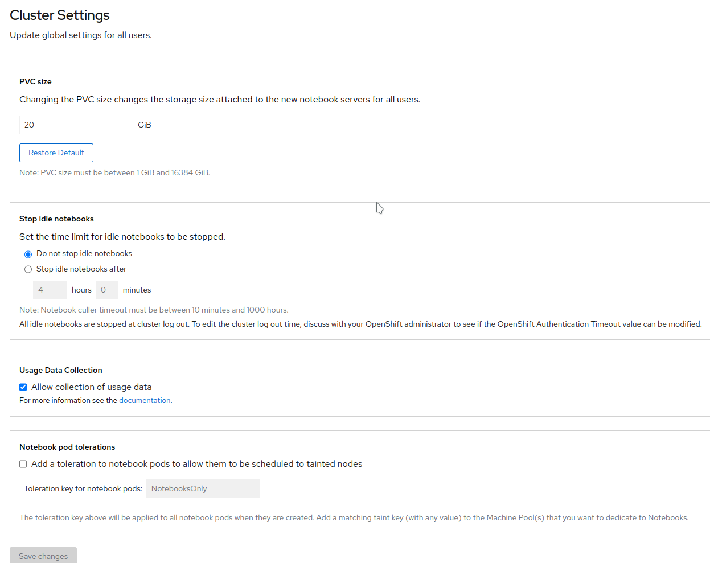

### User management

In this panel, you can edit who has access to RHODS by defining the "Data Science user groups", and who has access to the Settings by defining the "Data Science administrators groups".

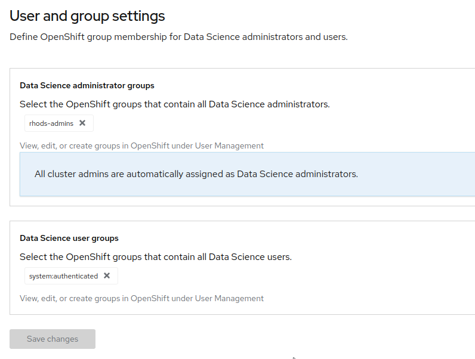

## Advanced configuration

### Dashboard configuration

RHODS or ODH main configuration is done trough a Custom Resource (CR) of type `odhdashboardconfigs.opendatahub.io`.

- To get access to it, from your OpenShift console, navigate to Home->API Explorer, and filter for `OdhDashboardConfig`:

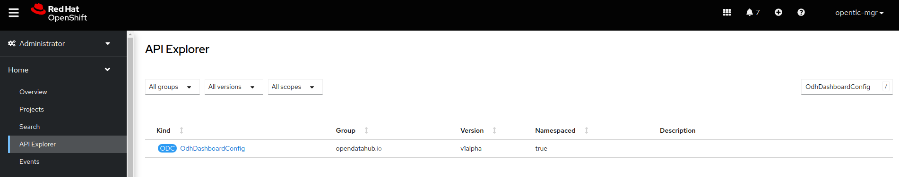

- Click on `OdhDashboardConfig` and in the Instances tab, click on `odh-dashboard-config`:

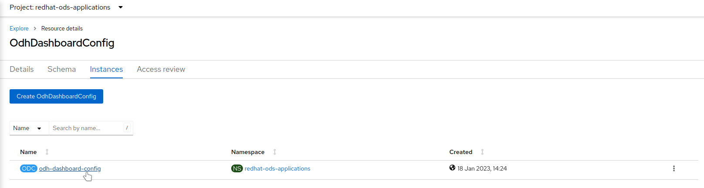

- You can now view and edit the YAML file to modify the configuration:

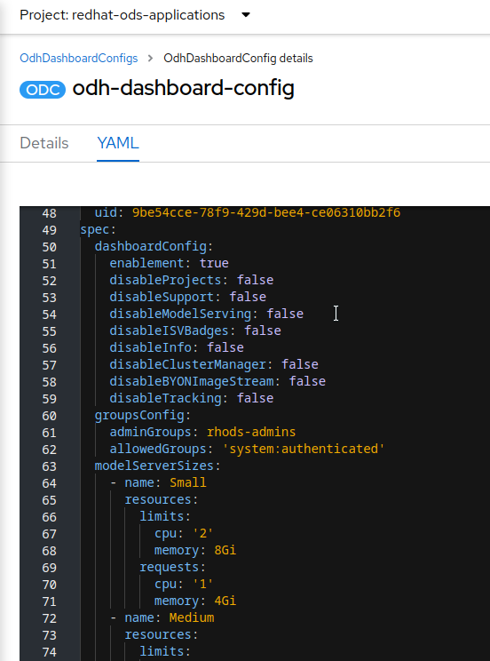

In the `spec` section, the following items are of interest:

- `dashboardConfig`: the different toggles will allow you to activate/deactivate certain features. For example you may want to hide Model Serving for your users, or prevent them to import custom images.
- `notebookSizes`: that is where you can fully customize the sizes of the notebooks. You can of course modify the resources, but also add or remove sizes to the default configuration.
- `modelServerSizes`: that is the same concept as the previous setting, but for model servers.

### Adding a custom application

Let's say you have installed another application in your cluster and you want to make it available through the dashboard. That's easy! A tile is in fact represented by a custom resource (CR) of type `OdhApplication`.

In this example we will add a tile to access the MLFlow UI (see the [MLFlow installation](../tools-and-applications/mlflow/mlflow.md) instructions to test it).

- The file [mlflow-tile.yaml](mlflow-tile.yaml){:target="_blank"} gives you an example on how to create the tile.
- Edit this file to set the `route` (the name of the Route CR) and `routeNamespace` parameters to where the UI is accessible. In this example, this is `mlflow-server`(route name) and `mlflow` (server). Apply this file to create the resource.
- Wait 1-2 mn for the change to take effect. Your tile is now available in the Explore view (bottom left):

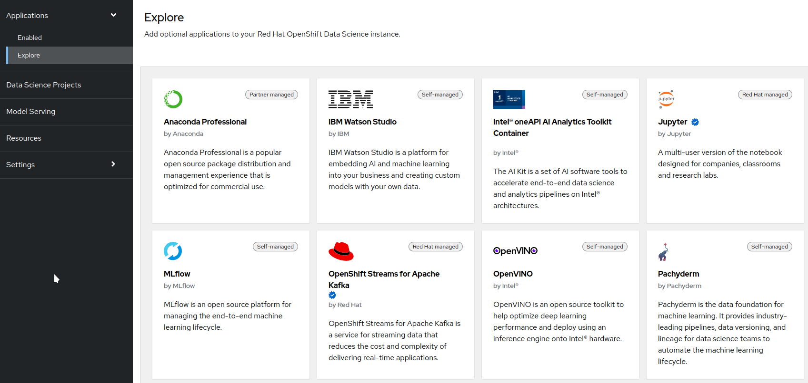

- However it is not yet enabled. To enable this tile, you can click on it in the Explorer view, then click on the "Enable" button at the top of the description. You can also create a ConfigMap from the file [cm-mlflow-enable.yaml](cm-mlflow-enable.yaml){:target="_blank"}.
- Wait another 1-2 mn, and your tile is now ready to use in the Enabled view:

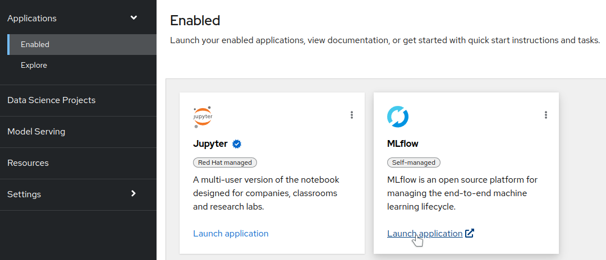
