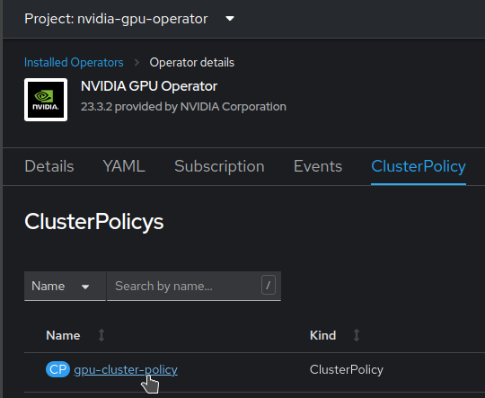

# Working with NVIDIA GPUs

## Using NVIDIA GPUs on OpenShift

### How does this work?

NVIDIA GPUs can be easily installed on OpenShift. Basically it involves installing two different operators.

The Node Feature Discovery operator will "discover" your cards from a hardware perspective and appropriately label the relevant nodes with this information.

Then the NVIDIA GPU operator will install the necessary drivers and tooling to those nodes. It will also integrate into Kubernetes so that when a Pod requires GPU resources it will be scheduled on the right node, and make sure that the containers are "injected" with the right drivers,  configurations and tools to properly use the GPU.

So from a user perspective, the only thing you have to worry about is asking for GPU resources when defining your pods, with something like:

```yaml
spec:
  containers:
  - name: app
    image: ...
    resources:
      requests:
        memory: "64Mi"
        cpu: "250m"
        nvidia.com/gpu: 2
      limits:
        memory: "128Mi"
        cpu: "500m"
```

But don't worry, OpenShift Data Science and Open Data Hub take care of this part for you when you launch notebooks, workbenches, model servers, or pipeline runtimes!

### Installation

Here is the documentation you can follow:

- [OpenShift Data Science documentation](https://access.redhat.com/documentation/en-us/red_hat_openshift_data_science_self-managed/1-latest/html/installing_openshift_data_science_self-managed/enabling-gpu-support-in-openshift-data-science_install)
- [NVIDIA documentation (more detailed)](https://docs.nvidia.com/datacenter/cloud-native/gpu-operator/latest/openshift/contents.html)

## Advanced configuration

### Working with taints

In many cases, you will want to restrict access to certain types of expensive GPUs (or to any GPU at all), or be able to provide choice between different types of GPUs: simply stating "I want a GPU" is not enough.

The only supported method at the moment to achieve this is to taint nodes, then apply tolerations on the Pods depending on where you want them scheduled. If you don't pay close attention though when applying taints on Nodes, you may end up with the NVIDIA drivers not installed on those nodes...

In this case you must:

- Apply the taints you need to your Nodes or MachineSets, for example:

```yaml
apiVersion: machine.openshift.io/v1beta1
kind: MachineSet
metadata:
  ...
spec:
  replicas: 1
  selector:
    ...
  template:
    ...
    spec:
      ...
      taints:
        - key: accessrestricted
          value: "yes"
          effect: NoSchedule
```

- Apply the relevant toleration to the NVIDIA Operator.
    - In the `nvidia-gpu-operator` namespace, get to the Installed Operator menu, open the NVIDIA GPU Operator settings, get to the ClusterPolicy tab, and edit the ClusterPolicy.

    - Edit the YAML, and add the toleration in the daemonset section:

```yaml
apiVersion: nvidia.com/v1
kind: ClusterPolicy
metadata:
  ...
  name: gpu-cluster-policy
spec:
  vgpuDeviceManager: ...
  migManager: ...
  operator: ...
  dcgm: ...
  gfd: ...
  dcgmExporter: ...
  cdi: ...
  driver: ...
  devicePlugin: ...
  mig: ...
  sandboxDevicePlugin: ...
  validator: ...
  nodeStatusExporter: ...
  daemonsets:
    ...
    tolerations:
      - effect: NoSchedule
        key: accessrestricted
        operator: Exists
  sandboxWorkloads: ...
  gds: ...
  vgpuManager: ...
  vfioManager: ...
  toolkit: ...
...
```

That's it, the operator is now able to deploy all the NVIDIA tooling on the nodes. Repeat the procedure for any taint you want to apply to your nodes.
