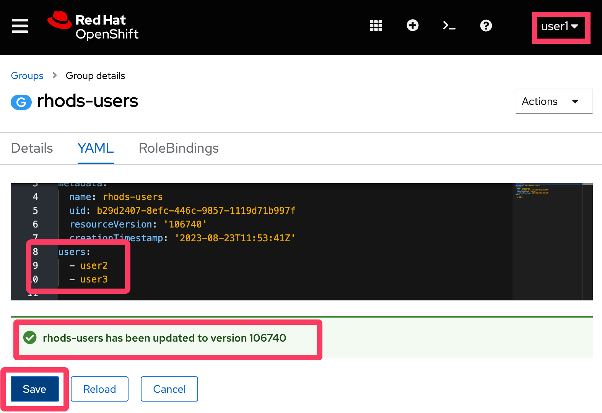

# OpenShift Group Management

In the Red Hat OpenShift Documentation, there are [instructions](https://access.redhat.com/documentation/en-us/red_hat_openshift_data_science/1/html/managing_users_and_user_resources/defining-openshift-data-science-admin-and-user-groups_user-mgmt) on how to configure a specific list of RHODS Administrators and RHODS Users.

However, if the list of users keep changing, the membership of the groupd called `rhods-users` will have to be updated frequently. By default, in OpenShift, only OpenShift admins can edit group membership. Being a RHODS Admin does not confer you those admin privileges, and so, it would fall to the OpenShift admin to administer that list.

The instructions in page will show how the OpenShift Admin can create these groups in such a way that any member of the group `rhods-admins` can edit the users listed in the group `rhods-users`.

For expediency in the instructions, we are using the `oc` cli, but these can also be achieved using the OpenShift Web Console. We will assume that the user setting this up has admin privileges to the cluster.

## Creating the groups

Here, we will create the groups mentioned above. Note that you can alter those names if you want, but will then need to have the same alterations throughout the instructions.

1. To create the groups:
    ```bash
    oc adm groups new rhods-users
    oc adm groups new rhods-admins
    ```
1. The above may complain about the group(s) already existing.
1. To confirm both groups exist:
    ```bash
    oc get groups | grep rhods
    ```
1. That should return:
    ```log
    bash-4.4 ~ $ oc get groups | grep rhods
    rhods-admins
    rhods-users
    ```

## Creating ClusterRole and ClusterRoleBinding

1. This will create a Cluster Role and a Cluster Role Binding:
    ```bash
    oc apply -f - <<EOF
    apiVersion: rbac.authorization.k8s.io/v1
    kind: ClusterRole
    metadata:
      name: update-rhods-users
    rules:
      - apiGroups: ["user.openshift.io"]
        resources: ["groups"]
        resourceNames: ["rhods-users"]
        verbs: ["update", "patch", "get"]
    ---
    kind: ClusterRoleBinding
    apiVersion: rbac.authorization.k8s.io/v1
    metadata:
      name: rhods-admin-can-update-rhods-users
    subjects:
      - kind: Group
        apiGroup: rbac.authorization.k8s.io
        name: rhods-admins
    roleRef:
      apiGroup: rbac.authorization.k8s.io
      kind: ClusterRole
      name: update-rhods-users
    EOF
    ```
1. To confirm they were both succesfully created, run:
    ```bash
    oc get ClusterRole,ClusterRoleBinding  | grep 'update\-rhods'
    ```
1. You should see:
    ```log
    bash-4.4 ~ $ oc get ClusterRole,ClusterRoleBinding  | grep 'update\-rhods'
    clusterrole.rbac.authorization.k8s.io/update-rhods-users
    clusterrolebinding.rbac.authorization.k8s.io/rhods-admin-can-update-rhods-users
    ```

## Add some users as `rhods-admins`

To confirm this works, add a user to the `rhods-admin` group. In my example, I'll add `user1`

## Capture the URL to edit the `rhods-user` group

Since people who are not cluster admin won't be able to browse the list of groups, capture the URL that allows to control the membership of `rhods-users`.

It should look similar to:

`https://console-openshift-console.apps.<thecluster>/k8s/cluster/user.openshift.io~v1~Group/rhods-users`

## Ensure that `rhods-admins` are now able to edit `rhods-users`

Ask someone in the `rhods-admins` group to confirm that it works for them. (Remember to provide them with the URL to do so).

