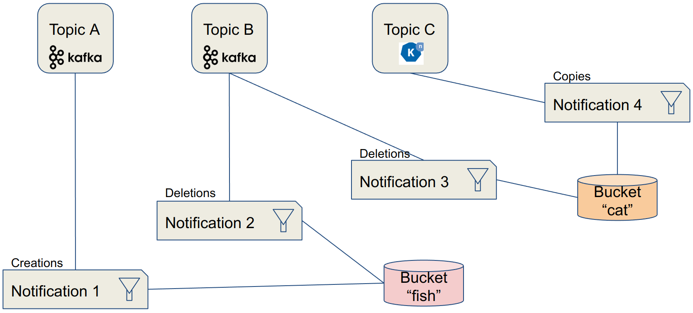

# Bucket Notifications

## Description

The **Rados Gateway (RGW)** component of **Ceph** provides Object Storage through an **S3-compatible** API on all Ceph implementations: **OpenShift Data Foundation** and its upstream version **Rook-Ceph**, **Red Hat Ceph Storage**, **Ceph**,…​

Bucket notifications provide a mechanism for sending information from the **RGW** when certain **events** are happening on a **bucket**. Currently, notifications can be sent to: HTTP, AMQP0.9.1 and Kafka endpoints.

From a data engineering point of view, **bucket notifications** allow to create an **event-driven** architecture, where messages (instead of simply log entries) can be sent to various processing components or event buses whenever something is happening on the object storage: object creation, deletion, with many fine-grained settings available.

## Use cases

### Application taking actions on the objects

As part of an event-driven architecture, this pattern can be used to trigger an application to perform an action following the storage event. An example could be the automated processing of a new image that has just been uploaded to the object storage (analysis, resizing,…​). Paired with Serverless functions this becomes a pretty efficient architecture compared to having an application constantly monitoring or polling the storage, or to have to implement this triggering process in the application interacting with the storage. This loosely-coupled architecture also gives much more agility for updates, technology evolution,…​

### External monitoring systems

The events sent by the RGW are simple messages containing all the metadata relevant to the event and the object. So it can be an excellent source of information for a monitoring system. For example if you want to keep a trace or send an alert whenever a specific type of file, or with a specific name, is uploaded or deleted from the storage.

## Implementations examples

This pattern is implemented in the [XRay pipeline demo](../../demos/xray-pipeline/xray-pipeline.md)

## How does it work?

### Characteristics

- Notifications are sent directly from the RGW on which the event happened to an external endpoint.
- Pluggable endpoint architecture:
    - HTTP/S
    - AMQP 0.9.1
    - Kafka
    - Knative

### Data Model

- Topics contain the definition of a specific endpoint in “push mode”
- Notifications tie topics with buckets, and may also include filter definition on the events



## Configuration

This configuration shows how to create a notification that will send a message (event) to a Kafka topic when a new object is created in a bucket.

### Requirements

- Access to a Ceph/ODF/RHCS installation with the RGW deployed.
- Endpoint address (URL) for the RGW.
- Credentials to connect to the RGW:
    - AWS_ACCESS_KEY_ID
    - AWS_SECRET_ACCESS_KEY

!!! note
    As Ceph implements an S3-Compatible API to access Object Storage, standard naming for variables or procedures used with S3 were retained to stay coherent with examples, demos or documentation related to S3. Therefore the AWS prefix in the previous variables.

### Topic Creation

A topic is the definition of a specific endpoint. It must be created first.

#### Method 1: "RAW" configuration

As everything is done through the RGW API, you can query it directly. To be fair, this method is almost never used (unless there is no SDK or S3 tool for your environment) but gives a good understanding of the process.

Example for a Kafka Endpoint:

```http
POST
Action=CreateTopic
&Name=my-topic
&push-endpoint=kafka://my-kafka-broker.my-net:9999
&Attributes.entry.1.key=verify-ssl
&Attributes.entry.1.value=true
&Attributes.entry.2.key=kafka-ack-level
&Attributes.entry.2.value=broker
&Attributes.entry.3.key=use-ssl
&Attributes.entry.3.value=true
&Attributes.entry.4.key=OpaqueData
&Attributes.entry.4.value=https://s3-proxy.my-zone.my-net
```

!!! note
    The authentication part is not detailed here as the mechanism is pretty convoluted, but it is directly implemented in most API development tools, like Postman.

The full reference for the REST API for bucket notifications is available [here](https://docs.ceph.com/en/latest/radosgw/notifications/#bucket-notification-rest-api){:target="_blank}.

#### Method 2: Python + AWS SDK

As the creator of the S3 API, AWS is providing [SDKs](https://aws.amazon.com/tools/){:target="_blank} for the main languages to interact with it. Thanks to this compatibility, you can use those SDKs to interact with Ceph in the same way. For Python, the library to interact with AWS services is called boto3.

Example for a Kafka Endpoint:

```python
import boto3
sns = boto3.client('sns',
                endpoint_url = endpoint_url,
                aws_access_key_id = aws_access_key_id,
                aws_secret_access_key= aws_secret_access_key,
                region_name='default',
                config=botocore.client.Config(signature_version = 's3'))

attributes = {}
attributes['push-endpoint'] = 'kafka://my-cluster-kafka-bootstrap:9092'
attributes['kafka-ack-level'] = 'broker'

topic_arn = sns.create_topic(Name=my-topic, Attributes=attributes)['TopicArn']
```

### Notification Configuration

The notification configuration will "tie" a bucket with a topic.

#### Method 1: "RAW" configuration

As previously, you can directly query the RGW REST API. This is done through an XML formatted payload that is sent with a PUT command.

Example for a Kafka Endpoint:

```xml
PUT /my-bucket?notification HTTP/1.1

<NotificationConfiguration xmlns="http://s3.amazonaws.com/doc/2006-03-01/">
    <TopicConfiguration>
        <Id>my-notification</Id>
        <Topic>my-topic</Topic>
        <Event>s3:ObjectCreated:*</Event>
        <Event>s3:ObjectRemoved:DeleteMarkerCreated</Event>
    </TopicConfiguration>
    <TopicConfiguration>
...
    </TopicConfiguration>
</NotificationConfiguration>
```

Again, the full reference for the REST API for bucket notifications is available [here](https://docs.ceph.com/en/latest/radosgw/notifications/#bucket-notification-rest-api){:target="_blank}.

#### Method 2: Python + AWS SDK

Example for a Kafka Endpoint:

```python
import boto3
s3 = boto3.client('s3',
                endpoint_url = endpoint_url,
                aws_access_key_id = aws_access_key_id,
                aws_secret_access_key = aws_secret_access_key,
                region_name = 'default',
                config=botocore.client.Config(signature_version = 's3'))

bucket_notifications_configuration = {
            "TopicConfigurations": [
                {
                    "Id": 'my-id',
                    "TopicArn": 'arn:aws:sns:s3a::my-topic',
                    "Events": ["s3:ObjectCreated:*"]
                }
            ]
        }

s3.put_bucket_notification_configuration(Bucket = bucket_name,
        NotificationConfiguration=bucket_notifications_configuration)
```

### Filters

Although a notification is specific to a bucket (and you can have multiple configurations on one bucket), you may want that it does not apply to all the objects from this bucket. For example you want to send an event when an image is uploaded, but not do anything it’s another type of file. You can do this with filters! And not only on the filename, but also on the tags associated to it in its metadata.

Filter examples, on keys or tags:

```xml
<Filter>
    <S3Key>
        <FilterRule>
         <Name>regex</Name>
         <Value>([0-9a-zA-Z\._-]+.(png|gif|jp[e]?g)</Value>
        </FilterRule>
    </S3Key>
    <S3Tags>
        <FilterRule>
            <Name>Project</Name><Value>Blue</Value>
        </FilterRule>
        <FilterRule>
            <Name>Classification</Name><Value>Confidential</Value>
        </FilterRule>
    </S3Tags>
</Filter>
```

### Events

The notifications sent to the endpoints are called events, and they are structured like this:

Event example:

```json
{"Records":[
    {
        "eventVersion":"2.1",
        "eventSource":"ceph:s3",
        "awsRegion":"us-east-1",
        "eventTime":"2019-11-22T13:47:35.124724Z",
        "eventName":"ObjectCreated:Put",
        "userIdentity":{
            "principalId":"tester"
        },
        "requestParameters":{
            "sourceIPAddress":""
        },
        "responseElements":{
            "x-amz-request-id":"503a4c37-85eb-47cd-8681-2817e80b4281.5330.903595",
            "x-amz-id-2":"14d2-zone1-zonegroup1"
        },
        "s3":{
            "s3SchemaVersion":"1.0",
            "configurationId":"mynotif1",
            "bucket":{
                "name":"mybucket1",
                "ownerIdentity":{
                    "principalId":"tester"
                },
                "arn":"arn:aws:s3:us-east-1::mybucket1",
                "id":"503a4c37-85eb-47cd-8681-2817e80b4281.5332.38"
            },
            "object":{
                "key":"myimage1.jpg",
                "size":"1024",
                "eTag":"37b51d194a7513e45b56f6524f2d51f2",
                "versionId":"",
                "sequencer": "F7E6D75DC742D108",
                "metadata":[],
                "tags":[]
            }
        },
        "eventId":"",
        "opaqueData":"me@example.com"
    }
]}
```
