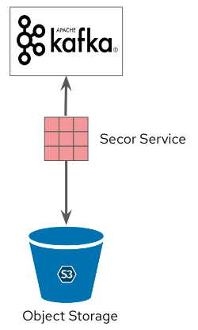

# Kafka to Object Storage

## Description

Kafka is a distributed event stream processing system which is great for storing hot relevant data. Based on the retention policy of the data, it can be used to store data for a long time. However, it is not suitable for storing data for a long time. This is where we need a mechanism to move data from Kafka to the object storage.

## Use Cases

### Long term retention of data

As Kafka is not really suited for long term retention of data, persisting it inside an object store will allow you to keep your data for further use, backup or archival purposes. Depending on the solution you use, you can also transform or format you data while storing it, which will ease further retrieval.

### Move data to Central Data Lake

Production Kafka environment may not be the best place to run analytics or do model training. Transferring or copying the date to a central data lake will allow you to decouple those two aspects (production and analytics), bringing peace of mind and further capabilities to the data consumers.

## Implementations examples

This pattern is implemented in the [Smart City demo](../../../demos/smart-city/smart-city.md)

## Configuration Using Secor

This pattern implements the Secor Kafka Consumer. It can be used to consume kafka messages from a kafka topic and store that to S3 compatible Objet Buckets.

[Secor](https://github.com/pinterest/secor){:target="_blank"} is a service persisting Kafka logs to Amazon S3, Google Cloud Storage, Microsoft Azure Blob Storage and Openstack Swift. Its key features are: *strong consistency, fault tolerance, load distribution, horizontal scalability, output partitioning, configurable upload policies, monitoring, customizability, event transformation*.

### Prerequisites

#### Bucket

An S3-compatible bucket, with its access key and secret key.

#### ZooKeeper Entrance

Secor needs to connect directly to Zookeeper to keep track of some data. If you have a secured installation of Zookeeper, like when you deploy Kafka using Strimzi or AMQStreams, you need to deploy a **[ZooKeeper Entrance](https://github.com/scholzj/zoo-entrance){:target="_blank"}**. This is a special proxy to Zookeeper that will allow this direct connection.

!!! note
    The deployment file is based on a Strimzi or AMQ Streams deployment of Kafka. If you configuration is different you may have to adapt some of the parameters.

Deployment:

- In the file [deployment/zookeeper-entrance.yaml](deployment/zookeeper-entrance.yaml){:target="_blank"}, replace:
    - the occurrences of 'NAMESPACE' by the namespace where the Kafka cluster is.
    - the occurrences of 'YOUR_KAFKA' by the name of your Kafka cluster.
    - the parameters YOUR_KEY, YOUR_SECRET, YOUR_ENDPOINT, YOUR_BUCKET with the values corresponding to the bucket where you want to store the data.
- Apply the modified file to deploy ZooKeeper Entrance.

### Deployment

#### Secor

- In the file [deployment/secor.yaml](deployment/secor.yaml){:target="_blank"}, replace:
    - the occurrences of 'NAMESPACE' by the namespace where the Kafka cluster is.
    - the occurrences of 'YOUR_KAFKA' by the name of your Kafka cluster.
    - adjust all the other Secor parameters or add others depending on the processing you want to do with the data: output format, aggregation,... Full instructions are [available here](https://github.com/pinterest/secor/blob/master/README.setup.md){:target="_blank"}.
- Apply the modified file to deploy Secor.
