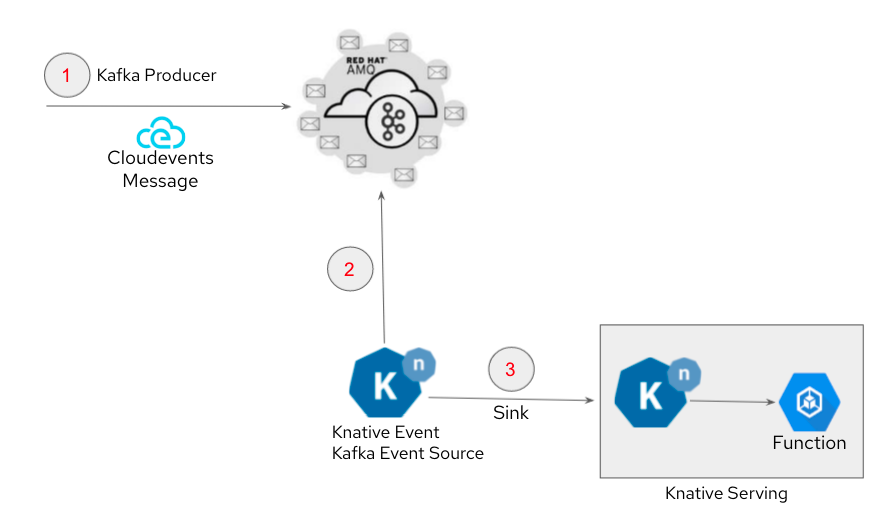

# Kafka to Serverless

## Description

This pattern describes how to use AMQ Streams (Kafka) as an event source to OpenShift Serverless (Knative). You will learn how to implement Knative Eventing that can trigger a Knative Serving function when a messaged is posted to a Kafka Topic (Event).

### Knative & OpenShift Serverless

[Knative](https://knative.dev/docs/){:target="_blank"} is an open source project that helps to deploy and manage modern serverless workloads on Kubernetes. [Red Hat OpenShift Serverless](https://cloud.redhat.com/learn/topics/serverless){:target="_blank"} is an enterprise-grade serverless offering based on knative that provides developers with a complete set of tools to build, deploy, and manage serverless applications on OpenShift Container Platform

Knative consists of 3 primary components:

- Build - A flexible approach to building source code into containers.
- Serving - Enables rapid deployment and automatic scaling of containers through a request-driven model for serving workloads based on demand.
- Eventing - An infrastructure for consuming and producing events to stimulate applications. Applications can be triggered by a variety of sources, such as events from your own applications, cloud services from multiple providers, Software-as-a-Service (SaaS) systems, and Red Hat AMQ streams.

### EDA (Event Driven Architecture)

[Event-Driven Architecture (EDA)](https://www.redhat.com/en/topics/integration/what-is-event-driven-architecture){:target="_blank"} is a way of designing applications and services to respond to real-time information based on the sending and receiving of information about individual events. EDA uses events to trigger and communicate between decoupled services and is common in modern applications built with microservices.



## Use Cases

- Develop an event-driven architecture with serverless applications.
- Serverless Business logic processing that is capable of automated scale-up and scale-down to zero.

## Implementations examples

This pattern is implemented in the [XRay Pipeline Demo](../../../demos/xray-pipeline/xray-pipeline.md)

## Deployment example

### Requirements

- Red Hat OpenShift Container Platform
- Red Hat AMQ Streams or Strimzi: the operator should be installed and a Kafka cluster must be created
- Red Hat OpenShift Serverless: the operator must be installed

### Part 1: Set up KNative

Once Red Hat OpenShift Serverless operator has been installed, we can create KnativeServing, KnativeEventing and KnativeKafka instances.

#### Step 1: Create required Knative instances

- From the deployment folder, apply the YAML file [01_knative_serving_eventing_kafka_setup.yaml](deployment/01_knative_serving_eventing_kafka_setup.yaml){:target="_blank"} to create knative instances

```bash
oc create -f 01_knative_serving_eventing_kafka_setup.yaml
```

!!!note
    Those instances can also be deployed through the OpenShift Console if you prefer to use a UI. In this case, follow the [Serverless deployment instructions](https://docs.openshift.com/container-platform/4.12/serverless/install/install-serverless-operator.html){:target="_blank"} (this section and the following ones).

#### Step 2: Verify Knative Instances

```bash
oc get po -n knative-serving
oc get po -n knative-eventing
```

- Pod with prefix kafka-controller-manager represents Knative Kafka Event Source.

### Part 2: Knative Serving

Knative Serving is your serverless business logic that you would like to execute based on the event generated by Kafka.

For example purpose we are using a simple greeter service here. Depending on your use case you will replace that with your own business logic.

#### Step 1: Create Knative Serving

- From the deployment folder, in the YAML file [02_knative_service.yaml](deployment/02_knative_service.yaml){:target="_blank"}, replace the placeholder `YOUR_NAMESPACE` with your namespace, and apply the file to create knative serving.

```bash
oc create -f 02_knative_service.yaml
```

#### Step 2: Verify Knative Serving

```bash
oc get serving
```

### Part 3: Knative Eventing

Knative Eventing enables developers to use an event-driven architecture with serverless applications. An event-driven architecture is based on the concept of decoupled relationships between event producers that create events, and event sinks, or consumers, that receive them.

#### Step 1: Kafka topic

- Create a Kafka topic where the events will be sent. In this example, the topic will be `example_topic`.

#### Step 2: Create Knative Eventing

- To create a Knative Eventing, we need to create a Kafka Event Source. Before you apply the following YAML file, [03_knative_kafka_source.yaml](deployment/03_knative_kafka_source.yaml){:target="_blank"}, please make sure to edit namespace and bootstrapServers to match your Kafka cluster. Also make sure to use the correct Knative Service (serving) that you have created in the previous step (`greeter` in this example).

```bash
oc create -f 03_knative_kafka_source.yaml
```

#### Step 3: Verify Knative Eventing

```bash
oc get kafkasource
```

At this point, as soon as new messages are received in Kafka topic `example_topic`, Knative Eventing will trigger the Knative Service greeter to execute the business logic, allowing you to have event-driven serverless application running on OpenShift Container Platform.

### Part 4: Testing

- Optional: to view the logs of Knative Serving you can install [stern](https://github.com/wercker/stern){:target="_blank"} to them from the CLI, or use the OpenShift Web Console.

```bash
oc get ksvc
stern --selector=serving.knative.dev/service=greeter -c user-container
```

- Launch a temporary Kafka CLI (kafkacat) in a new terminal

```bash
oc run kafkacat -i -t --image debezium/tooling --restart=Never
```

- From the kafkacat container shell, generate kafka messages in the topic `example_topic` of your Kafka cluster. Here we are generating Kafka messages with CloudEvents (CE) specification.

```bash
for i in {1..50} ; do sleep 10 ; \
echo '{"message":"Hello Red Hat"}' | kafkacat -P -b core-kafka-kafka-bootstrap -t example_topic \
  -H "content-type=application/json" \
  -H "ce-id=CE-001" \
  -H "ce-source=/kafkamessage"\
  -H "ce-type=dev.knative.kafka.event" \
  -H "ce-specversion=1.0" \
  -H "ce-time=2018-04-05T03:56:24Z"
done ;
```

The above command will generate 50 Kafka messages every 10 seconds. Knative Eventing will pick up the messages and invoke the greeter Knative service, that you can verify from the logs of Knative Serving.
