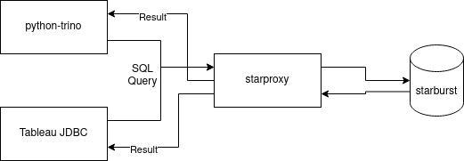

# Starburst/Trino Proxy

## What it is

[Starproxy](https://github.com/wseaton/starproxy){:target="_blank"} is a fully HTTP compliant proxy that is designed to sit between clients and a Trino/Starburst cluster. The motivation for developing a solution like this is laid out in some prior art below:

- [Facebook Engineering Blog - Static Analysis](https://engineering.fb.com/2022/11/30/data-infrastructure/static-analysis-sql-queries/){:target="_blank"}
- [Strata Conference Talk](https://conferences.oreilly.com/strata/strata-ca-2018/public/schedule/detail/63709.html){:target="_blank"}
- [Uber Case Study - Prism](https://www.youtube.com/watch?v=0NwUCvOZuHY){:target="_blank"}

The most attractive items to us are probably:

- Enabling host based security
- Detecting "bad" queries and blocking/deprioritizing them with custom rules
- Load balancing across regions

## How it works

First and foremost, **starproxy** is an **http proxy** implemented in **rust** using a combination of **axum/hyper**.

1. Parse the query AST, then check a variety of rules:

      - inbound CIDR rule checking
      - checking for predicates in queries
      - identifying select * queries with no limit, among other rules
  
2. If rules are violated they can be associated with actions, like tagging the query as low priority. This is done by modifying the request headers and injecting special tags.
Rules can also outright block requests by returning error status codes to the client directly.
