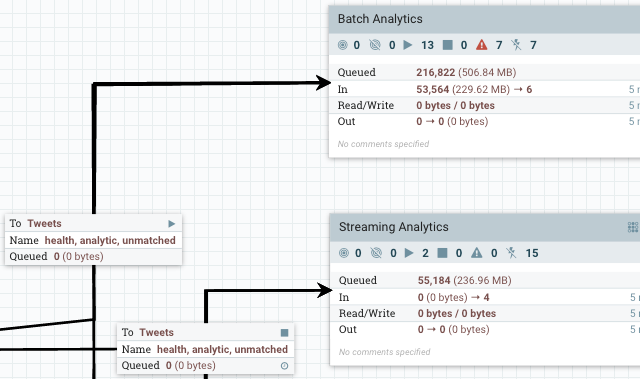

# Apache NiFi

**[Apache NiFi](https://nifi.apache.org/){:target="_blank"}** is an open-source **data integration** tool that helps automate the **flow of data** between systems. It is designed to be easy to use and allows users to quickly and efficiently **process, transmit, and securely distribute data**. NiFi provides a **web-based interface** for monitoring and controlling data flows, as well as a library of **processors** for common data manipulation tasks such as **filtering, routing, and transformation**. It is highly configurable and can be used in a variety of scenarios including **data ingestion, ETL, and dataflow management**.

**Nifi** is a powerful tool to **move data** between systems and can handle **real-time data** with ease. It can be used in conjunction with other big data technologies such as Apache Kafka and Apache Spark to create a complete **data pipeline**. It supports a **wide range** of **protocols and data formats**, making it a versatile solution for any organization looking to manage and process large amounts of data.

## Installing Apache Nifi on OpenShift

The easiest way to install Nifi on OpenShift is to follow the instructions available on [this repo](https://github.com/guimou/nifi-on-openshift){:target="_blank"}.

Contrary to other recipes or the images you can find on the Nifi project, the container images available on this repo are all based on UBI8 and follow OpenShift guidelines and constraints, like running with minimal privileges.

Several deployment options are available:

- Choice on the number of nodes to deploy,
- Basic, OIDC or LDAP authentication.
