# Ensemble Models with Triton and KServe

**Ensemble models** are a feature of the **Triton Model Server**. They represent a pipeline of one or more models and the connection of input and output tensors between those models. Ensemble models are intended to be used to encapsulate a procedure that involves multiple models, such as “data preprocessing -> inference -> data postprocessing”.

Using Ensemble models for this purpose can avoid the overhead of transferring intermediate tensors and minimize the number of requests that must be sent to Triton.

[*Full reference*](https://docs.nvidia.com/deeplearning/triton-inference-server/archives/triton_inference_server_1150/user-guide/docs/models_and_schedulers.html#ensemble-models){:target="_blank"}

!!!note
    In [this repo](https://github.com/rh-aiservices-bu/kserve-triton-ensemble-testing){:target="_blank"} you will find the full recipe to deploy the Triton runtime with the Single Model Serving Stack, and an example of an Ensemble model to test it.

The following instructions are the walkthrough for this installation and test.

## Requirements

Deploy Triton as a custom Single Model Serving Runtime in OpenShift AI. You can import a [REST Interface version](https://github.com/rh-aiservices-bu/kserve-triton-ensemble-testing/blob/main/runtime/runtime-rest.yaml){:target="_blank"}, or a [gRPC one](https://github.com/rh-aiservices-bu/kserve-triton-ensemble-testing/blob/main/runtime/runtime-grpc.yaml){:target="_blank"}.

- On the OpenShift AI dashboard, go to Settings->Serving runtimes

    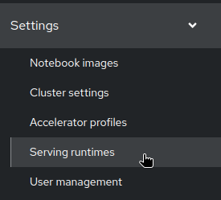

- Add a Servig runtime:

    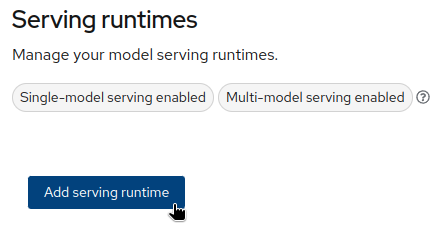

- Select the type:

    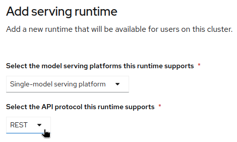

- Paste the content of the runtime definition:

    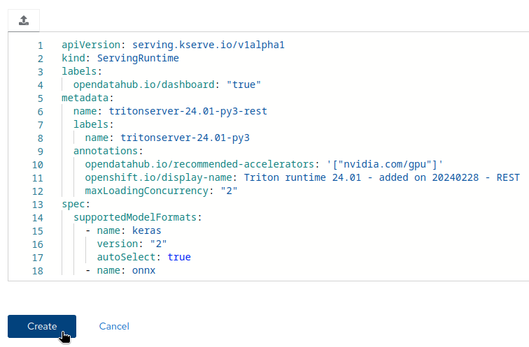

- You can do the same with the gRPC version:

    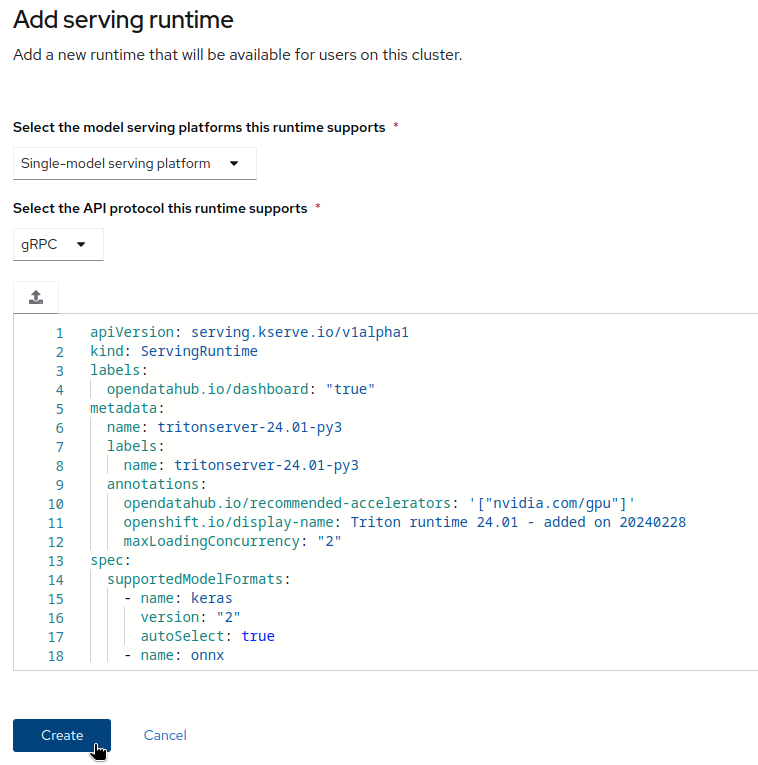

- You now have the two runtimes available:

    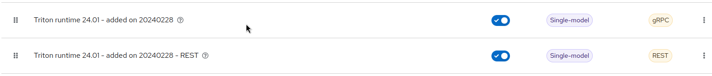

## Model Deployment

This deployment is based on the example model you can find in the [model01](https://github.com/rh-aiservices-bu/kserve-triton-ensemble-testing/tree/main/model01){:target="_blank"} of the repo.

- Copy the whole content of the model folder (so normally multiple models, plus the Ensemble definition) to an object store bucket.

    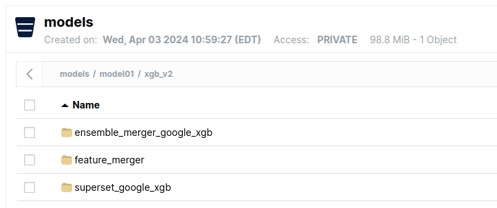

- In OpenShift AI, create a Data Connection pointing to the bucket.

    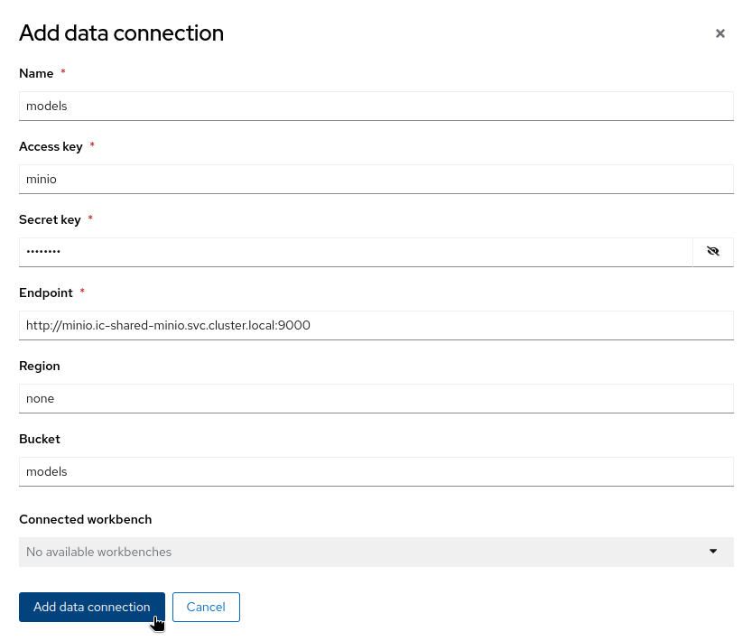

- Serve the model in OpenShift AI using the custom runtime you imported, pointing it to the data connection.

    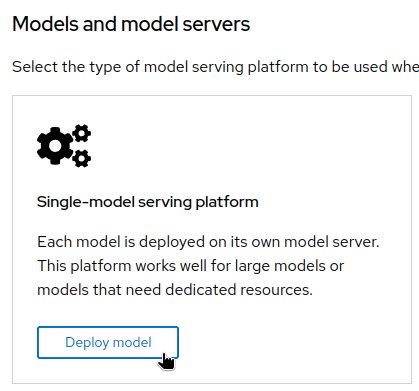
    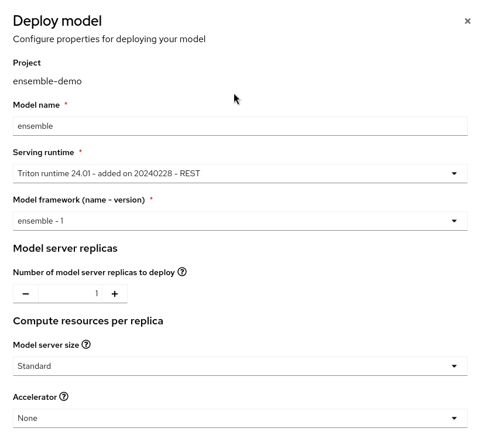
    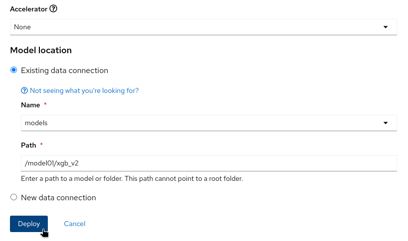

- After a few seconds/minutes, the model is served and an inference endpoint is available.
  
    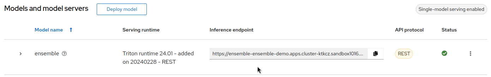

- You can also deploy the gRPC version in the same manner if wou want.

## Test

- You can use the notebook [test-ensemble-rest.ipynb](https://github.com/rh-aiservices-bu/kserve-triton-ensemble-testing/blob/main/test-ensemble-rest.ipynb){:target="_blank"} to test the endpoint if you deployed the REST version of the runtime. Another notebook is available for gRPC.
  
    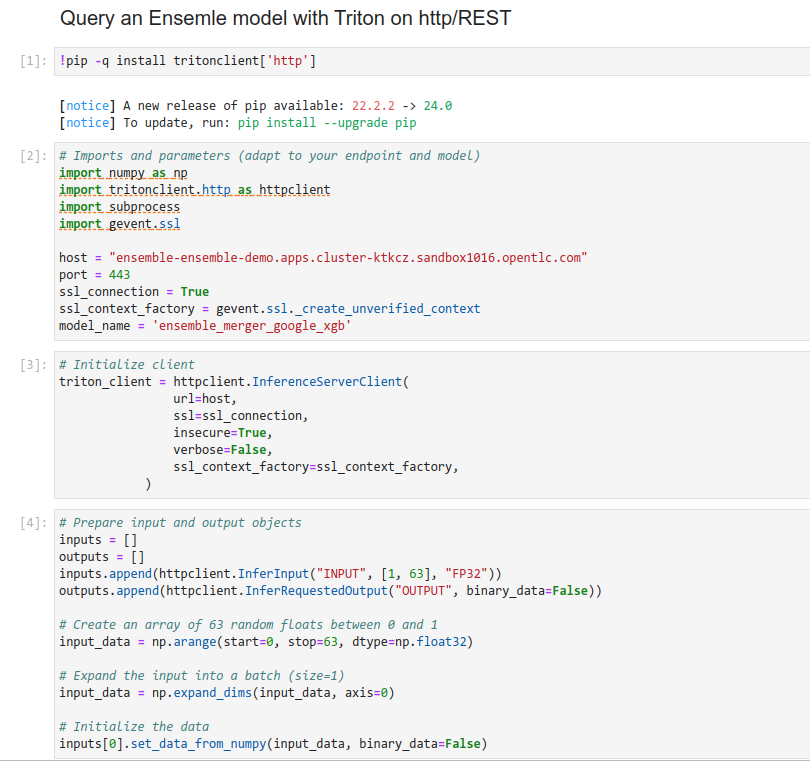
    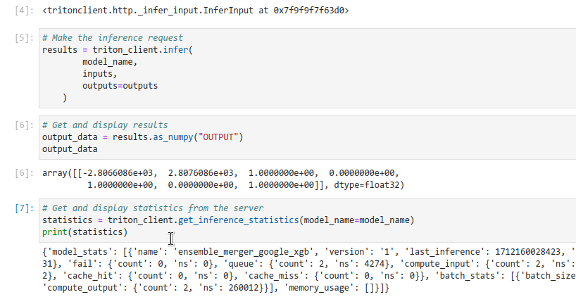
