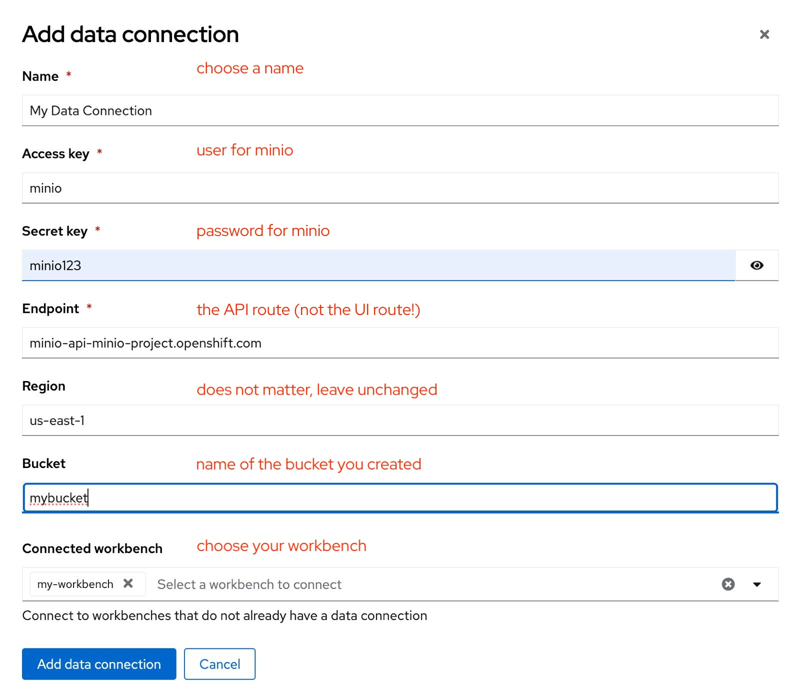

# Minio

## What is it?

[Minio](https://min.io/) is a high-performance, S3 compatible **object store**. It can be deployed on a wide variety of platforms, and it comes in multiple [flavors](https://min.io/pricing).

## Why this guide?

This guide is a very quick way of deploying the community version of Minio in order to quickly setup a fully standalone Object Store, in an OpenShift Cluster. This can then be used for various prototyping tasks that require Object Storage.

Note that nothing in this guide should be used in production-grade environments. Also, Minio is not included in RHOAI, and Red Hat does not provide support for Minio.

## Pre-requisites

* Access to an OpenShift cluster
* Namespace-level admin permissions, or permission to create your own project

## Deploying Minio on OpenShift

### Create a Data Science Project (Optional)

If you already have your own Data Science Project, or OpenShift project, you can skip this step.

1. If your cluster already has [Red Hat OpenShift AI](https://developers.redhat.com/products/red-hat-openshift-ai/overview) installed, you can use the Dashboard Web Interface to create a Data Science project.
1. Simply navigate to **Data Science Projects**
1. And click **Create Project**
1. Choose a name for your project (here, **Showcase**) and click **Create**:

    

1. Make sure to make a note of the Resource name, in case it's different from the name.

### Log on to your project in OpenShift Console

1. Go to your cluster's OpenShift Console:

    

1. Make sure you use the **Administrator** view, not the developer view.
1. Go to **Workloads** then **Pods**, and confirm the selected **project** is the right one

    

1. You now have a project in which to deploy Minio

### Deploy Minio in your project

1. Click on the **+** ("Import YAML") button:

    

1. Paste the following YAML in the box, but **don't press ok yet!**:
    ```yaml
    ---
    kind: PersistentVolumeClaim
    apiVersion: v1
    metadata:
      name: minio-pvc
    spec:
      accessModes:
        - ReadWriteOnce
      resources:
        requests:
          storage: 20Gi
      volumeMode: Filesystem
    ---
    kind: Secret
    apiVersion: v1
    metadata:
      name: minio-secret
    stringData:
      # change the username and password to your own values.
      # ensure that the user is at least 3 characters long and the password at least 8
      minio_root_user: minio
      minio_root_password: minio123
    ---
    kind: Deployment
    apiVersion: apps/v1
    metadata:
      name: minio
    spec:
      replicas: 1
      selector:
        matchLabels:
          app: minio
      template:
        metadata:
          creationTimestamp: null
          labels:
            app: minio
        spec:
          volumes:
            - name: data
              persistentVolumeClaim:
                claimName: minio-pvc
          containers:
            - resources:
                limits:
                  cpu: 250m
                  memory: 1Gi
                requests:
                  cpu: 20m
                  memory: 100Mi
              readinessProbe:
                tcpSocket:
                  port: 9000
                initialDelaySeconds: 5
                timeoutSeconds: 1
                periodSeconds: 5
                successThreshold: 1
                failureThreshold: 3
              terminationMessagePath: /dev/termination-log
              name: minio
              livenessProbe:
                tcpSocket:
                  port: 9000
                initialDelaySeconds: 30
                timeoutSeconds: 1
                periodSeconds: 5
                successThreshold: 1
                failureThreshold: 3
              env:
                - name: MINIO_ROOT_USER
                  valueFrom:
                    secretKeyRef:
                      name: minio-secret
                      key: minio_root_user
                - name: MINIO_ROOT_PASSWORD
                  valueFrom:
                    secretKeyRef:
                      name: minio-secret
                      key: minio_root_password
              ports:
                - containerPort: 9000
                  protocol: TCP
                - containerPort: 9090
                  protocol: TCP
              imagePullPolicy: IfNotPresent
              volumeMounts:
                - name: data
                  mountPath: /data
                  subPath: minio
              terminationMessagePolicy: File
              image: >-
                quay.io/minio/minio:RELEASE.2023-06-19T19-52-50Z
              args:
                - server
                - /data
                - --console-address
                - :9090
          restartPolicy: Always
          terminationGracePeriodSeconds: 30
          dnsPolicy: ClusterFirst
          securityContext: {}
          schedulerName: default-scheduler
      strategy:
        type: Recreate
      revisionHistoryLimit: 10
      progressDeadlineSeconds: 600
    ---
    kind: Service
    apiVersion: v1
    metadata:
      name: minio-service
    spec:
      ipFamilies:
        - IPv4
      ports:
        - name: api
          protocol: TCP
          port: 9000
          targetPort: 9000
        - name: ui
          protocol: TCP
          port: 9090
          targetPort: 9090
      internalTrafficPolicy: Cluster
      type: ClusterIP
      ipFamilyPolicy: SingleStack
      sessionAffinity: None
      selector:
        app: minio
    ---
    kind: Route
    apiVersion: route.openshift.io/v1
    metadata:
      name: minio-api
    spec:
      to:
        kind: Service
        name: minio-service
        weight: 100
      port:
        targetPort: api
      wildcardPolicy: None
      tls:
        termination: edge
        insecureEdgeTerminationPolicy: Redirect
    ---
    kind: Route
    apiVersion: route.openshift.io/v1
    metadata:
      name: minio-ui
    spec:
      to:
        kind: Service
        name: minio-service
        weight: 100
      port:
        targetPort: ui
      wildcardPolicy: None
      tls:
        termination: edge
        insecureEdgeTerminationPolicy: Redirect
    ```

1. By default, the size of the storage is 20 GB. (see line 11). Change it if you need to.
1. If you want to, edit lines 21-22 to change the default user/password.
1. Press Create.
1. You should see:

    

1. And there should now be a running minio pod:

    

1. As well as  **two** minio routes:

    

1. The `-api` route is for programmatic access to Minio
1. The `-ui` route is for browser-based access to Minio
1. Your Minio Object Store is now deployed, but we still need to create at least one bucket in it, to make it useful.

## Creating a bucket in Minio

### Log in to Minio

1. Locate the **minio-ui** Route, and open its location URL in a web browser:
1. When prompted, log in
    * if you kept the default values, then:
    * user: `minio`
    * pass: `minio123`

    {style="width:400px"}

1. You should now be logged into your Minio instance.

### Create a bucket

1. Click on **Create a Bucket**

    

1. Choose a name for your bucket (for example `mybucket`) and click **Create Bucket**:

    

1. Repeat those steps to create as many buckets as you will need.

## Create a matching Data Connection for Minio

1. Back in RHOAI, inside of your Data Science Project, Click on **Add data connection**:

    

1. Then, fill out the required field to match with your newly-deployed Minio Object Storage

    

1. You now have a Data Connection that maps to your **mybucket** bucket in your Minio Instance.
1. This data connection can be used, among other things
    * In your Workbenches
    * For your Model Serving
    * For your Pipeline Server Configuration

## Validate 

To test if everything is working correctly, you can access the workbench associated with your Data Connection and run the following commands (i.e., inside a Jupyter notebook): 

1. Install and import MinIO Python Client SDK

    ``` python
    !pip install minio
    ```
    ``` python
    from minio import Minio
    from minio.error import S3Error
    import  os
    import datetime
    ```

1. Access Data Connection properties as environment variables:

    ``` python
    # MinIO client doesn't like URLs with procotol/schema, so use
    # yourendpoint.com instead of https://yourtendpoint.com
    AWS_S3_ENDPOINT = os.getenv("AWS_S3_ENDPOINT")
    AWS_ACCESS_KEY_ID = os.getenv("AWS_ACCESS_KEY_ID")
    AWS_SECRET_ACCESS_KEY = os.getenv("AWS_SECRET_ACCESS_KEY")
    AWS_S3_BUCKET = os.getenv("AWS_S3_BUCKET")
    ```

1. Create the MinIO client

    ``` python 
    # Create the MinIO client
    client = Minio(
        AWS_S3_ENDPOINT,
        access_key=AWS_ACCESS_KEY_ID,
        secret_key=AWS_SECRET_ACCESS_KEY,
        secure=True  # Set to True if you are using HTTPS
    )
    ```

1. Test the connection by listing all buckets

    ``` python 
    #List all buckets
    try:
        buckets = client.list_buckets()
        for bucket in buckets:
            print(bucket.name, bucket.creation_date)
    except S3Error as e:
        print("Error occurred: ", e)
    ```

1. Create a sample local file

    ``` python 
    # Create File
    FILE_ON_DISK = 'file.txt'
     
    file = open(f"{FILE_ON_DISK}", "w")
    file.write('Hello there %s recorded at %s.\n' % (FILE_ON_DISK, datetime.datetime.now()))
    file.close()
    ```

1. Upload a file to MinIO

    ``` python 
    # Upload a File 
    file_path = FILE_ON_DISK
    object_name = 'target-file.txt'
    
    try:
        client.fput_object(AWS_S3_BUCKET, object_name, file_path)
        print(f"'{object_name}' is successfully uploaded as object to bucket '{bucket_name}'.")
    except S3Error as e:
        print("Error occurred: ", e)
    ```

1. Download a file from MinIO

    ``` python 
    # Download a file 
    object_name = 'target-file.txt'
    file_path = 'file-froms3.txt'
    
    try:
     client.fget_object(AWS_S3_BUCKET, object_name, file_path)
     print(f"'{object_name}' is successfully downloaded to '{file_path}'.")
    except S3Error as e:
     print("Error occurred: ", e)
    ```

1. List objects in our bucket

    ``` python 
    # Download a file 
    object_name = 'target-file.txt'
    file_path = 'file-froms3.txt'
    
    try:
        client.fget_object(AWS_S3_BUCKET, object_name, file_path)
        print(f"'{object_name}' is successfully downloaded to '{file_path}'.")
    except S3Error as e:
        print("Error occurred: ", e)
    ``` 

For more complete and detailed information about MinIO Python Client SDK usage, please check the official [documentation](https://min.io/docs/minio/linux/developers/python/minio-py.html). 

## Notes and FAQ

* As long as you are using the Route URLs, a Minio running in one namespace can be used by any other application, even running in another namespace, or even in another cluster altogether.

## Uninstall instructions:

This will completely remove Minio and all its content. Make sure you have a backup of the things your need before doing so!

1. Track down those objects created earlier:

    

1. Delete them all.
