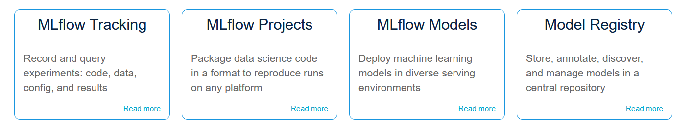

# MLFlow
MLflow is an open source platform to manage the ML lifecycle, including experimentation, reproducibility, deployment, and a central model registry. MLflow currently offers four components:

Read more here: [https://mlflow.org/](https://mlflow.org/)

## Helm installation into OpenShift namespace
**Pre-requisites**  

- Install the "Crunchy Postgres for Kubernetes" operator (can be found in OperatorHub) - To store the MLFlow config
- Install the "OpenShift Data Foundation" operator (can be found in OperatorHub) - To provide S3 storage for the experiments and models

**Install**

```
<Create an OpenShift project, either through the OpenShift UI or 'oc new-project project-name'>
helm repo add strangiato https://strangiato.github.io/helm-charts/
helm repo update
<Log in to the correct OpenShift project through 'oc project project-name'>
helm install mlflow-server strangiato/mlflow-server
```

**Test MLFlow**  

- Go to the OpenShift Console and switch to Developer view.  
- Go to the Topology view and make sure that you are on the MLFlow project.  
- Check that the MLFlow circle is dark blue (this means it has finished deploying).  
- Press the "External URL" link in the top right corner of the MLFlow circle to open up the MLFlow UI.  
- Run `helm test mlflow-server` to test MLFlow, if successfull you should see a new experiment called "helm-test" show up in the MLFlow UI with 3 experiments inside it.

## Adding MLFlow to Training Code
```
import mlflow
from sklearn.linear_model import LogisticRegression

# Set tracking URI
mlflow.set_tracking_uri(“https://<route-to-mlflow>”)

# Setting the experiment
mlflow.set_experiment("my-experiment")

if __name__ == "__main__":  
    # Enabling automatic logging for scikit-learn runs
    mlflow.sklearn.autolog()
    
    # Starting a logging run
    with mlflow.start_run():
        # train
```
## Source Code
MLFlow Server Source Code:  
[https://github.com/strangiato/mlflow-server](https://github.com/strangiato/mlflow-server) 

MLFlow Server Helm Chart Source Code:  
[https://github.com/strangiato/helm-charts/tree/main/charts/mlflow-server](https://github.com/strangiato/helm-charts/tree/main/charts/mlflow-server)


## Demos
- Credit Card Fraud Detection pipeline using MLFlow together with RHODS: [Demo](/demos/credit-card-fraud/credit-card-fraud)