# Rclone

## What is it?

{ width=400px .noborder}

[**Rclone**](https://rclone.org/){:target="_blank"} is a program to manage files on cloud storage. It is a feature-rich alternative to cloud vendors' web storage interfaces. Over 40 cloud storage products support rclone including S3 object stores, business & consumer file storage services, as well as standard transfer protocols.

Users call rclone "The Swiss army knife of cloud storage", and "Technology indistinguishable from magic".

Rclone really looks after your data. It preserves timestamps and verifies checksums at all times. Transfers over limited bandwidth; intermittent connections, or subject to quota can be restarted, from the last good file transferred. You can check the integrity of your files. Where possible, rclone employs server-side transfers to minimize local bandwidth use and transfers from one provider to another without using local disk.

Rclone is mature, open-source software originally inspired by rsync and written in Go. The friendly support community is familiar with varied use cases.

[The implementation](https://github.com/guimou/rclone-web-on-openshift) described here is a containerized version of Rclone to run on OpenShift, alongside or integrated within ODH/RHOAI.

## Deployment

### Integrated in Open Data Hub or OpenShift AI

Use this method if you want to use **Rclone from the ODH/RHOAI launcher or in a Data Science Project**.

- In the Cluster Settings menu, import the image `quay.io/guimou/rclone-web-openshift:odh-rhoai_latest`. You can name it Rclone.
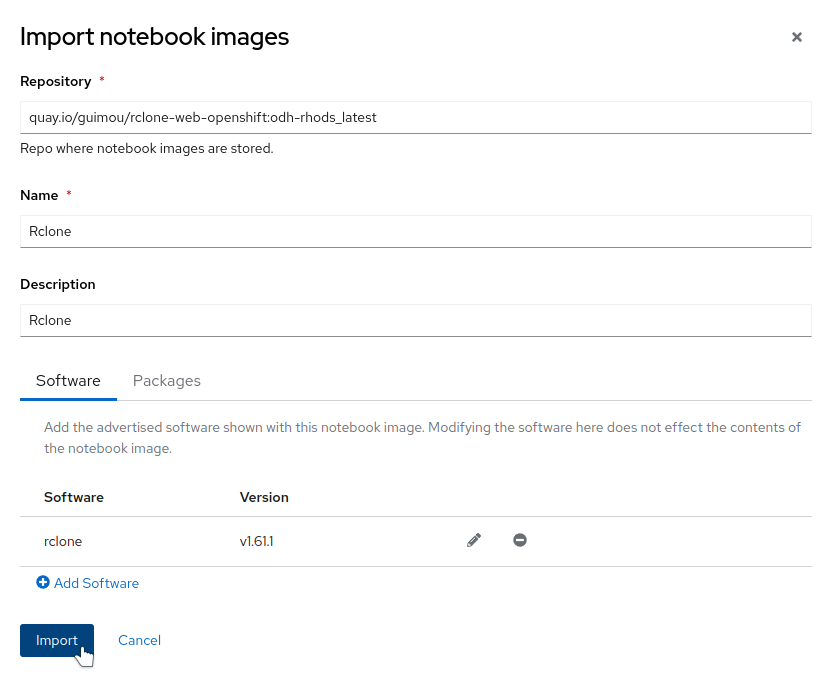
- In your DSP project, create a new workbench using the Rclone image. You can set the storage size as minimal as it's only there to store the configuration of the endpoints.
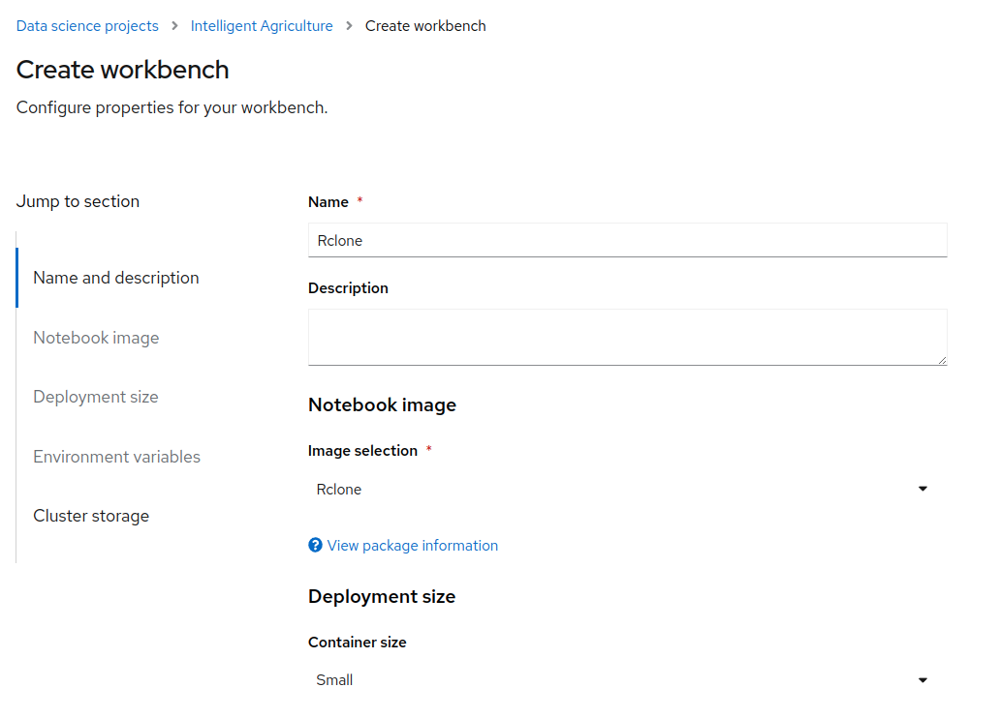
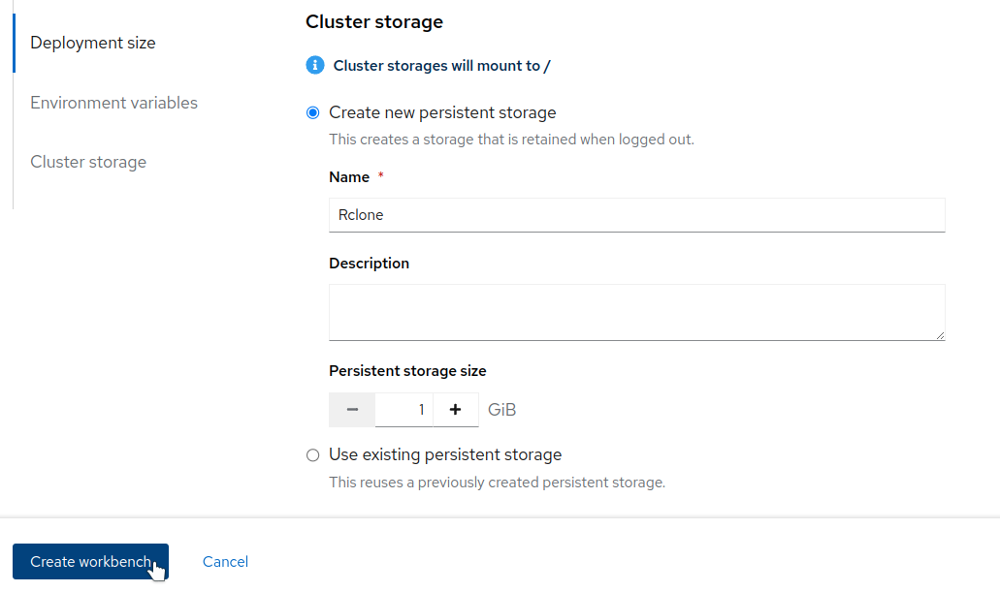
!!!TIP
    The minimal size allowed by the dashboard for a storage volume is currently 1GB, which is way more than what is required for the Rclone configuration. So you can also create a much smaller PVC manually in the namespace corresponding to your Data Science Project, for example 100MB or less, and select this volume when creating the workbench.
- Launch Rclone from the link once it's deployed!
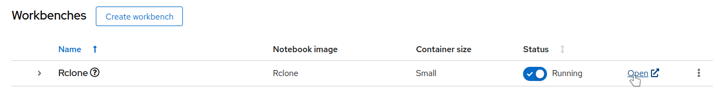
- After the standard authentication, you end up on the Rclone Login page. There is nothing to enter, but I have not found yet how to bypass it. So simply click on "Login".
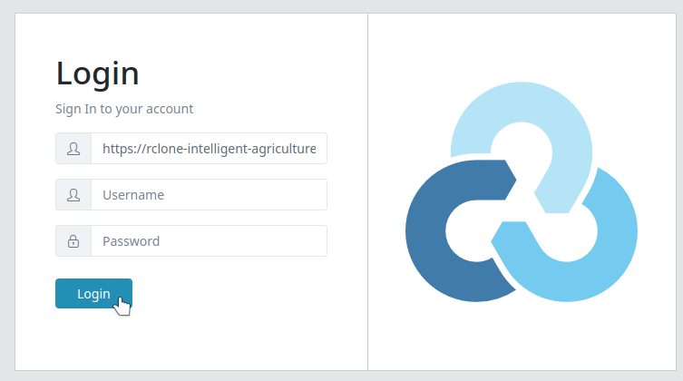

### Standalone deployment

Use this method if you want to use **Rclone on its own in a namespace**. You can still optionally make a shortcut appear in the ODH/RHOAI dashboard.

- Create a project/namespace for your installation.
- Clone or head to [this repo](https://github.com/guimou/rclone-web-on-openshift).
- From the deploy folder, apply the different YAML files:
    - 01-pvc.yaml: creates a persistent volume to hold the configuration
    - 02-deployment.yaml: creates the deployment. Modify admin account and password if you want to restrict access. You should!
    - 03-service.yaml, 04-route.yaml: create the external access so that you can connect to the Web UI.
    - **Optionally**, to create a tile on the ODH/RHOAI dashboard:
        - modify the 05-tile.yaml file with the address of the Route that was created previously (namespace and name of the Route object).
        - the will appear under the available applications in the dashboard. Select it and click on "Enable" to make it appear in the "Enabled" menu.

## Configuration

In this example, we will create an S3 configuration that connects to a bucket on the MCG from OpenShift Data Foundation. So you must have created this bucket in advance and have all the information about it: endpoint, access and secret keys, bucket name.

- In Rclone, click on "Configs" to create the new Remote.
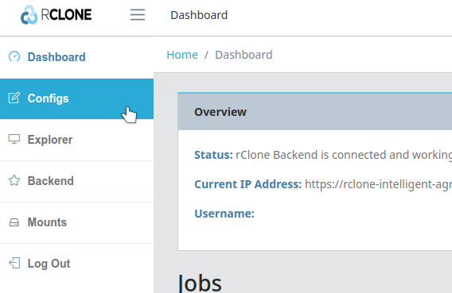
- Create new configuration, give it a name, and select "Amazon S3 Compliant Storage Providers...", which includes Ceph and MCG (even if not listed).
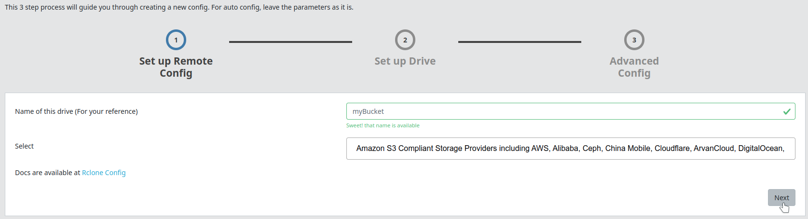
- Enter the connection info. You only have to enter the Access key and Secret, as well as the Endpoint in "Endpoint for S3 API". This last info is automatically copied in other fields, that's normal.
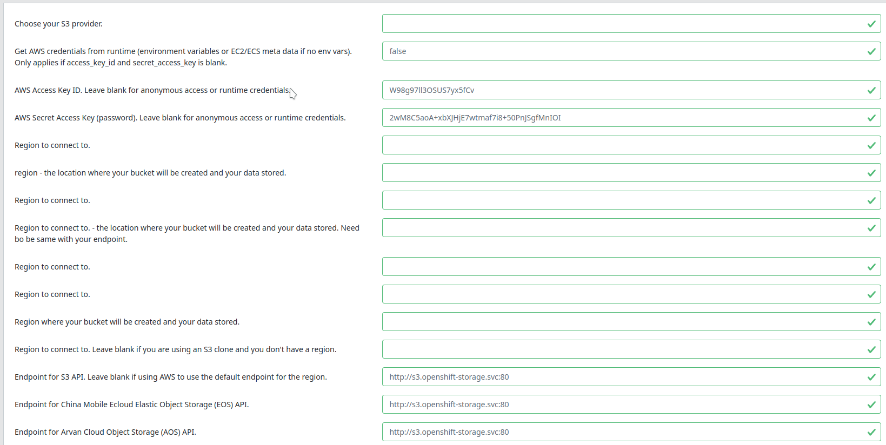
- Finalize the config by clicking on "Next" at the bottom.

Now that you have the Remote set up, you can go on the Explorer, select the Remote, and browse it!
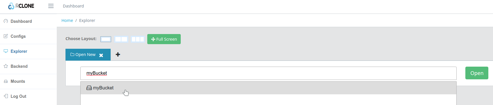
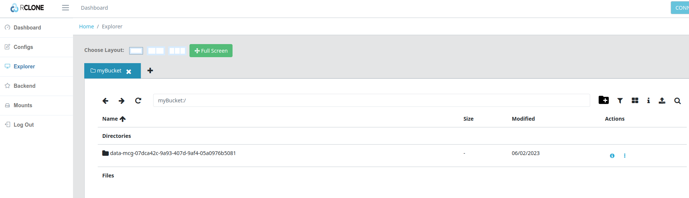

## Usage Example

In this simple example, we will transfer a dump sample from Wikipedia. Wikimedia publishes those dumps daily, and they are mirrored by different organizations. In a "standard" setup, loading those information into your object store would not be really practical, sometimes involving downloading it first locally to then push it to your storage.

This is how we can do it with Rclone.

- Create your Bucket Remote as described in Configuration.
- Create another remote of type "HTTP", and enter the address of one of the mirrors. Here I used `https://dumps.wikimedia.your.org/wikidatawiki/`.
- Open the Explorer view, set it in dual-pane layout. In the first pane open your Bucket Remote, and in the other one the HTTP. This is what it will look like:
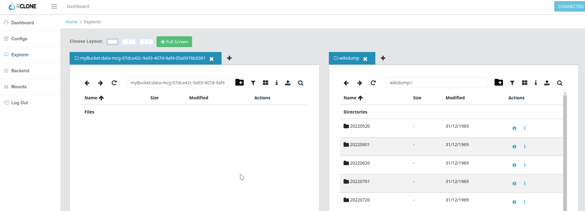
- Browse to the folder you want, select a file or a folder, and simply drag and drop it from the Wikidump to your bucket. You can select a big one to make things more interesting!
- Head for the dashboard where you will see the file transfer happening in the background.
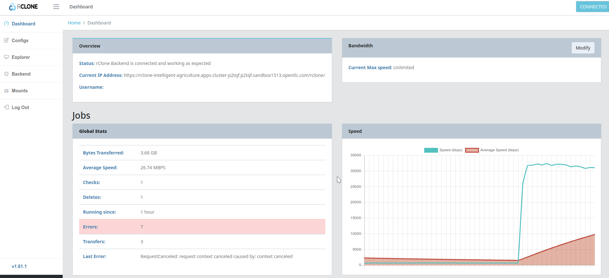

That's it! Nothing to install, high speed optimized transfer, and you could even do multiple transfers in the background,...
