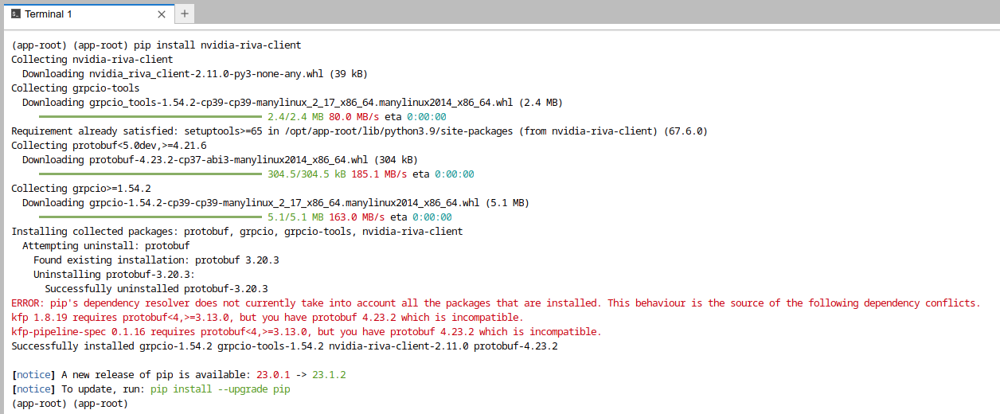
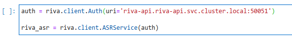
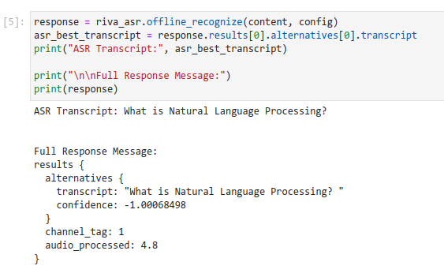

# NVIDIA RIVA

[**NVIDIA® Riva**](https://docs.nvidia.com/deeplearning/riva/user-guide/docs/overview.html){:target="_blank"} is a GPU-accelerated SDK for building Speech AI applications that are customized for your use case and deliver real-time performance.

Riva offers pretrained speech models in NVIDIA NGC™ that can be fine-tuned with the NVIDIA NeMo on a custom data set, accelerating the development of domain-specific models by 10x.

Models can be easily exported, optimized, and deployed as a speech service on premises or in the cloud with a single command using Helm charts.

Riva’s high-performance inference is powered by NVIDIA TensorRT™ optimizations and served using the NVIDIA Triton™ Inference Server, which are both part of the NVIDIA AI platform.

Riva services are available as gRPC-based microservices for low-latency streaming, as well as high-throughput offline use cases.

Riva is fully containerized and can easily scale to hundreds and thousands of parallel streams.

## Deployment

The [guide](https://docs.nvidia.com/deeplearning/riva/user-guide/docs/installation/deploy-kubernetes.html){:target="_blank"} to deploy Riva on Kubernetes has to be adapted for OpenShift. Here are the different steps.

### Prerequisites

1. You have access and are logged into NVIDIA NGC. For step-by-step instructions, refer to the NGC [Getting Started Guide](https://docs.nvidia.com/ngc/ngc-overview/index.html#registering-activating-ngc-account){:target="_blank"}. Specifically you will need your API Key from NVIDIA NGC.
2. You have at least one worker node with an NVIDIA Volta™, NVIDIA Turing™, or an NVIDIA Ampere architecture-based GPU. For more information, refer to the [Support Matrix](https://docs.nvidia.com/deeplearning/riva/user-guide/docs/support-matrix.html#support-matrix).
3. The Node Feature Discovery and the NVIDIA operators have been properly installed and configured on your OpenShift Cluster to enable your GPU(s). Full instructions [here](https://docs.nvidia.com/datacenter/cloud-native/gpu-operator/openshift/contents.html){:target="_blank"}
4. The Pod that will be deployed will consume about 10GB of RAM. Make sure you have enough resources on your node (on top of the GPU itself), and you don't have limits in place that would restrict this. GPU memory consumption will be about 12GB with all models loaded.

### Installation

Included in the NGC Helm Repository is a chart designed to automate deployment to a Kubernetes cluster. This chart must be modified for OpenShift.

The Riva Speech AI Helm Chart deploys the ASR, NLP, and TTS services automatically. The Helm chart performs a number of functions:

* Pulls Docker images from NGC for the Riva Speech AI server and utility containers for downloading and converting models.
* Downloads the requested model artifacts from NGC as configured in the values.yaml file.
* Generates the Triton Inference Server model repository.
* Starts the Riva Speech AI server as configured in a Kubernetes pod.
* Exposes the Riva Speech AI server as a configured service.

Examples of pretrained models are released with Riva for each of the services. The Helm chart comes preconfigured for downloading and deploying all of these models.

Installation Steps:

1. Download the Helm chart

        :::bash
        export NGC_API_KEY=<your_api_key>
        helm fetch https://helm.ngc.nvidia.com/nvidia/riva/charts/riva-api-2.11.0.tgz \
                --username=\$oauthtoken --password=$NGC_API_KEY --untar

2. Switch to the newly created folder, `riva-api`
3. In the `templates` folder, modify the file `deployment.yaml`. For both the container `riva-speech-api` and the initContainer `riva-model-init` you must add the following security context information:

        :::yaml
        securityContext:
            allowPrivilegeEscalation: false
            capabilities:
              drop: ["ALL"]
            seccompProfile:
              type: "RuntimeDefault"
            runAsNonRoot: true

4. The file `deployment.yaml` should now look like this:

        :::yaml
        ...
        apiVersion: apps/v1
        kind: Deployment
        metadata:
          name: {{ template "riva-server.fullname" . }}
          ...
        spec:
          ...
          template:
            ...
            spec:
              containers:
                - name: riva-speech-api
                  securityContext:
                    allowPrivilegeEscalation: false
                    capabilities:
                      drop: ["ALL"]
                    seccompProfile:
                      type: "RuntimeDefault"
                    runAsNonRoot: true
                  image: {{ $server_image }}
                  ...
              initContainers:
                - name: riva-model-init
                  securityContext:
                    allowPrivilegeEscalation: false
                    capabilities:
                      drop: ["ALL"]
                    seccompProfile:
                      type: "RuntimeDefault"
                    runAsNonRoot: true
                  image: {{ $servicemaker_image }}
                  ...

5. At the root of `riva-api`, modify the file `values.yaml`:
      1. You will need to convert your API Key to a password value. In a Terminal run:

            :::bash
            echo -n $NGC_API_KEY | base64 -w0

      2. In the `ngcCredentials` section ov `values.yaml`, enter the password you obtained above and your email
      3. In the `modelRepoGenerator` section, for the `modelDeployKey` value, enter `dGx0X2VuY29kZQ==`. (This value is obtained from the command `echo -n tlt_encode | base64 -w0`.
      4. In the `persistentVolumeClaim` section, set `usePVC` to true. This is very important as it will disable the hostPath configuration for storage that is not permitted by default on OpenShift.
      5. If you don't have a storageClass set as default, or want to you another one, enter the name of the class you want to use in `storageClassName`. Otherwise leave this field empty and the default class will be used.
      6. Optionally, modify the storageSize.
      7. Leave the `ingress` section as is, we will create an OpenShift Route later.
      8. Optionally you can modify other values in the file to enable/disable certain models, or modify their configuration.

6. Log into your OpenShift cluster from a Terminal, and create a project `riva-api`:

        :::bash
        oc new-project riva-api

7. Move up one folder (so outside of the `riva-api` folder), and install NVIDIA Riva with the modified Helm chart:

        :::bash
        helm install riva-api riva-api

The deployment will now start.

!!!info
    Beware that the deployment can be really long the first time, about 45mn if you have all the models and features selected. Containers and models have to be downloaded and configured. Please be patient...

## Usage

The Helm chart had automatically created a Service, `riva-api` in the namespace where you have deployed it. If you followed this guide, this should also be `riva-api`. So within the OpenShift cluster, the API is accessible at `riva-api.riva-api.svc.cluster.local`.

Different ports are accessible:

* http (8000): HTTP port of the Triton server.
* grpc (8001): gRPC port of the Triton server.
* metrics (8002): port for the metrics of the Triton server.
* speech-grpc (50051): gRPC port of the Speech that exposes directly the different services you can use. This is normally the one that you will use.

If you want to use the API outside of the OpenShift cluster, you will have to create one or multiple Routes to those different endpoints.

## Example

* On the same cluster where NVIDIA Riva is deployed, deploy RHOAI or ODH and launch a Notebook (Standard DataScience is enough).
* Clone the NVIDIA Riva tutorials repository at [https://github.com/nvidia-riva/tutorials](https://github.com/nvidia-riva/tutorials){:target="_blank"}
* Open a Terminal and install the client with `pip install nvidia-riva-client`:

(depending on the base image you used this may yield errors that you can ignore most of times).

* In the `tutorials` folder, open the notebook `asr-basics.ipynb`.
* In the cell that defines the uri of the API server, modify the default (localhost) for the address of the API server: `riva-api.riva-api.svc.cluster.local`
  

* Run the notebook!

!!!note
    In this example, only the first part of the notebook will work as only the English models have been deployed. You would have to adapt the configuration for other languages.
